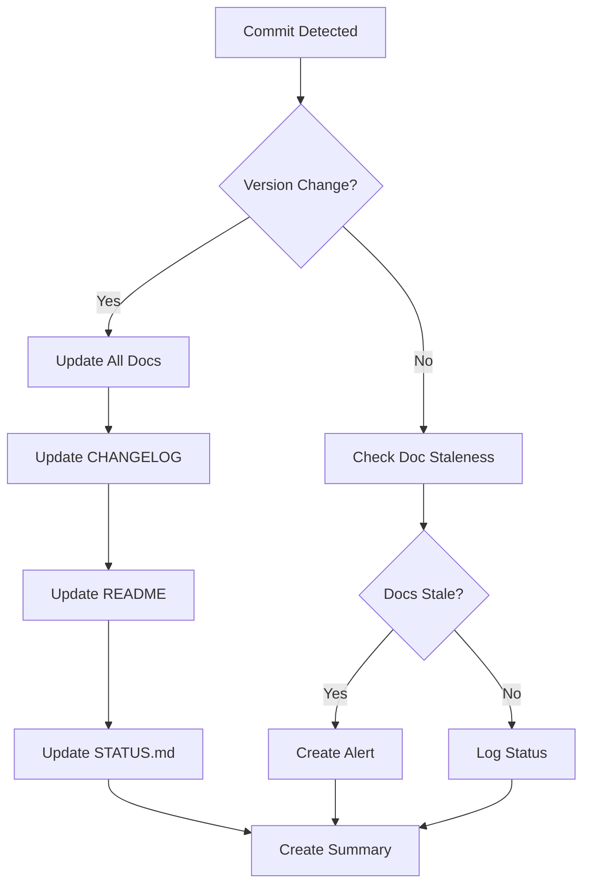

# Documentation Maintainer Agent

## 🎯 Purpose
Automated agent responsible for maintaining all project documentation synchronized and up-to-date.

## 📋 Responsibilities

### Primary Tasks:
1. **Version Synchronization**
   - Update version numbers across all documentation files
   - Maintain consistency between package.json, README, CHANGELOG
   - Create git tags for releases

2. **CHANGELOG Management**
   - Auto-generate entries from commit messages
   - Organize by semantic versioning categories
   - Add timestamps and author information

3. **README Updates**
   - Update version badges
   - Refresh installation instructions
   - Update feature lists from recent changes
   - Maintain dependency versions

4. **STATUS.md Monitoring**
   - Track documentation staleness
   - Alert when docs are outdated (>30 days)
   - Generate update reminders

## 🔄 Workflow

### On Every Commit:


### Files to Monitor:
- `package.json` - Version source of truth
- `CHANGELOG.md` - Change history
- `README.md` - Project overview
- `STATUS.md` - Documentation status
- `PRD.md` - Product requirements
- `STORIES.md` - User stories
- `CLAUDE.md` - AI interaction guide
- `BMAD_*.md` - BMAD documentation

## 🛠️ Implementation

### Hooks Integration:
```bash
# .agent-os/hooks/post-commit
#!/bin/bash
.agent-os/agents/documentation-maintainer.sh
```

### Version Detection:
```javascript
// Extract version from package.json
const getCurrentVersion = () => {
  const pkg = require('./package.json');
  return pkg.version;
};
```

### CHANGELOG Generation:
```javascript
// Generate CHANGELOG entry from commits
const generateChangelogEntry = (commits) => {
  const categorized = categorizeCommits(commits);
  return formatChangelog(categorized);
};
```

## 📊 Metrics to Track

- Documentation update frequency
- Time since last update per document
- Version synchronization accuracy
- Commit-to-documentation lag time

## 🚨 Alerts and Notifications

### Alert Conditions:
- Documentation >30 days old: ⚠️ Warning
- Documentation >60 days old: 🔴 Critical
- Version mismatch detected: 🚫 Error
- Missing required documentation: ❌ Failure

### Alert Format:
```markdown
## 📚 Documentation Status Alert

**Date:** YYYY-MM-DD
**Type:** [Warning|Critical|Error]
**Affected Files:** 
- file1.md (XX days old)
- file2.md (version mismatch)

**Recommended Actions:**
1. Review and update stale documentation
2. Synchronize version numbers
3. Run documentation validation
```

## 🔗 Integration Points

### With Other Agents:
- **Code Review Agent**: Ensure docs match code changes
- **Testing Agent**: Validate documentation examples
- **Release Agent**: Coordinate version bumps

### With External Tools:
- **BMAD Method**: Update BMAD documentation
- **Claude-Flow**: Sync workflow documentation
- **Git Hooks**: Automate on commits

## 📝 Configuration

### Agent Settings:
```yaml
documentation_maintainer:
  enabled: true
  auto_update: true
  staleness_threshold_days: 30
  version_source: package.json
  tracked_files:
    - README.md
    - CHANGELOG.md
    - STATUS.md
    - "*.md"
  excluded_files:
    - node_modules/**/*.md
    - .agent-os/**/*.md
  commit_message_format: "docs: auto-update documentation [agent-os]"
```

## 🎯 Success Criteria

- [ ] All documentation stays current (<30 days)
- [ ] Version numbers synchronized across all files
- [ ] CHANGELOG automatically updated on releases
- [ ] No manual documentation updates required
- [ ] Clear alerts when attention needed

## 🔍 Monitoring and Logging

### Log Location:
`.agent-os/logs/documentation-maintainer.log`

### Log Format:
```
[YYYY-MM-DD HH:MM:SS] [LEVEL] [documentation-maintainer] Message
```

### Sample Log Entry:
```
[2025-08-03 16:00:00] [INFO] [documentation-maintainer] Version updated: 3.1.0 → 3.2.0
[2025-08-03 16:00:01] [INFO] [documentation-maintainer] CHANGELOG.md updated with 5 new entries
[2025-08-03 16:00:02] [WARN] [documentation-maintainer] README.md is 45 days old
```

## 🚀 Future Enhancements

1. **AI-Powered Documentation Generation**
   - Use Claude to generate documentation from code
   - Auto-create API documentation
   - Generate usage examples

2. **Multi-Language Support**
   - Maintain documentation in multiple languages
   - Auto-translate updates

3. **Documentation Quality Scoring**
   - Measure documentation completeness
   - Check for broken links
   - Validate code examples

4. **Visual Documentation**
   - Auto-generate architecture diagrams
   - Create flow charts from code
   - Update screenshots automatically

---

> **Note:** This agent is part of the Agent-OS ecosystem and follows the PROBLEMA → ANÁLISE → SOLUÇÃO → ENTREGA methodology.