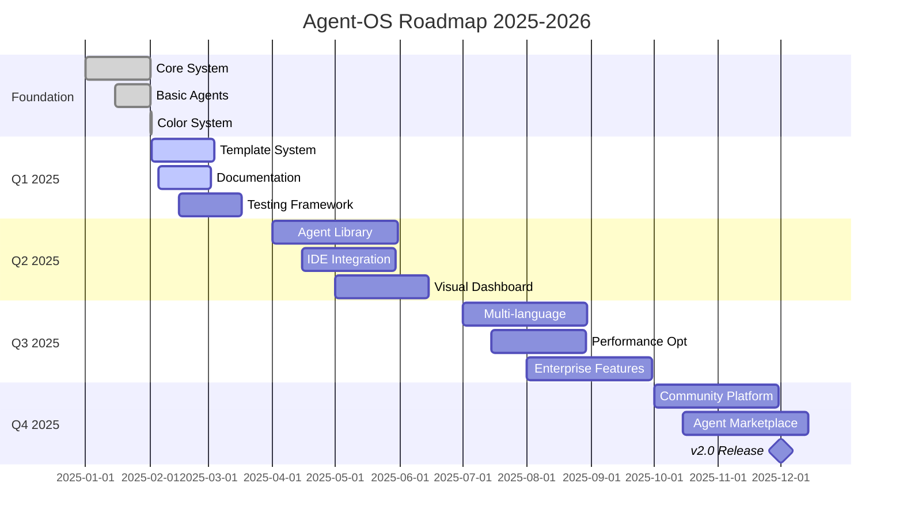

# Agent-OS Development Roadmap

## 🗺️ Overview

This roadmap outlines the evolution of Agent-OS from its current MVP state to a comprehensive agent orchestration platform. Each milestone is designed to add value while maintaining our core principle of simplicity.

## 📅 Timeline Overview

## 🎯 Milestones

### ✅ Milestone 0: Foundation (Completed)
**Status**: ✅ Complete  
**Completed**: 2025-02-02

- [x] Core routing system
- [x] Memory persistence with SQLite
- [x] 5 basic agents (analyst, architect, developer, tester, orchestrator)
- [x] Hook system for automation
- [x] CLI interface
- [x] Color system for agents
- [x] Integration with Claude native agents

### 🔄 Milestone 1: Production Ready
**Target**: Q1 2025 (End of March)  
**Status**: 🚧 In Progress

#### Goals:
- [ ] Complete PROBLEMA → ANÁLISE → SOLUÇÃO → ENTREGA templates for all agents
- [ ] Comprehensive test coverage (>80%)
- [ ] Performance benchmarks established
- [ ] Complete documentation suite
- [ ] Error handling and recovery mechanisms
- [ ] Logging and debugging tools

#### Deliverables:
1. **Agent Templates** (Week 1-2)
   - [ ] Update architect agent
   - [ ] Update developer agent
   - [ ] Update tester agent
   - [ ] Update orchestrator agent

2. **Testing Framework** (Week 3-4)
   - [ ] Unit tests for core components
   - [ ] Integration tests for agent workflows
   - [ ] Performance test suite
   - [ ] CI/CD pipeline setup

3. **Documentation** (Week 5-6)
   - [ ] User guide
   - [ ] Developer guide
   - [ ] API documentation
   - [ ] Video tutorials

### 🚀 Milestone 2: Enhanced Capabilities
**Target**: Q2 2025 (End of June)  
**Status**: 📋 Planned

#### Goals:
- [ ] 20+ specialized agents
- [ ] Visual monitoring dashboard
- [ ] IDE integrations
- [ ] Advanced routing algorithms
- [ ] Pattern learning system

#### New Agents:
- [ ] **code-reviewer**: Automated code review
- [ ] **security-scanner**: Security vulnerability detection
- [ ] **performance-analyzer**: Performance optimization
- [ ] **documentation-writer**: Auto-documentation
- [ ] **test-generator**: Automatic test creation
- [ ] **refactorer**: Code refactoring specialist
- [ ] **database-designer**: Database schema design
- [ ] **api-designer**: REST/GraphQL API design
- [ ] **ui-designer**: UI/UX recommendations
- [ ] **devops**: CI/CD and deployment

#### Features:
1. **Visual Dashboard**
   - Real-time agent activity monitoring
   - Task flow visualization
   - Performance metrics
   - Memory usage insights

2. **IDE Integration**
   - VSCode extension
   - Cursor integration
   - IntelliJ plugin
   - Sublime Text package

### 🌍 Milestone 3: Multi-Language & Scale
**Target**: Q3 2025 (End of September)  
**Status**: 📋 Planned

#### Goals:
- [ ] Support for Python, JavaScript, Rust, Go, Java
- [ ] Distributed agent execution
- [ ] Cloud deployment options
- [ ] Enterprise security features
- [ ] Advanced caching strategies

#### Technical Enhancements:
1. **Language Support**
   - Language-specific agents
   - Cross-language project support
   - Framework-specific optimizations

2. **Performance**
   - Parallel agent execution
   - Intelligent caching
   - Resource optimization
   - Scalability to 1000+ agents

3. **Enterprise Features**
   - SSO integration
   - Audit logging
   - Compliance reporting
   - Role-based access control

### 🏪 Milestone 4: Community Platform
**Target**: Q4 2025 (End of December)  
**Status**: 📋 Planned

#### Goals:
- [ ] Agent marketplace
- [ ] Community contributions
- [ ] Revenue sharing model
- [ ] Certification program
- [ ] Agent-OS v2.0 release

#### Platform Features:
1. **Marketplace**
   - Browse and install community agents
   - Rating and review system
   - Version management
   - Automatic updates

2. **Community**
   - Agent development SDK
   - Contribution guidelines
   - Community forums
   - Monthly showcases

### 🔮 Milestone 5: AI-Native Development
**Target**: 2026  
**Status**: 🔵 Vision

#### Vision:
- [ ] Self-improving agents
- [ ] Cross-project learning
- [ ] Natural language programming
- [ ] Autonomous project management
- [ ] Industry-specific solutions

## 📊 Success Criteria

### Technical Metrics:
- **Performance**: <100ms agent selection time
- **Memory**: <50MB base memory usage
- **Reliability**: 99.9% uptime
- **Scalability**: Support 1000+ concurrent agents

### User Metrics:
- **Adoption**: 10,000+ active users by end of 2025
- **Satisfaction**: >4.5/5 average rating
- **Community**: 100+ contributed agents
- **Enterprise**: 50+ enterprise deployments

## 🔄 Release Schedule

### Version Planning:
- **v1.0.0** - Current (Foundation)
- **v1.1.0** - Q1 2025 (Production Ready)
- **v1.2.0** - Q2 2025 (Enhanced Capabilities)
- **v1.3.0** - Q3 2025 (Multi-Language)
- **v2.0.0** - Q4 2025 (Community Platform)

### Release Cadence:
- **Major**: Annually (breaking changes)
- **Minor**: Quarterly (new features)
- **Patch**: As needed (bug fixes)

## 🚧 Risk Mitigation

### Identified Risks:
1. **Complexity Creep**
   - Mitigation: Strict adherence to simplicity principle
   - Review all features against "5-minute understanding" rule

2. **Performance Degradation**
   - Mitigation: Continuous benchmarking
   - Performance budget for each feature

3. **Community Fragmentation**
   - Mitigation: Strong governance model
   - Clear contribution guidelines

## 📢 Community Involvement

### How to Contribute:
1. **Feedback**: Use GitHub Issues for suggestions
2. **Agents**: Submit PR with new agent templates
3. **Testing**: Help test pre-release versions
4. **Documentation**: Improve guides and examples
5. **Promotion**: Share your success stories

### Communication Channels:
- GitHub Discussions: Feature requests
- Discord: Real-time community chat
- Twitter: Updates and announcements
- Blog: Deep dives and tutorials

## 🎯 North Star

Our ultimate goal is to make Agent-OS the **"jQuery of AI development"** - so useful, so simple, and so ubiquitous that it becomes an essential tool in every developer's toolkit.

---

**Last Updated**: 2025-08-02  
**Version**: 1.0.0  
**Next Review**: 2025-03-01  
**Maintainer**: Bragatte

*This is a living document. Community input shapes our direction.*