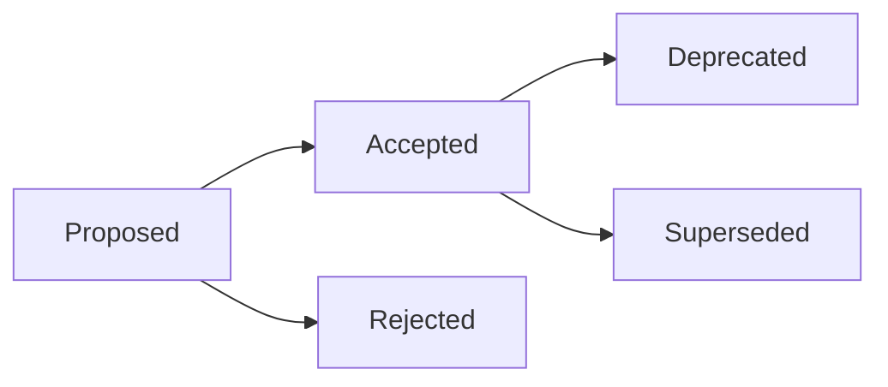

# ADR-[XXX]: [Título da Decisão Arquitetural]

**Data:** [YYYY-MM-DD]  
**Status:** [Proposed | Accepted | Deprecated | Superseded]  
**Deciders:** [Lista de pessoas envolvidas]  
**Tags:** [performance, security, database, api, etc.]

## Status



**Status Atual:** Proposed

## Contexto

[Descreva o contexto e as forças em jogo. Qual problema estamos tentando resolver? Quais são as restrições? Por que precisamos tomar esta decisão agora?]

### Problema
- [Descrição clara do problema]
- [Impacto atual do problema]
- [Por que precisa ser resolvido agora]

### Requisitos
- [Requisito técnico 1]
- [Requisito de negócio 1]
- [Restrição 1]

### Premissas
- [Premissa sobre o ambiente]
- [Premissa sobre recursos]
- [Premissa sobre timeline]

## Decisão

[Descreva a decisão que está sendo proposta ou foi tomada. Seja específico e claro.]

### Solução Escolhida
[Descrição detalhada da solução]

### Implementação
```
[Exemplo de código ou diagrama de arquitetura]
```

## Alternativas Consideradas

### Opção 1: [Nome da Alternativa]
- **Prós:**
  - [Vantagem 1]
  - [Vantagem 2]
- **Contras:**
  - [Desvantagem 1]
  - [Desvantagem 2]
- **Por que foi rejeitada:** [Razão]

### Opção 2: [Nome da Alternativa]
- **Prós:**
  - [Vantagem 1]
  - [Vantagem 2]
- **Contras:**
  - [Desvantagem 1]
  - [Desvantagem 2]
- **Por que foi rejeitada:** [Razão]

### Opção 3: Status Quo (Não fazer nada)
- **Prós:**
  - Sem custo de mudança
  - Sem risco de implementação
- **Contras:**
  - Problema continua
  - Débito técnico aumenta
- **Por que foi rejeitada:** [Razão]

## Consequências

### Positivas
- ✅ [Benefício esperado 1]
- ✅ [Benefício esperado 2]
- ✅ [Benefício esperado 3]

### Negativas
- ❌ [Trade-off aceito 1]
- ❌ [Trade-off aceito 2]
- ❌ [Risco assumido 1]

### Neutras
- ➖ [Mudança que não é boa nem ruim]
- ➖ [Impacto lateral]

## Validação

### Critérios de Sucesso
- [ ] [Como saberemos que funcionou 1]
- [ ] [Como saberemos que funcionou 2]
- [ ] [Métrica de sucesso]

### Plano de Rollback
[Como reverter se a decisão se provar incorreta]

## Implementação

### Timeline
- **Fase 1:** [O quê e quando]
- **Fase 2:** [O quê e quando]
- **Fase 3:** [O quê e quando]

### Responsáveis
- **Tech Lead:** [Nome]
- **Implementação:** [Time/Pessoa]
- **Review:** [Time/Pessoa]

## Referências

- [Link para documentação relevante]
- [Link para discussão original]
- [Link para POC ou spike]
- [Link para benchmarks]

## Notas

[Qualquer informação adicional, contexto histórico, ou considerações futuras]

---

## Registro de Mudanças

| Data | Autor | Mudança |
|------|-------|---------|
| [YYYY-MM-DD] | [Nome] | Documento criado |
| [YYYY-MM-DD] | [Nome] | Status alterado para Accepted |