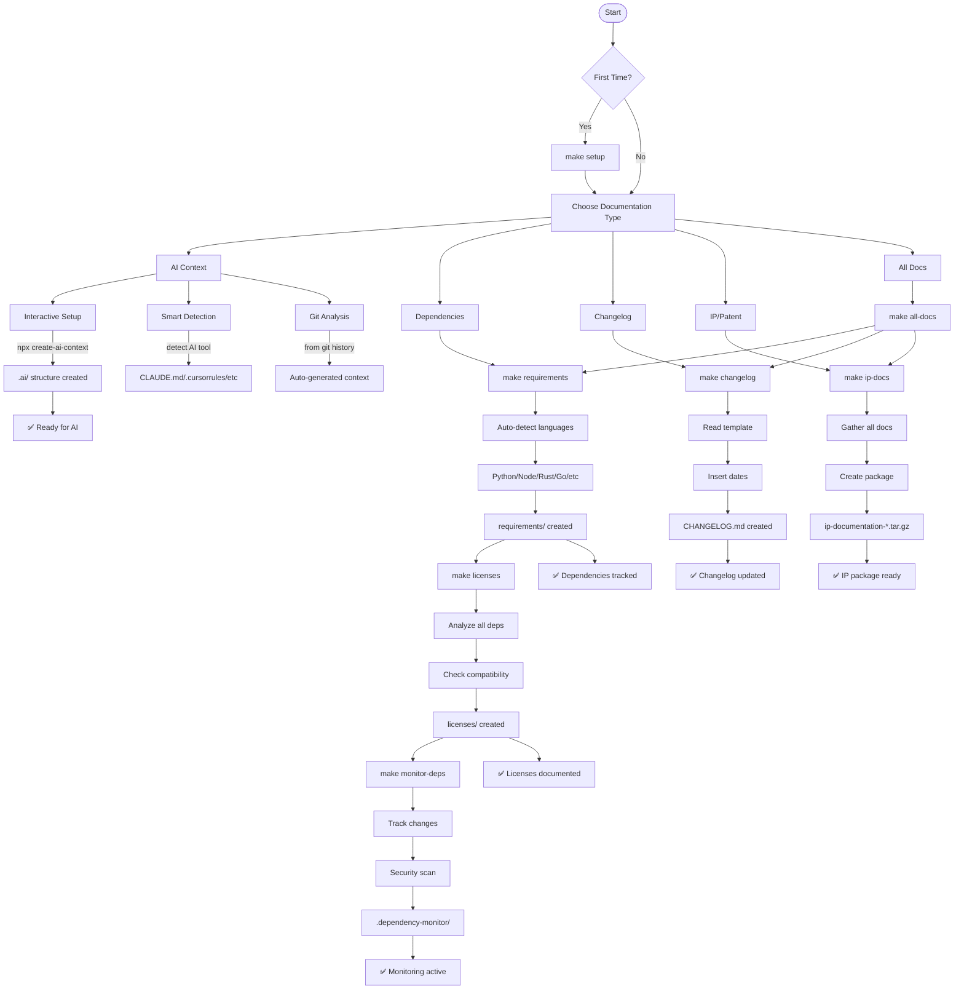

# Documentation Flow Guide

## 🎯 Overview

This repository provides multiple documentation models and automated tools for different needs:

1. **AI-Assisted Development** - Help AI understand your code
2. **Dependency Management** - Track requirements and licenses
3. **Change Tracking** - Dynamic changelog generation
4. **IP Protection** - Documentation for patents/legal

## 📊 Complete Documentation Flow



## 🚀 Quick Start by Use Case

### For AI-Assisted Development

```bash
# Option 1: Interactive (answers questions)
npx create-ai-context

# Option 2: Auto-detect your AI tool
bash .ai/scripts/smart-ai-detector.sh

# Option 3: From git history
bash .ai/scripts/auto-generate-from-git.sh

# Option 4: Minimal 3-file setup
bash .ai/scripts/minimal-setup.sh
```

### For Dependency Tracking

```bash
# Complete dependency documentation
make requirements  # Detect & document all dependencies
make licenses     # Analyze all licenses
make monitor-deps # Set up monitoring
```

### For Change Management

```bash
# Generate dynamic changelog
make changelog
```

### For IP/Patent Filing

```bash
# Generate complete IP package
make ip-docs
# Creates: .ai/ip-documentation-YYYYMMDD.tar.gz
```

### For Everything

```bash
# Generate all documentation
make all-docs
```

## 📁 Output Structure

```
project/
├── .ai/                          # AI Context
│   ├── 1-QUESTIONS.md           # Project questionnaire
│   ├── 2-README.md              # AI-focused overview
│   ├── AI_ASSISTANT.md          # Generic AI config
│   ├── CLAUDE.md                # Claude-specific
│   ├── scripts/                 # Automation tools
│   └── ip-documentation-*.tar.gz # IP package
│
├── requirements/                 # Dependencies
│   ├── base.txt                 # Python requirements
│   ├── npm-dependencies.json    # Node.js deps
│   ├── cargo-tree.txt           # Rust deps
│   ├── go-dependencies.txt      # Go modules
│   └── SBOM.json                # Software BOM
│
├── licenses/                     # License Analysis
│   ├── LICENSE-SUMMARY.md       # Quick overview
│   ├── DETAILED-LICENSE-REPORT.md # For legal
│   ├── python-licenses.json     # Per-language
│   ├── nodejs-licenses.json     # reports
│   └── texts/                   # Full license texts
│
├── .dependency-monitor/          # Monitoring
│   ├── alerts.log               # Change alerts
│   ├── dependency-report.md     # Status report
│   └── baseline.json            # Comparison base
│
├── CHANGELOG.md                  # Version history
└── .cursorrules                  # Cursor AI config
    .github/copilot-instructions.md # Copilot config
```

## 🎯 Model-Specific Configurations

### AI Assistant Models

| Model | Config File | Location | Auto-Detection |
|-------|------------|----------|----------------|
| Claude (Anthropic) | CLAUDE.md | .ai/ | Via usage history |
| GitHub Copilot | copilot-instructions.md | .github/ | Via .github/ folder |
| Cursor | .cursorrules | project root | Via .cursorrules file |
| ChatGPT/OpenAI | OPENAI_CODEX.md | .ai/ | Manual selection |
| Gemini (Google) | GEMINI_CONTEXT.md | .ai/ | Manual selection |
| Generic/Other | AI_ASSISTANT.md | .ai/ | Default fallback |

### Language Models

| Language | Requirements | License Tool | Package Manager |
|----------|--------------|--------------|-----------------|
| Python | requirements.txt, Pipfile | pip-licenses | pip, pipenv |
| Node.js | package.json | license-checker | npm, yarn |
| Rust | Cargo.toml | cargo-license | cargo |
| Go | go.mod | go-licenses | go mod |
| Ruby | Gemfile | bundle-licenses | bundler |
| PHP | composer.json | composer licenses | composer |
| Java | pom.xml, build.gradle | license-maven-plugin | maven, gradle |

## 🔄 Workflow Examples

### New Project Setup
```bash
make setup          # Initial setup
make all-docs       # Generate everything
git add .ai/        # Commit AI context
```

### Before Release
```bash
make monitor-deps   # Check for changes
make licenses       # Update license docs
make changelog      # Update version history
```

### For Legal/Patent
```bash
make ip-docs        # Generate IP package
# Send .ai/ip-documentation-*.tar.gz to legal team
```

### CI/CD Integration
```yaml
# .github/workflows/docs.yml
on: [push, pull_request]
jobs:
  docs:
    steps:
      - run: make setup
      - run: make monitor-deps
      - run: make licenses
```

## 📈 Decision Tree

```
Need documentation?
│
├─ For AI coding assistance?
│  ├─ Know your AI tool? → Run smart-ai-detector.sh
│  └─ Want universal? → Use minimal-setup.sh
│
├─ For dependency tracking?
│  ├─ First time? → make requirements
│  ├─ Check licenses? → make licenses
│  └─ Monitor changes? → make monitor-deps
│
├─ For version history?
│  └─ make changelog
│
├─ For IP/Patent filing?
│  └─ make ip-docs
│
└─ Want everything?
   └─ make all-docs
```

## 🚦 Status Indicators

- 🟢 **Ready**: File exists and is current
- 🟡 **Needs Update**: File exists but outdated
- 🔴 **Missing**: Required file not found
- ⚫ **Not Applicable**: Not needed for your project

## 💡 Pro Tips

1. **Start Small**: Use `make setup` then add as needed
2. **Automate**: Add to git hooks or CI/CD
3. **Stay Current**: Run `make monitor-deps` weekly
4. **Document Early**: AI context helps from day 1
5. **Legal Ready**: Keep `make ip-docs` output archived