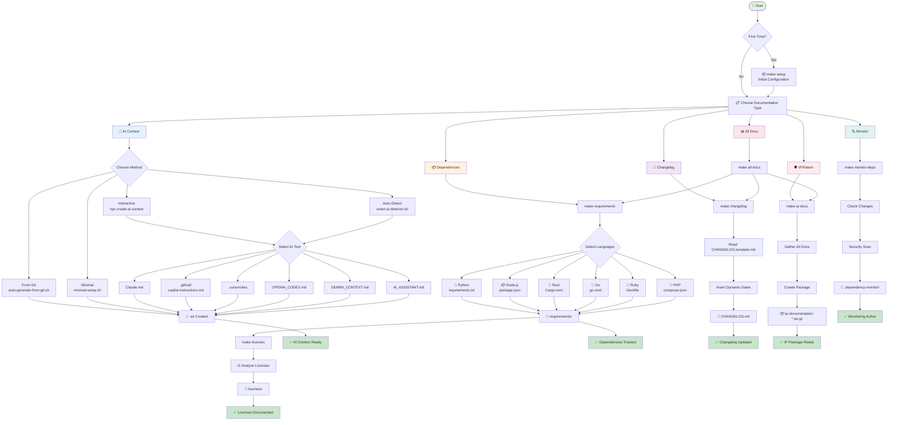

# Documentation Flow Diagram

## Interactive Mermaid Diagram



## Simplified ASCII Flow

```
                    ┌─────────────┐
                    │   START     │
                    └──────┬──────┘
                           │
                    ┌──────▼──────┐
                    │ First Time? │
                    └──┬───────┬──┘
                       │       │
                    NO │       │ YES
                       │       │
                       │  ┌────▼─────┐
                       │  │   make   │
                       │  │  setup   │
                       │  └────┬─────┘
                       │       │
                    ┌──▼───────▼──┐
                    │   Choose:   │
                    └──────┬──────┘
                           │
        ┌──────────────────┼──────────────────┐
        │                  │                  │
   ┌────▼────┐      ┌──────▼──────┐    ┌─────▼─────┐
   │   AI    │      │ Dependencies │    │ IP/Patent │
   │ Context │      │  & Licenses  │    │   Docs    │
   └────┬────┘      └──────┬──────┘    └─────┬─────┘
        │                  │                  │
        ▼                  ▼                  ▼
   Select Tool:       make requirements   make ip-docs
   • Claude          make licenses
   • Copilot         make monitor-deps
   • Cursor
   • ChatGPT
   • Gemini
```

## Quick Reference Card

### 🎯 By Goal

| I want to... | Run this... | Get this... |
|--------------|-------------|-------------|
| Help AI understand my code | `npx create-ai-context` | `.ai/` folder with context |
| Track what I'm using | `make requirements` | `requirements/` folder |
| Check license compliance | `make licenses` | `licenses/` folder with analysis |
| Monitor for changes | `make monitor-deps` | Alerts and reports |
| Update version history | `make changelog` | Updated CHANGELOG.md |
| Prepare for patent filing | `make ip-docs` | Complete IP package |
| Do everything at once | `make all-docs` | All documentation |

### 🤖 By AI Tool

| Using... | Creates... | Where... |
|----------|------------|----------|
| Claude | CLAUDE.md | `.ai/` |
| GitHub Copilot | copilot-instructions.md | `.github/` |
| Cursor | .cursorrules | Project root |
| ChatGPT/GPT-4 | OPENAI_CODEX.md | `.ai/` |
| Gemini | GEMINI_CONTEXT.md | `.ai/` |
| Something else | AI_ASSISTANT.md | `.ai/` |

### 💻 By Language

| Language | Looks for... | Analyzes with... |
|----------|--------------|------------------|
| Python | requirements.txt, Pipfile, setup.py | pip-licenses |
| Node.js | package.json, package-lock.json | license-checker |
| Rust | Cargo.toml, Cargo.lock | cargo-license |
| Go | go.mod, go.sum | go-licenses |
| Ruby | Gemfile, Gemfile.lock | bundle-licenses |
| PHP | composer.json, composer.lock | composer licenses |
| Java | pom.xml, build.gradle | maven/gradle plugins |