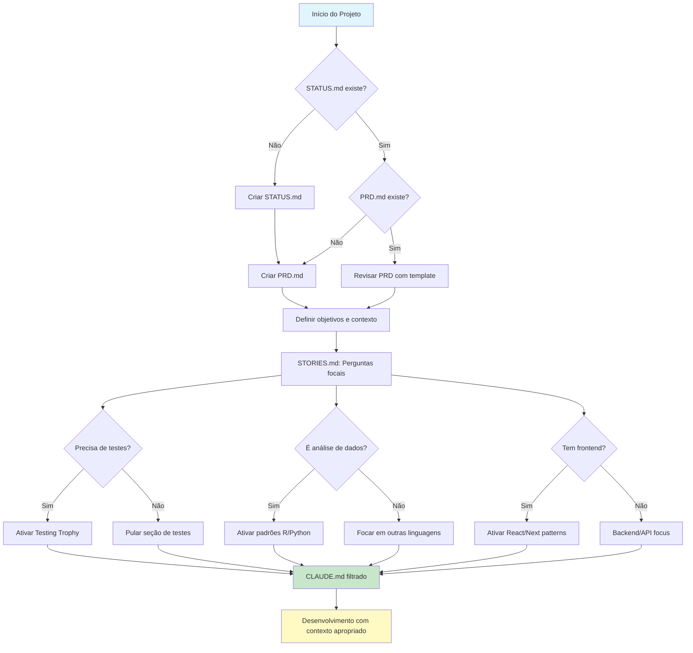
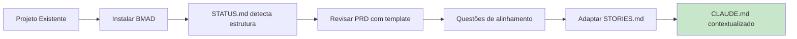
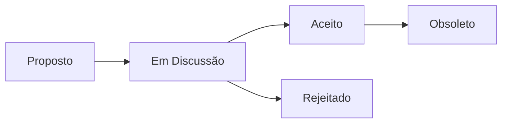
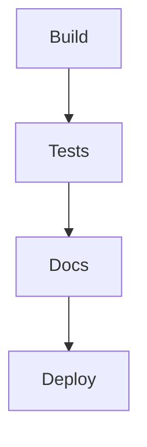

# Claude.md - Guia Global para Interação com Claude.code

> **Versão:** 2.3.0 | **Atualizado:** 2025-01-23 | **Mantenedor:** Bragatte  
> **Método Base:** [BMAD Method](https://github.com/bmadcode/BMAD-METHOD) (recomendado, mas adaptável)  
> **Propósito:** Maximizar qualidade e eficiência na colaboração humano-IA através de práticas estruturadas  
> **📚 Detalhes:** Ver [CLAUDE-EXTENDED.md](./CLAUDE-EXTENDED.md) | **📋 Histórico:** Ver [CHANGELOG.md](./CHANGELOG.md)

---

## 🚀 Quick Start

### Setup Inicial (faça uma vez):
```bash
# Instalar BMAD Method
pnpm dlx bmad-method@latest install --full --ide cursor

# Ativar os 4 MCPs essenciais no seu claude.json:
# - context7: Docs sempre atualizados
# - fetch: Requisições web inteligentes  
# - sequential-thinking: Raciocínio estruturado
# - serena: Gestão inteligente do Claude
```

### Fluxo de Trabalho:
1. **Check STATUS.md** → Existe? Estado dos docs?
2. **Check PRD.md** → Objetivos claros? Contexto definido?
3. **Check STORIES.md** → Jornadas mapeadas? Decisões de filtro?
4. **Desenvolver** → Com contexto apropriado ativado

💡 **Dica:** Use "use context7" em prompts para docs atualizados

---

## 📖 Navegação para Detalhes

Conteúdo expandido em **[CLAUDE-EXTENDED.md](./CLAUDE-EXTENDED.md)**:
- [Filosofia de Simplicidade](./CLAUDE-EXTENDED.md#filosofia-simplicidade) - Antipadrões e checklist
- [Context Engineering](./CLAUDE-EXTENDED.md#context-engineering) - Estratégias avançadas
- [Testing Trophy](./CLAUDE-EXTENDED.md#testing-trophy) - Implementação prática
- [Padrões de Código](./CLAUDE-EXTENDED.md#padroes-codigo) - Exemplos por linguagem
- [Templates de Documentos](./CLAUDE-EXTENDED.md#documentos-projeto) - PRD, STORIES, STATUS
- [Versionamento Semântico](./CLAUDE-EXTENDED.md#versionamento-semantico) - Estratégia simplificada
- [Comandos Slash](./CLAUDE-EXTENDED.md#comandos-slash) - Criação e uso
- [Cross-Platform](./CLAUDE-EXTENDED.md#cross-platform) - Estratégias por linguagem

---

## 🔄 Fluxo de Auto-Modulação do Sistema



> **💡 Princípio Central:** Este documento contém TODAS as possíveis diretrizes, mas apenas o subconjunto relevante é aplicado baseado nas decisões tomadas no PRD.md e STORIES.md. É um sistema adaptativo, não monolítico.

---

## 📌 Nota sobre Nomenclatura

> **IMPORTANTE:** Este arquivo deve sempre ser nomeado `CLAUDE.md` (em MAIÚSCULAS), seguindo a convenção de documentação principal como README.md, LICENSE, CHANGELOG.md. Isso garante:
> - ✅ Consistência visual e organizacional
> - ✅ Compatibilidade cross-platform (evita conflitos em sistemas case-insensitive)
> - ✅ Padronização para ferramentas e automação
> - ⚠️ Evite criar variações como `claude.md` ou `Claude.md`

---

## 🎯 Princípios Fundamentais

1. **STATUS.md primeiro** - SEMPRE cheque STATUS.md antes de qualquer ação
2. **Questione e valide** - Sempre analise premissas antes de implementar
3. **Documentação é código** - Rastreabilidade total com `## razão:`
4. **Metodologia flexível** - BMAD recomendado, mas adaptável a Scrum, Kanban, etc.
5. **Why-What-How** - Estrutura padrão para explicações
6. **Parceria intelectual** - Priorize verdade, clareza e criticidade
7. **Simplicidade é sofisticação** - A elegância está em tornar o complexo simples
8. **Context Engineering > Prompt Engineering** - Forneça contexto completo, não apenas prompts inteligentes

---

## 🎨 Filosofia de Simplicidade e Elegância

> "Simplicidade é a sofisticação suprema" - *Leonardo da Vinci*  
> "A perfeição é atingida não quando não há mais nada para adicionar, mas quando não há mais nada para remover" - *Antoine de Saint-Exupéry*

### Princípios de Design Simples:

1. **KISS (Keep It Simple, Stupid)**
   - Sempre prefira a solução mais simples que resolve o problema
   - Um júnior deve entender a solução em 5 minutos
   - Complexidade deve ser justificada por necessidade real

2. **Checklist de Simplicidade:**
   - [ ] Um desenvolvedor júnior entenderia isso?
   - [ ] Posso explicar em uma frase?
   - [ ] Existe uma biblioteca que já faz isso bem?
   - [ ] A solução é testável sem setup complexo?

---

## 🎭 Context Engineering vs Prompt Engineering

> "Context Engineering is 10x better than prompt engineering and 100x better than vibe coding"

### A Diferença Fundamental:
- **Prompt Engineering:** Como você formula a pergunta (como dar um sticky note)
- **Context Engineering:** Sistema completo de contexto (como escrever um roteiro completo)

### Por que Context Engineering vence:
1. **Reduz falhas da IA** - A maioria dos erros são de contexto, não do modelo
2. **Garante consistência** - IA segue padrões e convenções do projeto
3. **Permite complexidade** - IA consegue implementações multi-step
4. **Auto-correção** - Loops de validação permitem correção automática

---

## 🔧 Configuração e Metodologia

### Metodologia Padrão (Recomendada)
Por padrão, recomendamos o **BMAD Method** para estruturação de projetos:

```bash
# Instalação rápida do BMAD (usando pnpm quando disponível)
pnpm dlx bmad-method@latest install --full --ide cursor
# ou com npx se pnpm não estiver disponível
npx bmad-method@latest install --full --ide cursor
```

**Usando outra metodologia?** Sem problemas! Adapte as diretrizes para Scrum, Kanban, XP ou sua metodologia preferida.

### 🔌 MCP (Model Context Protocol) - OBRIGATÓRIO

#### ⚠️ Os 4 MCPs devem estar SEMPRE ativos:

1. **Context7** - Documentação sempre atualizada
   - ✅ Elimina código baseado em dados de treinamento antigos
   - ✅ Previne APIs alucinadas
   - ✅ Uso: adicione `use context7` ao prompt

2. **fetch** - Requisições web inteligentes
   - ✅ Busca e analisa conteúdo web
   - ✅ Processa HTML em markdown

3. **sequential-thinking** - Raciocínio estruturado
   - ✅ Decomposição de problemas complexos
   - ✅ Auto-correção e revisão de raciocínio

4. **serena** - Gestão inteligente do Claude
   - ✅ Otimiza uso de contexto e memória
   - ✅ Melhora qualidade das respostas
   - ✅ Gestão de sessões longas

#### Configuração no claude.json:
```json
{
  "mcpServers": {
    "context7": { ... },
    "fetch": { ... },
    "sequential-thinking": { ... },
    "serena": { ... }
  }
}
```

💡 **Verificação:** Se não vir `mcp__` nas ferramentas, os MCPs não estão ativos!

### 🔨 Comandos Slash Customizados
Potencialize o Context Engineering com comandos específicos em `.claude/commands/`:
- `/generate-prp` - Gera PRPs completos a partir de requisitos
- `/execute-prp` - Executa implementação com validação automática
- `/validate-patterns` - Verifica aderência aos padrões do projeto


---

## 🎯 Sistema de Auto-Modulação Contextual

### Como o STORIES.md Filtra Este Documento

O CLAUDE.md não é aplicado monoliticamente. Baseado nas respostas às perguntas focais do STORIES.md, apenas as seções relevantes são ativadas:

| Pergunta no STORIES | Resposta | Seções Ativadas | Seções Ignoradas |
|-------------------|----------|-----------------|------------------|
| Precisa de testes? | Sim | Testing Trophy, Padrões de Teste | - |
| Precisa de testes? | Não | - | Testing Trophy, /tests |
| É análise de dados? | Sim | Padrões Python/R, Comentários ## | React, Frontend |
| Tem interface visual? | Sim | React/Next, Artifacts HTML | Backend puro |
| Processa dados genômicos? | Sim | Bioinformática patterns | Web patterns |

### Exemplo Prático: Análise Epidemiológica

```markdown
## STORIES.md (exemplo)
**Q: Tipo de projeto?** A: Análise de dados epidemiológicos
**Q: Precisa de testes?** A: Apenas para funções estatísticas críticas  
**Q: Interface?** A: Dashboard Shiny simples
**Q: Deploy?** A: Local/RStudio Server

## Resultado: CLAUDE.md filtrado aplica:
✅ Padrões R com comentários ##
✅ Estrutura de análise epidemiológica
✅ Testes focados em cálculos estatísticos
❌ React/Next.js patterns (ignorado)
❌ Kubernetes deploy (ignorado)
❌ E2E testing (ignorado)
```

### Projetos Estruturados: Processo de Revisão

Quando aplicado a projetos existentes:



---

## 🚦 Protocolo de Início de Sessão (OBRIGATÓRIO)

### Ao iniciar QUALQUER trabalho em projeto:

1. **Verificar STATUS.md**
   ```
   Claude deve sempre:
   1. Procurar por STATUS.md no projeto
   2. Se não existir: "Não encontrei STATUS.md. Vamos criar um para rastrear o projeto?"
   3. Se existir: Checar tabela de documentação
   4. Se algum doc estiver ⚠️ ou 🔴: Alertar IMEDIATAMENTE
   5. Verificar se PRD existe e está alinhado
   ```

2. **Verificar metodologia do projeto**
   - Projeto usa BMAD? Use os templates oficiais
   - Outra metodologia? Adapte as práticas conforme necessário

3. **Exemplo de primeira interação:**
```
Claude: "Verificando STATUS.md... Encontrei 2 documentos que precisam atenção:
- CLAUDE.md está vencido há 3 dias ⚠️
- TESTING.md está desatualizado há 15 dias 🔴
- PRD.md existe e define projeto de análise genômica

Baseado no PRD, vejo que é um projeto de bioinformática. 
Sugiro revisar o STORIES.md para confirmar quais módulos do CLAUDE.md aplicar.
Por onde começamos?"
```

---

## 📋 Documentos Essenciais do Projeto

### 🔴 Obrigatórios (SEMPRE criar e manter):

1. **PRD.md (Product Requirements Document)**
   - Inicie SEMPRE com PRD claro
   - Objetivos, métricas, premissas, perguntas fundamentais
   - Critérios de aceitação e contexto completo
   - **Em bioinformática**: Incluir pipeline esperado, formatos de dados
   
2. **STORIES.md**
   - Jornada do usuário como guia central
   - **Perguntas focais na entrega de valor ao usuário**
   - Critérios de aceitação claros + PRPs para implementação
   - **Decisões que filtram CLAUDE.md**

3. **README.md** - Visão geral, propósito, instruções
4. **CHANGELOG.md** - Histórico semver (major.minor.patch)
5. **STATUS.md** - Progresso atual + tabela de atualização dos docs
6. **CLAUDE.md** - Este documento, revisado mensalmente
7. **TESTING.md** - Estratégias de teste + pasta `/tests`

### 🟣 Críticos para Context Engineering:

8. **examples/** - Padrões de código do projeto (FUNDAMENTAL)
   - Estrutura de módulos e imports
   - Padrões de teste e mocking
   - Integrações e fluxos típicos
   - Anti-padrões a evitar
   - **Bioinformática**: Pipelines de análise, validação de dados

### 🟡 Desejáveis (projetos complexos):

9. **ROADMAP.md** - Planejamento e marcos futuros
10. **ARCHITECTURE.md / ADRs** - Decisões técnicas críticas
11. **SECURITY.md** - Práticas de segurança + `.env.example`
12. **DATA_DICTIONARY.md** - Schemas e glossário
13. **PROMPTS.md** - Biblioteca de prompts bem-sucedidos
14. **AI_CONTEXT.md** - Contexto para agentes/IA
15. **DEBUGGING.md** - Logging e troubleshooting
16. **MAINTENANCE.md** - Rotinas e responsáveis


---

## 🔄 Fluxos de Status Visuais

### ADRs - Fluxo Obrigatório
Todo ADR deve ter diagrama Mermaid mostrando estado atual:



### README - Fluxo Opcional
Adicione indicadores visuais quando relevante:



**Princípio 80/20:**
- Foque no estado atual, não no histórico completo
- Use cores/emojis com moderação (🟢🟡🔴)
- Sincronize com STATUS.md quando existir
- Mantenha simples - se precisar explicar, está complexo demais

---

## 🎯 Captura de Prompts e Histórias

### STORIES.md é fundamental para:
- **Capturar jornadas do usuário** que guiam desenvolvimento
- **Registrar perguntas focais** sobre entrega de valor
- **Manter contexto** de decisões orientadas ao usuário
- **Integrar PRPs** para implementação técnica eficiente
- **Filtrar seções aplicáveis** do CLAUDE.md

### Evolução: PRPs (Product Requirements Prompts)
PRPs são specs evoluídas para Context Engineering:
- **Contexto completo** da implementação
- **Gates de validação** em cada etapa
- **Padrões de erro** e recuperação
- **Critérios mensuráveis** de sucesso

### Formato simplificado:
```markdown
## [YYYY-MM-DD] - [Categoria]: [Título]
**Contexto:** [Situação que gerou a necessidade]
**Prompt:** [O que funcionou]
**Resultado:** [O que foi gerado/alcançado]
**Métricas:** [Se aplicável: tempo economizado, acurácia, etc.]
**Decisões CLAUDE.md:** [Quais seções foram aplicadas/ignoradas]
```

### Gatilho automático:
- Adicione `[prompt-saved]` ao commit para salvar automaticamente


---

## 📝 Padrões de Código e Comentários

### Padrões de Código por Linguagem:

#### Python - Padrões Modernos:
- Use `##` para TODA linha de código significativa
- **UV para ambientes virtuais** (não pip/conda)
- **Polars > pandas** para manipulação de dados
- Imports devem ter comentário explicando o uso
- Declare encoding UTF-8 explicitamente
- Use pathlib.Path para caminhos de arquivo
- Type hints sempre que possível

#### R - Análise Estatística:
- Use `##` para comentários linha a linha
- Tidyverse para manipulação moderna
- Encoding UTF-8 explícito
- here::here() para caminhos relativos


#### Rust - Performance e Segurança:
- Use `//` para comentários de linha, `///` para doc comments
- **Tipagem explícita sempre** para melhor diagnóstico de erros
- **Gestão de memória explícita** com lifetimes quando necessário
- Error handling explícito com Result<T, E> customizado
- UTF-8 encoding sempre especificado
- Validação de entrada antes de processamento
- Zero-cost abstractions quando possível
- Prefer `&str` sobre `String` quando não precisar ownership


#### React com TypeScript - Epic Stack Patterns:
- **Epic Stack patterns** ([epicweb.dev](https://github.com/epicweb-dev/full-stack-foundations))
- Full-stack TypeScript com Remix
- Interfaces tipadas para props e state
- Hooks modernos (useState, useEffect, useMemo)
- Acessibilidade com aria-labels e roles
- Performance com memoização quando necessário
- Componentes funcionais, não classes
- Database-backed authentication
- Testing com Vitest e Testing Library
- Tailwind CSS para styling
- Conform para forms type-safe
- Zod para validação de schemas
- Prisma para ORM type-safe


### Regras gerais:
- `##` para explicações de linha/função em Python/R
- `//` para comentários em Rust (use `///` para doc comments)
- TypeScript: Use tipos explícitos e interfaces
- Imports no início com explicação
- Encoding UTF-8 explícito
- Use `pathlib.Path` (Python) ou `std::path::Path` (Rust)
- Datas em formato ISO (YYYY-MM-DD)
- **Bioinformática**: Documentar formatos esperados (FASTA, VCF, etc.)


---

## 🚫 Nunca Faça

1. **Implementar sem validar ADRs** - Respeite decisões documentadas
2. **Código sem comentários** - Em R/Python, SEMPRE comente
3. **Assumir ambiente/encoding** - Sempre confirme especificações
4. **Criar testes não solicitados** - Apenas quando pedido no STORIES
5. **Implementar sem documentação** - PRD e STORIES devem existir primeiro
6. **Deploy sem limpar cache** - Sempre inicie limpo
7. **Citar metodologia em commits** - Foque nas mudanças do projeto
8. **Usar tecnologias defasadas** - Sempre versões modernas
9. **Hardcode valores/versões** - Seja agnóstico
10. **ADR sem fluxo de status** - Todo ADR precisa Mermaid
11. **Testes com data-testid** - Force acessibilidade com queries semânticas
12. **Testar implementação** - Foque em comportamento observável do usuário
13. **Over-mocking** - Mock apenas dependências externas (APIs, DBs)
14. **Aplicar seções irrelevantes** - Se STORIES disse "não precisa", não faça

---

## 🚀 Mantenha-se Moderno

### Versões Recomendadas (sempre verificar sites oficiais):
- **Python:** 3.13+ ([python.org](https://python.org)) - Análises e pipelines
  - **UV** para gerenciamento de ambientes ([astral.sh/uv](https://astral.sh/uv))
  - **Polars** > pandas para processamento de dados
- **R:** 4.3+ com tidyverse atualizado ([r-project.org](https://r-project.org)) - Estatística e visualização
- **Rust:** 1.78+ ([rust-lang.org](https://rust-lang.org)) - Performance crítica e ferramentas CLI
- **TypeScript:** 5.5+ ([typescriptlang.org](https://typescriptlang.org)) - Type safety no frontend
- **React:** 18.3+ com hooks modernos - Interfaces interativas
  - **Remix** para full-stack React apps
  - **Epic Stack** como referência de arquitetura
- **D3.js:** v7+ ([d3js.org](https://d3js.org)) - Visualizações customizadas
- **Package Manager:** pnpm > yarn > npm ([pnpm.io](https://pnpm.io))
- **Java:** 21 LTS (quando necessário para ferramentas específicas)

### Red Flags de Código Legado:
🚩 Bibliotecas sem updates há 2+ anos  
🚩 Callbacks aninhados (use async/await)  
🚩 jQuery em projetos novos  
🚩 Python 2.x syntax  
🚩 R sem tidyverse em análises modernas
🚩 React class components em código novo
🚩 JavaScript puro quando TypeScript é viável
🚩 Visualizações estáticas quando interatividade agregaria valor


---

## ✅ Sempre Faça

### 1. Use artifacts para:
- Código > 20 linhas
- Documentos estruturados
- Análises complexas
- Relatórios e visualizações
- **Pipelines de bioinformática**

### 2. Código Agnóstico:
- Detecte ambiente em runtime (platform, sys)
- Nunca hardcode paths ou versões
- Use variáveis de ambiente quando apropriado
- Paths sempre com pathlib.Path


### 3. Estrutura Why-What-How:
- **Why:** Por que é importante?
- **What:** O que exatamente fazer?
- **How:** Como implementar?

### 4. Testes focados em comportamento:
- **Testing Trophy:** Priorize testes de integração sobre unit tests
- **Acessibilidade primeiro:** Nunca use `data-testid` - force componentes acessíveis
- **Comportamento > Implementação:** Teste fluxos de usuário, não detalhes internos
- **Queries semânticas:** Use `getByRole`, `getByLabelText`, `getByText`
- **Equilíbrio contextual:** Ajuste tipos de teste conforme complexidade do projeto
- **Bioinformática:** Teste validação de formatos, não parsing interno

---

## 🌐 Compatibilidade Cross-Platform

- Sempre use pathlib.Path (Python) ou std::path::Path (Rust)
- Evite separadores de path hardcoded (/, \)
- Detecte OS com platform.system() quando necessário
- UTF-8 como encoding padrão sempre
- Considere diferenças de line endings (LF vs CRLF)


---

## 🔄 Protocolo para Projetos Existentes

Ao adicionar CLAUDE.md a projeto estruturado:

1. **Análise inicial via STATUS.md**
   ```
   STATUS.md detecta:
   - Estrutura existente do projeto
   - Convenções de código em uso
   - Stack tecnológica atual
   ```

2. **Revisão e alinhamento do PRD**
   - Mapear objetivos existentes vs. template BMAD
   - Identificar gaps e overlaps
   - Criar PRD unificado

3. **STORIES.md adaptativo**
   ```markdown
   ## Perguntas de Alinhamento para Projeto Existente
   - Manter convenções atuais? [S/N]
   - Migrar gradualmente para novos padrões? [S/N]
   - Quais decisões arquiteturais são imutáveis?
   - Onde podemos introduzir melhorias?
   ```

4. **Criar ADAPTATIONS.md se necessário**
   - Documenta desvios necessários do CLAUDE.md padrão
   - Justifica cada adaptação
   - Define cronograma de convergência (se aplicável)

5. **ADR para decisões de integração**
   ```markdown
   # ADR-XXX: Integração CLAUDE.md em Projeto Legacy
   
   ## Status
   Aceito
   
   ## Contexto
   Projeto existente com convenções estabelecidas...
   
   ## Decisão
   Aplicar CLAUDE.md com as seguintes adaptações...
   
   ## Consequências
   - Positivas: Padronização gradual, melhor documentação
   - Negativas: Período de transição com dois padrões
   ```

---

## 📝 Padrões de Commits

### Use Conventional Commits:
```
feat: adiciona análise de tendências sazonais
fix: corrige cálculo de taxa de incidência
docs: atualiza README com exemplos de uso
test: adiciona testes para validação de dados
refactor: simplifica lógica de processamento
```

**Foque no PROJETO**, não na metodologia ou ferramentas internas.

---

## 💡 Maximizando Valor com Claude

### Sempre comece com:
- "Vamos checar o STATUS.md primeiro?"
- "Qual a versão atual do projeto?"
- "Que metodologia o projeto usa?"
- "O PRD define que tipo de análise/sistema?"

### Seja específico e contextual:
- ❌ "Análise de dados"
- ✅ "EDA focada em sazonalidade e outliers para dados COVID-19"
- ✅✅ "Análise filogenética de sequências SARS-CoV-2 com focus em variantes de preocupação"

### Forneça contexto completo:
- Tamanho dos dados e formato
- Ambiente (Mac, Windows, WSL2)
- Restrições e requisitos
- Referência ao PRD/STORIES quando existir

---

## ✅ Checklist de Qualidade

### Para código:
- [ ] Comentários apropriados (## em R/Python)
- [ ] Imports organizados
- [ ] Encoding UTF-8 declarado
- [ ] Paths com pathlib.Path
- [ ] Práticas modernas
- [ ] Sem hardcode
- [ ] **Bioinformática**: Validação de formatos de entrada

### Para documentação:
- [ ] STATUS.md atualizado
- [ ] PRD claro com objetivos
- [ ] STORIES com jornadas de usuário
- [ ] CHANGELOG versionado
- [ ] ADRs com fluxo Mermaid
- [ ] **Decisões de modulação** documentadas

### Para deploy:
- [ ] Cache limpo
- [ ] Variáveis em .env
- [ ] Tag no repositório
- [ ] Docs atualizados
- [ ] Tests passando
- [ ] **Dados sensíveis**: Conformidade com LGPD/HIPAA

---

## 🔗 Referências Essenciais

- **Exemplos e Detalhes:** [CLAUDE-EXTENDED.md](./CLAUDE-EXTENDED.md)
- **BMAD Method:** [github.com/bmadcode/BMAD-METHOD](https://github.com/bmadcode/BMAD-METHOD)
- **Context7 para exemplos:** Adicione "use context7" aos prompts

---

> **Evolução contínua:** Este documento deve ser revisado mensalmente ou a cada release major/minor. Para casos específicos, exemplos detalhados e troubleshooting, consulte [CLAUDE-EXTENDED.md](./CLAUDE-EXTENDED.md)