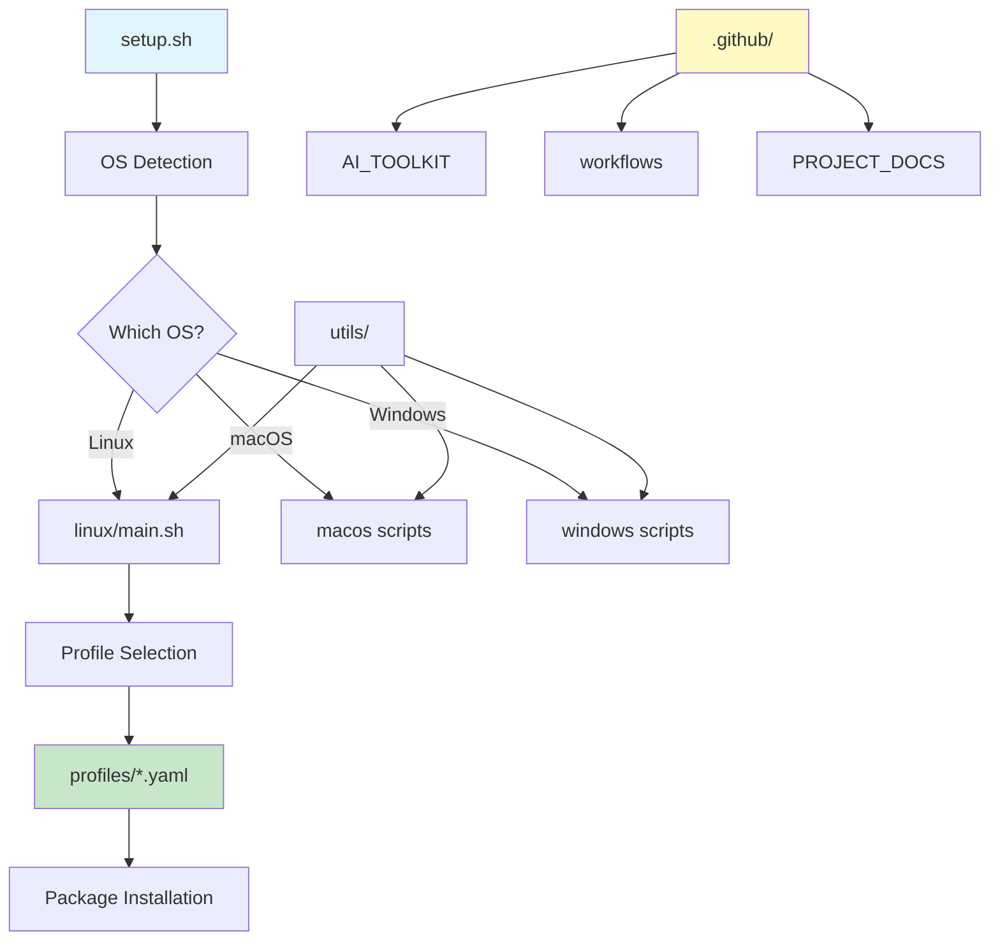

# 🏗️ Architecture Guide - OS Post-Install Scripts

> **Last Updated:** 2025-07-25 | **Version:** 1.0.0 | **Author:** Bragatte, M.A.S  
> **Philosophy:** "Evolution without revolution" - Improve gradually, never break existing functionality

## 📋 Table of Contents

1. [Executive Summary](#executive-summary)
2. [Current Architecture](#current-architecture)
3. [Design Principles](#design-principles)
4. [Directory Structure Guide](#directory-structure-guide)
5. [Where to Put Things](#where-to-put-things)
6. [Anti-Patterns to Avoid](#anti-patterns-to-avoid)
7. [Evolution Strategy](#evolution-strategy)
8. [Migration Roadmap](#migration-roadmap)

---

## 🎯 Executive Summary

This document describes the architectural decisions and structure of the os-postinstall-scripts project. Unlike traditional applications, this is a **collection of installation scripts** with specific requirements:

- **Cross-platform support** (Linux, macOS, Windows)
- **Profile-based installation** (developer, devops, data-scientist, etc.)
- **AI-assisted development** integration
- **Zero-downtime migration** requirements

**Key Insight:** The structure is optimized for script organization, not MVC patterns. Every decision prioritizes practical usage over theoretical purity.

---

## 🏛️ Current Architecture



### Why This Structure?

1. **Historical Evolution:** Started as Ubuntu scripts, grew to support multiple OS
2. **Practical Organization:** Scripts grouped by OS makes sense for installers
3. **Innovation Preservation:** Profiles system is a key differentiator
4. **Modern Additions:** AI tools integration via .github/

---

## 🎨 Design Principles

### 1. **OS-First Organization**
```
✅ linux/install_docker.sh     # Clear context
❌ installers/docker/linux.sh  # Unnecessary nesting
```

### 2. **Profiles as First-Class Citizens**
- YAML-based configuration
- Extensible and composable
- User-friendly selection

### 3. **Shared Code in Utils**
- Common functions extracted
- Source-able bash libraries
- Cross-platform helpers

### 4. **AI Tools Centralized**
- .github/AI_TOOLKIT/ for all AI-related content
- Keeps commits product-focused
- Modern development practices

### 5. **Progressive Enhancement**
- Start with basic scripts
- Add features without breaking
- Document before changing

---

## 📁 Directory Structure Guide

```
os-postinstall-scripts/
├── linux/              # Linux-specific scripts
│   ├── main.sh        # Interactive menu
│   ├── post_install.sh # Main installer
│   └── scripts/       # Individual installers
├── windows/           # Windows scripts (PS1)
│   └── win11.ps1     # Windows 11 setup
├── macos/            # macOS scripts (minimal)
│   └── setup.sh      # Basic setup
├── profiles/         # Installation profiles ⭐
│   ├── developer-standard.yaml
│   ├── developer-minimal.yaml
│   ├── devops.yaml
│   ├── data-scientist.yaml
│   └── student.yaml
├── utils/            # Shared utilities
│   ├── common.sh     # Common functions
│   ├── logging.sh    # Logging utilities
│   └── package-manager-safety.sh
├── tests/            # Test suite
│   ├── security/     # Security-focused tests
│   └── basic/        # Basic functionality
├── docs/             # User documentation
│   ├── quick-start.md
│   └── *.md         # Various guides
├── .github/          # GitHub-specific + AI
│   ├── AI_TOOLKIT/   # AI agents, commands
│   ├── PROJECT_DOCS/ # Technical docs
│   └── workflows/    # CI/CD
└── [root files]      # Entry points
    ├── setup.sh      # Universal installer
    ├── install_*.sh  # Specific installers
    └── README.md     # Project overview
```

---

## 📍 Where to Put Things

### Decision Matrix

| What | Where | Why |
|------|-------|-----|
| New Linux installer | `linux/scripts/install_toolname.sh` | OS-specific organization |
| Shared function | `utils/common.sh` or new file | DRY principle |
| User guide | `docs/guide-name.md` | User-facing docs |
| Technical decision | `.github/PROJECT_DOCS/adrs/` | ADR pattern |
| AI agent/command | `.github/AI_TOOLKIT/` | Centralized AI tools |
| Profile config | `profiles/profile-name.yaml` | Profile system |
| CI/CD workflow | `.github/workflows/` | GitHub standard |
| Test | `tests/category/test_name.bats` | Organized by type |

### Quick Examples

```bash
# ❌ Wrong: Creating unnecessary nesting
src/installers/linux/database/postgresql/install.sh

# ✅ Right: Flat and clear
linux/scripts/install_postgresql.sh

# ❌ Wrong: Mixing concerns
profiles/scripts/developer-setup.sh

# ✅ Right: Separation of concerns
profiles/developer-standard.yaml  # Config only
linux/main.sh                    # Reads config
```

---

## 🚫 Anti-Patterns to Avoid

### 1. **The "Should Have" Syndrome**
```
❌ Creating src/ because "all projects have src/"
❌ Adding backend/frontend separation for scripts
❌ Creating empty directories "for the future"
```

### 2. **Over-Engineering Structure**
```
❌ domain/use-cases/installers/linux/apt/packages/
✅ linux/scripts/install_packages.sh
```

### 3. **Breaking Existing Paths**
```bash
# ❌ Never do this without migration plan
mv utils/ lib/  # Breaks all source commands!

# ✅ Safe migration
ln -s lib utils  # Symlink first
# Update scripts gradually
# Remove symlink in major version
```

### 4. **Ignoring OS Differences**
```
❌ install.sh that tries to handle all OS
✅ setup.sh that delegates to OS-specific scripts
```

### 5. **Documentation Sprawl**
```
❌ README.md in every single directory
✅ README.md at root + specific docs in docs/
```

---

## 🔄 Evolution Strategy

### Phase 1: Document Current State ✅
- Create this ARCHITECTURE.md
- Document all dependencies
- Identify pain points

### Phase 2: Non-Breaking Improvements
```bash
# Safe additions
mkdir -p lib
ln -s ../utils lib/utils  # Backward compatible

# Deprecation warnings
echo "WARNING: utils/ is deprecated, use lib/" >&2
```

### Phase 3: Gradual Migration
1. Update one script at a time
2. Test extensively
3. Maintain compatibility layer
4. Document changes in CHANGELOG

### Phase 4: Major Version Cleanup
- Remove compatibility layers
- Clean structure
- Full documentation update

---

## 🗺️ Migration Roadmap

### v2.6.0 - Prepare (No Breaking Changes)
- [ ] Create symlinks for future structure
- [ ] Add deprecation warnings
- [ ] Update new scripts to use new paths
- [ ] Document migration plan

### v2.7.0 - Migrate (Still Compatible)
- [ ] Update 50% of scripts
- [ ] Ensure CI/CD works with both
- [ ] Update documentation
- [ ] Community feedback

### v3.0.0 - Consolidate (Breaking Changes)
```
Proposed structure:
os-postinstall-scripts/
├── lib/            # Renamed from utils/
├── installers/     # Reorganized scripts
│   ├── linux/
│   ├── macos/
│   └── windows/
├── profiles/       # Unchanged
├── tests/          # Unchanged
├── docs/           # Unchanged
└── .github/        # Unchanged
```

### Decision Criteria for v3.0.0
- [ ] All major users notified
- [ ] Migration guide published
- [ ] Automated migration script ready
- [ ] 6-month deprecation period passed

---

## 🔍 Dependency Analysis

Before ANY structural change, run:

```bash
# Find all relative path references
grep -r "source.*utils" . 
grep -r "source.*/" .
grep -r "\.\./\.\." .

# Find all script calls
grep -r "bash.*/" .
grep -r "\./linux" .

# Check profiles
grep -r "script:" profiles/

# Check CI/CD
grep -r "path:" .github/workflows/
```

---

## 💡 Best Practices

1. **Always Symlink First**: Never move, always symlink then migrate
2. **Document Path Changes**: In CHANGELOG and migration guide
3. **Test Cross-Platform**: Changes must work on Linux, macOS, Windows
4. **Preserve Innovation**: Profiles and AI tools are differentiators
5. **Pragmatism > Purity**: Working code > perfect structure

---

## 🤝 Contributing Structure Changes

1. **Propose in Issue First**: Discuss before implementing
2. **Create ADR**: Document the decision
3. **Show Migration Path**: How to get from A to B safely
4. **Prove No Breakage**: Tests must pass
5. **Update This Doc**: Keep it current

---

> **Remember:** This project's value is in its scripts, not its structure. A messy structure that works is better than a clean structure that breaks user workflows.

**Built with ❤️ by Bragatte, M.A.S**