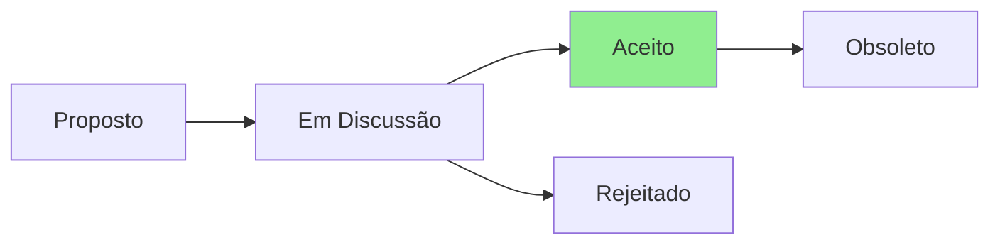

# Renderização de Diagramas Mermaid no GitHub

## Problema Identificado

Os diagramas Mermaid nas ADRs não estão renderizando corretamente no GitHub.

## Status Atual

Todas as 8 ADRs possuem diagramas Mermaid conforme exigido pelo CLAUDE.md:
- ✅ Sintaxe correta com ` ```mermaid `
- ✅ Diagramas de fluxo de status implementados
- ✅ Estilo visual aplicado ao status atual

## Possíveis Causas

1. **GitHub Mermaid Support**: O GitHub pode ter limitações ou estar com problemas temporários
2. **Sintaxe**: Embora correta, pode haver detalhes específicos do GitHub
3. **Cache do navegador**: Pode precisar limpar cache ou forçar refresh

## Soluções Recomendadas

### 1. Verificação Rápida
```bash
# Verificar se os diagramas estão corretos
grep -A 10 "```mermaid" .github/PROJECT_DOCS/adrs/*.md
```

### 2. Alternativa com GitHub Actions
Se os diagramas não renderizarem, podemos:
1. Gerar imagens PNG dos diagramas
2. Usar GitHub Actions para automatizar
3. Referenciar as imagens nas ADRs

### 3. Ferramentas de Visualização
- **Mermaid Live Editor**: https://mermaid.live/
- **VS Code Extension**: Mermaid Preview
- **GitHub App**: Mermaid Chart

## Exemplo de Diagrama Correto



## Validação

Para validar que os diagramas estão corretos:

1. Copie o código Mermaid
2. Cole em https://mermaid.live/
3. Verifique se renderiza corretamente

## Notas

- Os diagramas são obrigatórios pelo CLAUDE.md
- Todos as ADRs já possuem os diagramas implementados
- A sintaxe está correta e segue o padrão do Mermaid v10+

## Próximos Passos

1. Aguardar para ver se é problema temporário do GitHub
2. Se persistir, considerar gerar imagens estáticas
3. Documentar a solução escolhida em uma nova ADR

---

> **Última verificação:** 2025-07-23  
> **Status:** Investigando problema de renderização