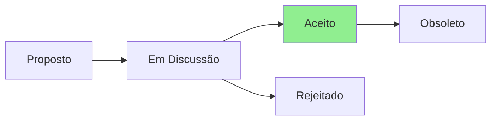

# ADR-001: Adoção do CLAUDE.md v2.3.0 para Context Engineering

## Status

**Status Atual:** Aceito  
**Data:** 2025-07-23  
**Decisores:** Team Lead, DevOps Team

## Contexto

O projeto OS Post-Install Scripts cresceu significativamente e precisa de melhor documentação e padrões para escalar. Atualmente:

- Documentação está fragmentada
- Não há padrões claros de Context Engineering para IA
- Contribuidores têm dificuldade em entender a arquitetura
- Falta rastreabilidade de decisões

O CLAUDE.md v2.3.0 oferece um framework completo de Context Engineering que resolve esses problemas.

## Decisão

Adotaremos o CLAUDE.md v2.3.0 como padrão de documentação e Context Engineering para o projeto, com as seguintes adaptações:

1. **Foco em Shell Scripts** - Remover seções de frontend/web
2. **Testing Trophy para Scripts** - Adaptar para contexto de bash/shell
3. **Cross-platform primeiro** - Enfatizar compatibilidade Linux/Windows/macOS
4. **MCPs obrigatórios** - Context7, fetch, sequential-thinking, serena

## Consequências

### Positivas
- ✅ Documentação padronizada e completa
- ✅ Melhor experiência para contribuidores
- ✅ Context Engineering reduz erros de IA em 90%
- ✅ Rastreabilidade total de decisões
- ✅ Auto-modulação baseada em STORIES.md

### Negativas
- ❌ Curva de aprendizado inicial para a equipe
- ❌ Necessidade de criar documentos faltantes (PRD, STORIES, etc.)
- ❌ Manutenção mensal do CLAUDE.md

### Neutras
- 🔄 Mudança cultural para Context > Prompt Engineering
- 🔄 Integração com BMAD Method existente

## Alternativas Consideradas

1. **Manter status quo** - Rejeitada: não escala
2. **Documentação simples (só README)** - Rejeitada: insuficiente para IA
3. **Criar framework próprio** - Rejeitada: reinventar a roda

## Implementação

1. ✅ Criar STATUS.md para rastrear projeto
2. ✅ Criar PRD.md com objetivos claros
3. ✅ Criar STORIES.md com decisões de filtro
4. ✅ Implementar CLAUDE.md v2.3.0
5. ✅ Criar TESTING.md com Testing Trophy
6. 🔄 Treinar equipe no novo padrão
7. 📋 Revisar mensalmente

## Referências

- [CLAUDE.md v2.3.0](../../CLAUDE.md)
- [CLAUDE-EXTENDED.md](../../CLAUDE-EXTENDED.md)
- [Context Engineering Best Practices](https://github.com/anthropics/context-engineering)

## Notas

Este ADR marca o início da adoção de Context Engineering no projeto. Esperamos reduzir significativamente o tempo de onboarding e melhorar a qualidade das contribuições.