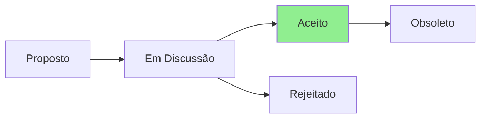

# ADR-002: Estratégia de Testing Trophy para Shell Scripts

## Status



**Status Atual:** Aceito  
**Data:** 2025-07-23  
**Decisores:** Team Lead, QA Team, DevOps Team

## Contexto

O projeto tem atualmente 50 testes funcionando, mas sem uma estratégia clara de testing. Os testes atuais são principalmente smoke tests que verificam sintaxe e execução básica.

Problemas identificados:
- Falta de testes de integração robustos
- Não há verificação de compatibilidade cross-platform automatizada
- Testes não cobrem cenários de erro comuns
- Difícil identificar regressões

## Decisão

Adotaremos a abordagem Testing Trophy adaptada para shell scripts:

```
       🏆 E2E Tests (5%)
      /  \
     /    \  Integration Tests (70%)
    /      \
   /________\ Unit Tests (20%)
  /__________\ Static Analysis (5%)
```

### Distribuição:
- **Static Analysis (5%)**: ShellCheck em CI/CD
- **Unit Tests (20%)**: Apenas funções utilitárias puras
- **Integration Tests (70%)**: Foco principal - interação com sistema
- **E2E Tests (5%)**: Cenários completos de instalação

## Consequências

### Positivas
- ✅ Testes focados em problemas reais (integração)
- ✅ Melhor cobertura de cenários cross-platform
- ✅ Detecção precoce de problemas de permissão/dependência
- ✅ CI/CD mais robusto
- ✅ Confiança para refatoração

### Negativas
- ❌ Testes de integração são mais lentos
- ❌ Requer infraestrutura (Docker/VMs)
- ❌ Maior complexidade inicial

### Neutras
- 🔄 Mudança de mindset: integração > unit tests
- 🔄 Necessidade de containers/VMs para testes

## Alternativas Consideradas

1. **Pyramid Testing (70% unit)** - Rejeitada: não adequada para scripts
2. **Apenas smoke tests** - Rejeitada: cobertura insuficiente
3. **100% E2E** - Rejeitada: muito lento e frágil

## Implementação

### Fase 1 - Infraestrutura
1. ✅ Configurar bats-core para testes
2. 📋 Setup Docker para ambientes de teste
3. 📋 Integrar com GitHub Actions

### Fase 2 - Migração
1. 📋 Converter testes existentes para bats
2. 📋 Adicionar testes de integração para cada módulo
3. 📋 Criar suite E2E para cenários principais

### Fase 3 - Maturidade
1. 📋 Coverage reporting (kcov)
2. 📋 Performance benchmarks
3. 📋 Testes de regressão automáticos

## Métricas de Sucesso

- Coverage total > 80%
- Tempo de execução < 30 minutos
- Zero falsos positivos em 30 dias
- Redução de 50% em bugs reportados

## Referências

- [TESTING.md](../../TESTING.md)
- [Testing Trophy](https://kentcdodds.com/blog/the-testing-trophy-and-testing-classifications)
- [Bash Testing with Bats](https://github.com/bats-core/bats-core)

## Notas

Esta estratégia prioriza testes que capturam problemas reais que usuários enfrentariam, em vez de testar implementação interna.