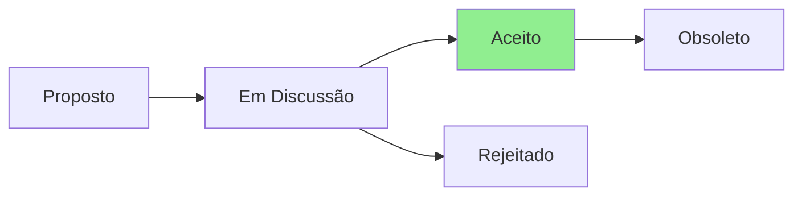

# ADR-004: Upgrade do BMAD Method para v4.30

## Status

**Status Atual:** Aceito  
**Data:** 2025-07-23  
**Decisores:** Team Lead

## Contexto

O projeto estava usando BMAD Method v4.25.0. A versão 4.30 traz melhorias significativas:

- Melhor integração com Context Engineering
- Novos templates otimizados
- Workflows aprimorados para projetos brownfield
- Compatibilidade melhorada com CLAUDE.md

## Decisão

Fazer upgrade imediato para BMAD Method v4.30.0 para aproveitar as melhorias e manter sincronização com CLAUDE.md v2.3.0.

## Consequências

### Positivas
- ✅ Melhor integração com CLAUDE.md
- ✅ Templates mais modernos
- ✅ Workflows otimizados
- ✅ Correções de bugs da v4.25

### Negativas
- ❌ Possíveis breaking changes (minimal)
- ❌ Necessidade de re-testar workflows

### Neutras
- 🔄 Atualização de documentação
- 🔄 Familiarização com novos recursos

## Implementação

1. ✅ Atualizar package.json
2. ✅ Executar npm update
3. 📋 Testar workflows existentes
4. 📋 Atualizar documentação se necessário

## Referências

- [BMAD Method Changelog](https://github.com/bmadcode/BMAD-METHOD/blob/main/CHANGELOG.md)
- [package.json](../../package.json)