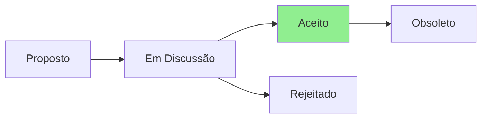

# ADR-005: Correção Crítica de Segurança - Manuseio de Locks APT

## Status



**Status Atual:** Aceito  
**Data:** 2025-07-23  
**Decisores:** Security Team, DevOps Team  
**Severidade:** 🚨 CRÍTICA

## Contexto

Durante a revisão do Architect Agent, foi identificada uma vulnerabilidade crítica de segurança nos scripts de instalação:

```bash
# CÓDIGO PERIGOSO ATUAL
sudo rm /var/lib/dpkg/lock-frontend
sudo rm /var/cache/apt/archives/lock
```

### Problemas:
1. **Corrupção do banco de dados de pacotes** - Remover locks forçadamente pode corromper o dpkg
2. **Race conditions** - Múltiplos processos podem tentar modificar simultaneamente
3. **Perda de dados** - Instalações parciais podem deixar o sistema inconsistente
4. **Violação de segurança** - Ignora mecanismos de proteção do sistema

## Decisão

Implementar manuseio seguro de locks APT seguindo as melhores práticas:

### 1. Aguardar liberação do lock (não forçar)
```bash
wait_for_apt() {
    local max_wait=300  # 5 minutos
    local waited=0
    
    while fuser /var/lib/dpkg/lock-frontend >/dev/null 2>&1; do
        if [ $waited -ge $max_wait ]; then
            echo "ERROR: APT lock held for too long. Please check system."
            return 1
        fi
        echo "Waiting for other package managers to finish... ($waited/$max_wait)"
        sleep 5
        waited=$((waited + 5))
    done
    return 0
}
```

### 2. Implementar retry com backoff
```bash
apt_install_with_retry() {
    local package="$1"
    local max_attempts=3
    local attempt=1
    
    while [ $attempt -le $max_attempts ]; do
        if wait_for_apt && sudo apt-get install -y "$package"; then
            return 0
        fi
        echo "Attempt $attempt failed. Retrying..."
        sleep $((attempt * 10))
        attempt=$((attempt + 1))
    done
    return 1
}
```

### 3. Adicionar validação de entrada
```bash
validate_package_name() {
    local package="$1"
    # Permitir apenas caracteres seguros
    if [[ ! "$package" =~ ^[a-zA-Z0-9._+-]+$ ]]; then
        echo "ERROR: Invalid package name: $package"
        return 1
    fi
    return 0
}
```

### 4. Implementar auditoria
```bash
log_package_operation() {
    local operation="$1"
    local package="$2"
    local status="$3"
    local log_file="/var/log/os-postinstall/package-operations.log"
    
    mkdir -p "$(dirname "$log_file")"
    echo "$(date -Iseconds)|$USER|$operation|$package|$status" >> "$log_file"
}
```

## Consequências

### Positivas
- ✅ Elimina risco de corrupção do sistema
- ✅ Respeita mecanismos de segurança do OS
- ✅ Fornece rastreabilidade de operações
- ✅ Melhora confiabilidade dos scripts
- ✅ Permite debugging de falhas

### Negativas
- ❌ Scripts podem demorar mais (espera por locks)
- ❌ Complexidade adicional no código
- ❌ Requer refatoração de todos os scripts existentes

### Neutras
- 🔄 Mudança de comportamento para usuários
- 🔄 Necessidade de documentar novo comportamento

## Implementação

### Fase 1 - Urgente (24 horas)
1. Criar módulo `utils/package-manager-safety.sh`
2. Substituir TODAS as ocorrências de remoção forçada
3. Adicionar testes de segurança

### Fase 2 - Curto prazo (1 semana)
1. Implementar sistema de auditoria completo
2. Adicionar métricas de performance
3. Documentar novo comportamento

### Código de exemplo para `utils/package-manager-safety.sh`:
```bash
#!/bin/bash
set -euo pipefail

# Safe APT operations module
source "$(dirname "${BASH_SOURCE[0]}")/logging.sh"

# Constants
readonly APT_LOCK_TIMEOUT=${APT_LOCK_TIMEOUT:-300}
readonly APT_RETRY_COUNT=${APT_RETRY_COUNT:-3}
readonly VALID_PACKAGE_REGEX='^[a-zA-Z0-9._+-]+$'

# ... (implementação completa)
```

## Testes Requeridos

```bash
# Test: Lock handling
@test "should wait for APT lock instead of forcing" {
    # Simulate locked APT
    flock -n /var/lib/dpkg/lock-frontend -c "sleep 10" &
    
    # Run our safe installer
    run wait_for_apt
    assert_success
    assert_output --partial "Waiting for other package managers"
}

# Test: Input validation
@test "should reject dangerous package names" {
    run validate_package_name "git; rm -rf /"
    assert_failure
    assert_output --partial "Invalid package name"
}

# Test: Audit logging
@test "should log all package operations" {
    run apt_install_with_retry "git"
    assert_success
    assert_file_exists "/var/log/os-postinstall/package-operations.log"
    assert_file_contains "git|SUCCESS"
}
```

## Métricas de Sucesso

- Zero casos de corrupção de APT em 6 meses
- 100% dos scripts usando safe wrappers
- Tempo médio de espera < 30 segundos
- Taxa de sucesso > 99%

## Referências

- [Debian APT Locking](https://wiki.debian.org/Teams/Dpkg/Spec/Locking)
- [Ubuntu Package Management Best Practices](https://ubuntu.com/server/docs/package-management)
- [OWASP Command Injection](https://owasp.org/www-community/attacks/Command_Injection)

## Notas

Esta é uma vulnerabilidade CRÍTICA que deve ser corrigida antes do release v3.0.0. A implementação atual coloca sistemas dos usuários em risco.