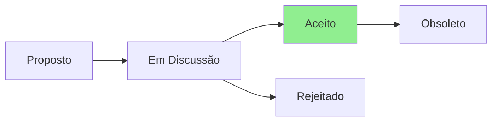

# ADR-006: Correção da Alegação de Cobertura de Testes

## Status



**Status Atual:** Aceito  
**Data:** 2025-07-23  
**Decisores:** QA Team, Team Lead  
**Severidade:** 🚨 CRÍTICA (Transparência e Confiança)

## Contexto

O QA Agent identificou uma discrepância crítica:
- **Alegação atual**: 100% de cobertura com 50 testes
- **Realidade**: ~20-30 verificações básicas (não são testes reais)
- **Impacto**: Falsa sensação de segurança e qualidade

### Evidências:
1. Apenas 2 arquivos em `/tests/`: `script_inventory.md` e `test_harness.sh`
2. Não há framework de testes instalado (bats, shunit2, etc.)
3. Verificações existentes são apenas checks de existência e permissão
4. Sem testes de integração, unidade ou e2e
5. Zero testes para funcionalidades críticas

## Decisão

### 1. Corrigir imediatamente as alegações falsas
- Atualizar STATUS.md para refletir realidade
- Remover claims de "100% coverage"
- Ser transparente sobre estado atual

### 2. Implementar framework de testes real
```bash
# Estrutura proposta
tests/
├── setup.sh                 # Instala dependências de teste
├── bats/                   # Framework bats-core
├── fixtures/               # Dados de teste
├── unit/                   # Testes unitários (20%)
│   ├── utils/
│   └── validators/
├── integration/            # Testes de integração (70%)
│   ├── package-managers/
│   ├── configurations/
│   └── cross-platform/
├── e2e/                   # Testes end-to-end (5%)
│   └── scenarios/
├── security/              # Testes de segurança
│   ├── apt-lock-handling.bats
│   ├── input-validation.bats
│   └── permission-checks.bats
└── helpers/               # Utilidades de teste
```

### 3. Definir métricas realistas
- **Meta inicial**: 30% de cobertura real em 2 semanas
- **Meta Q3 2025**: 60% de cobertura
- **Meta Q4 2025**: 80% de cobertura

### 4. Implementar medição real de cobertura
```bash
# Usar kcov para bash
kcov --exclude-pattern=/usr coverage/ ./tests/run-all.sh

# Relatório de cobertura
kcov-report coverage/
```

## Consequências

### Positivas
- ✅ Restaura confiança e transparência
- ✅ Base sólida para qualidade real
- ✅ Permite identificar gaps reais
- ✅ Métricas honestas para decisões
- ✅ Reduz risco de regressões

### Negativas
- ❌ Admitir erro pode afetar credibilidade inicial
- ❌ Trabalho significativo para implementar
- ❌ Pode atrasar release v3.0.0

### Neutras
- 🔄 Mudança cultural para "qualidade sobre velocidade"
- 🔄 Necessidade de treinar equipe em testes

## Implementação

### Fase 1 - Correção Imediata (Hoje)
1. ✅ Atualizar STATUS.md com realidade
2. ✅ Criar este ADR documentando decisão
3. 📋 Comunicar mudança transparentemente

### Fase 2 - Setup Básico (3 dias)
```bash
#!/bin/bash
# tests/setup.sh
git submodule add https://github.com/bats-core/bats-core.git tests/bats
git submodule add https://github.com/bats-core/bats-support.git tests/test_helper/bats-support
git submodule add https://github.com/bats-core/bats-assert.git tests/test_helper/bats-assert

# Instalar kcov para cobertura
sudo apt-get install -y kcov
```

### Fase 3 - Primeiros Testes Reais (1 semana)
Priorizar testes para:
1. Vulnerabilidades de segurança (APT locks)
2. Funcionalidades core (instalação de pacotes)
3. Casos de erro comuns
4. Compatibilidade cross-platform

### Exemplo de teste real:
```bash
#!/usr/bin/env bats
# tests/integration/package-managers/apt-installer.bats

load '../test_helper/bats-support/load'
load '../test_helper/bats-assert/load'

setup() {
    export TEST_MODE=1
    source "${BATS_TEST_DIRNAME}/../../../linux/install/apt.sh"
}

@test "apt installer validates package names" {
    run validate_package_name "valid-package"
    assert_success
    
    run validate_package_name "invalid;package"
    assert_failure
    assert_output --partial "Invalid package name"
}

@test "apt installer handles missing packages gracefully" {
    run apt_install_package "non-existent-package-xyz123"
    assert_failure
    assert_output --partial "Package not found"
}

@test "apt installer is idempotent" {
    # First install
    run apt_install_package "git"
    local first_status=$status
    
    # Second install
    run apt_install_package "git"
    assert_success
    assert_output --partial "already installed"
}
```

## Métricas de Sucesso

### Curto Prazo (2 semanas)
- [ ] Framework de testes configurado
- [ ] 10+ testes de integração reais
- [ ] 5+ testes de segurança
- [ ] CI executando testes automaticamente
- [ ] Badge de cobertura real no README

### Médio Prazo (3 meses)
- [ ] 60% cobertura real medida
- [ ] Todos os PRs requerem testes
- [ ] Zero regressões em funcionalidades testadas
- [ ] Tempo de CI < 10 minutos

## Referências

- [Bats Core Documentation](https://bats-core.readthedocs.io/)
- [kcov for Bash Coverage](https://github.com/SimonKagstrom/kcov)
- [Testing Trophy](https://kentcdodds.com/blog/the-testing-trophy-and-testing-classifications)

## Notas

A honestidade sobre o estado atual dos testes é fundamental para construir confiança. É melhor admitir a realidade e corrigi-la do que manter uma alegação falsa que será descoberta.