# ADR-007: Implementar Arquitetura Core/Adapters Prometida

## Status

```mermaid
graph LR
    A[Proposto] --> B[Em Discussão] --> C[Aceito]
    B --> D[Rejeitado]
    C --> E[Obsoleto]
    
    style C fill:#90EE90
```



**Status Atual:** Aceito  
**Data:** 2025-07-23  
**Decisores:** Architect Team, Team Lead  
**Severidade:** 🚨 CRÍTICA (Débito Técnico)

## Contexto

O ADR-003 prometeu uma arquitetura "Core Compartilhado + Adaptadores de Plataforma", mas o Architect Agent descobriu que:
- A estrutura core/adapters não existe
- Scripts têm implementações diretas sem abstração
- Windows/macOS têm implementações mínimas (one-liners)
- Não há interfaces definidas entre componentes

### Impacto:
1. **Manutenibilidade**: Código duplicado entre plataformas
2. **Escalabilidade**: Difícil adicionar novas plataformas
3. **Testabilidade**: Impossível mockar dependências
4. **Confiabilidade**: Comportamento inconsistente entre OS

## Decisão

Implementar IMEDIATAMENTE a arquitetura prometida antes do v3.0.0:

### Estrutura Obrigatória:
```
core/
├── interfaces/              # Contratos que adapters devem implementar
│   ├── package-manager.sh   # Interface para gerenciadores
│   ├── shell-compat.sh      # Interface para compatibilidade
│   └── system-info.sh       # Interface para detecção de OS
├── common/                  # Lógica compartilhada
│   ├── validation.sh        # Validações comuns
│   ├── logging.sh          # Sistema de logs unificado
│   └── error-handling.sh   # Tratamento de erros
└── constants.sh            # Constantes globais

adapters/
├── package-managers/
│   ├── apt/
│   │   ├── adapter.sh      # Implementa interface
│   │   └── tests/
│   ├── brew/
│   │   ├── adapter.sh
│   │   └── tests/
│   └── winget/
│       ├── adapter.ps1
│       └── tests/
├── shell-compat/
│   ├── bash-adapter.sh
│   ├── zsh-adapter.sh
│   └── pwsh-adapter.ps1
└── system/
    ├── linux-system.sh
    ├── macos-system.sh
    └── windows-system.ps1
```

### Exemplo de Interface:
```bash
#!/bin/bash
# core/interfaces/package-manager.sh

# Package Manager Interface Contract
# All adapters MUST implement these functions

# Initialize the package manager
# Returns: 0 on success, 1 on failure
package_manager_init() {
    echo "ERROR: package_manager_init not implemented" >&2
    return 1
}

# Update package lists
# Returns: 0 on success, 1 on failure
package_manager_update() {
    echo "ERROR: package_manager_update not implemented" >&2
    return 1
}

# Install a package
# Args: $1 - package name
# Returns: 0 on success, 1 on failure
package_manager_install() {
    echo "ERROR: package_manager_install not implemented" >&2
    return 1
}

# Check if package is installed
# Args: $1 - package name
# Returns: 0 if installed, 1 if not
package_manager_is_installed() {
    echo "ERROR: package_manager_is_installed not implemented" >&2
    return 1
}

# Remove a package
# Args: $1 - package name
# Returns: 0 on success, 1 on failure
package_manager_remove() {
    echo "ERROR: package_manager_remove not implemented" >&2
    return 1
}
```

### Exemplo de Adapter:
```bash
#!/bin/bash
# adapters/package-managers/apt/adapter.sh

# Source the interface
source "${CORE_DIR}/interfaces/package-manager.sh"
source "${CORE_DIR}/common/logging.sh"
source "${CORE_DIR}/common/validation.sh"

# Implement interface functions
package_manager_init() {
    log_info "Initializing APT package manager"
    
    # Check if apt is available
    if ! command -v apt-get &> /dev/null; then
        log_error "apt-get not found"
        return 1
    fi
    
    # Wait for any locks (from ADR-005)
    wait_for_apt_lock || return 1
    
    return 0
}

package_manager_update() {
    log_info "Updating APT package lists"
    
    if ! sudo apt-get update; then
        log_error "Failed to update package lists"
        return 1
    fi
    
    return 0
}

package_manager_install() {
    local package="$1"
    
    # Validate package name (from ADR-005)
    if ! validate_package_name "$package"; then
        return 1
    fi
    
    log_info "Installing package: $package"
    
    if package_manager_is_installed "$package"; then
        log_info "Package already installed: $package"
        return 0
    fi
    
    if ! sudo apt-get install -y "$package"; then
        log_error "Failed to install package: $package"
        return 1
    fi
    
    # Log for audit (from ADR-005)
    log_package_operation "install" "$package" "success"
    
    return 0
}

package_manager_is_installed() {
    local package="$1"
    dpkg -l "$package" 2>/dev/null | grep -q "^ii"
}

package_manager_remove() {
    local package="$1"
    
    log_info "Removing package: $package"
    
    if ! sudo apt-get remove -y "$package"; then
        log_error "Failed to remove package: $package"
        return 1
    fi
    
    log_package_operation "remove" "$package" "success"
    
    return 0
}
```

### Uso Unificado:
```bash
#!/bin/bash
# install.sh - Script principal

# Detect platform and load appropriate adapter
case "$(detect_os)" in
    ubuntu|debian)
        source "${ADAPTERS_DIR}/package-managers/apt/adapter.sh"
        ;;
    macos)
        source "${ADAPTERS_DIR}/package-managers/brew/adapter.sh"
        ;;
    windows)
        # Special handling for PowerShell
        ;;
    *)
        echo "Unsupported OS"
        exit 1
        ;;
esac

# Now use unified interface
package_manager_init || exit 1
package_manager_update || exit 1

# Install packages from config
for package in "${PACKAGES[@]}"; do
    package_manager_install "$package" || {
        log_error "Failed to install $package"
        # Continue or fail based on policy
    }
done
```

## Consequências

### Positivas
- ✅ Código DRY (Don't Repeat Yourself)
- ✅ Fácil adicionar novas plataformas
- ✅ Testabilidade com mocks
- ✅ Comportamento consistente
- ✅ Manutenção simplificada
- ✅ Permite evolução gradual

### Negativas
- ❌ Refatoração significativa necessária
- ❌ Pode atrasar v3.0.0
- ❌ Curva de aprendizado para contribuidores
- ❌ Mais arquivos para gerenciar

### Neutras
- 🔄 Mudança de paradigma de scripts simples para arquitetura
- 🔄 Necessidade de documentação de arquitetura

## Implementação

### Fase 1 - Estrutura Base (2 dias)
1. Criar diretórios core/ e adapters/
2. Definir todas as interfaces
3. Implementar common utilities
4. Criar adapter para APT (mais usado)

### Fase 2 - Migração Linux (3 dias)
1. Migrar scripts APT para usar adapter
2. Criar adapters para Snap e Flatpak
3. Atualizar scripts de instalação
4. Adicionar testes para adapters

### Fase 3 - Windows/macOS (1 semana)
1. Criar adapter Homebrew completo
2. Criar adapter Winget completo
3. Portar funcionalidades existentes
4. Adicionar funcionalidades faltantes

### Fase 4 - Validação (2 dias)
1. Testes de integração cross-platform
2. Documentação de arquitetura
3. Guia de contribuição atualizado

## Métricas de Sucesso

- 100% dos scripts usando adapters (não chamadas diretas)
- Zero duplicação de lógica entre plataformas
- Tempo de adição de nova plataforma < 1 dia
- Todos os adapters com testes unitários
- Documentação de arquitetura completa

## Alternativas Consideradas

1. **Manter como está** - Rejeitada: débito técnico crescente
2. **Reescrever em Go/Rust** - Rejeitada: mudança muito radical
3. **Usar Docker para tudo** - Rejeitada: overhead desnecessário

## Referências

- [Hexagonal Architecture](https://alistair.cockburn.us/hexagonal-architecture/)
- [Adapter Pattern](https://refactoring.guru/design-patterns/adapter)
- [Shell Script Best Practices](https://google.github.io/styleguide/shellguide.html)

## Notas

Esta arquitetura é fundamental para a sustentabilidade do projeto. Sem ela, adicionar suporte real para macOS ou melhorar Windows será exponencialmente mais difícil.