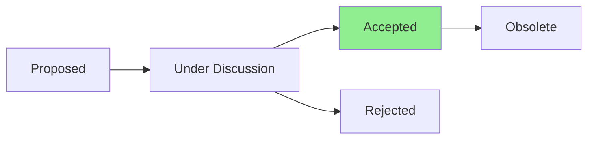

# ADR-010: Documentation Location Strategy

## Status



**Current Status:** Accepted

## Context

The CLAUDE.md framework (v2.3.0) specifies that critical project documents must be located in the repository root for proper Context Engineering workflow. However, during the v3.0.0 restructuring following the Agile Repository Structure Guide, these documents were moved to `.github/PROJECT_DOCS/`.

This created a fundamental disconnect where:
- Claude Code cannot find documents where expected
- Context Engineering workflow is broken
- Version tracking becomes inconsistent

Critical documents affected:
- STATUS.md - Project health tracking
- PRD.md - Product requirements document
- STORIES.md - User journeys and acceptance criteria
- TESTING.md - Testing strategy and guidelines

## Decision

Move the four critical documents from `.github/PROJECT_DOCS/` to the repository root to align with CLAUDE.md requirements and ensure proper Context Engineering workflow.

Keep other technical documentation in their current locations:
- ADRs remain in `.github/PROJECT_DOCS/adrs/`
- Technical guides remain in `.github/PROJECT_DOCS/`

## Consequences

### Positive
- ✅ Full alignment with CLAUDE.md v2.3.0 requirements
- ✅ Context Engineering workflow restored
- ✅ Better discoverability of critical documents
- ✅ Consistent with other root-level docs (README, CHANGELOG, etc.)
- ✅ Simplified navigation for AI-assisted development

### Negative
- ❌ Breaking change for existing references
- ❌ Deviation from Agile Repository Structure Guide recommendation
- ❌ Need to update all internal links and references

### Neutral
- 🔄 Requires one-time migration effort
- 🔄 Future contributors need to understand this convention

## Implementation

1. Move files to root:
   ```bash
   mv .github/PROJECT_DOCS/STATUS.md ./
   mv .github/PROJECT_DOCS/PRD.md ./
   mv .github/PROJECT_DOCS/STORIES.md ./
   mv .github/PROJECT_DOCS/TESTING.md ./
   ```

2. Update all references in documentation
3. Update README.md with new links
4. Verify Context Engineering workflow

## References

- CLAUDE.md v2.3.0 - Section "📋 Essential Project Documents"
- Agile Repository Structure Guide
- Context Engineering best practices

## Date

2025-01-27