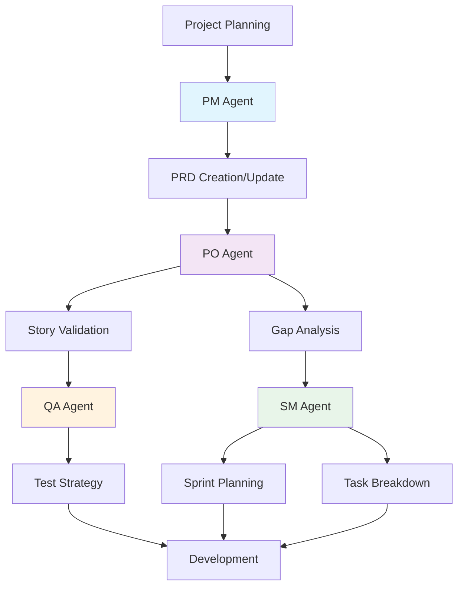

# ADR-011: BMAD Method Agents Integration

**Status:** Accepted  
**Date:** 2025-07-27  
**Decision Makers:** Project Lead, BMAD Agents (PM, PO, SM, QA)

## Context

The OS Post-Install Scripts project has evolved rapidly through July 2025, reaching a complexity level that benefits from structured project management. The BMAD Method v4.32.0 introduces AI-powered agents that provide specialized expertise in different aspects of software development.

### Current Challenges
1. **Documentation Drift** - PRD and STORIES had diverged significantly
2. **Unclear Testing Strategy** - Mixed messages about automation vs manual testing
3. **Overengineered Features** - 5-profile system didn't match user needs
4. **Lack of Structure** - No clear sprint planning or implementation roadmap

### BMAD Agent Capabilities
- **PM (John)** - Project vision, requirements gathering, PRD management
- **PO (Sarah)** - Story validation, backlog management, value delivery
- **SM (Mike)** - Sprint planning, task breakdown, agile ceremonies
- **QA (Lisa)** - Testing strategies, quality assurance, validation

## Decision

We will integrate BMAD Method agents into our development workflow to provide structured guidance and validation while maintaining human decision-making authority.

### Agent Activation Order
```
PM → PO → QA → SM
```

This order ensures:
1. Requirements are clearly defined (PM)
2. Stories align with requirements (PO)  
3. Quality strategy is established early (QA)
4. Implementation is properly planned (SM)

### Key Principles
1. **Agents Suggest, Humans Decide** - All agent recommendations require human approval
2. **Transparent Reasoning** - Agents must explain their rationale
3. **Context Aware** - Agents respect project-specific constraints (e.g., manual testing only)
4. **Educational Focus** - Agents teach best practices while working

## Implementation

### Agent Integration Points



### Agent Deliverables

| Agent | Role | Key Deliverables |
|-------|------|------------------|
| PM | Project Manager | PRD.md, Risk Assessment, Migration Strategy |
| PO | Product Owner | Gap Analysis, Story Validation, Acceptance Criteria |
| SM | Scrum Master | Sprint Plans, Task Breakdown, Implementation Guide |
| QA | Quality Assurance | Test Strategy, Quality Checklist, Validation Guides |

### Usage Guidelines

1. **When to Activate Agents**
   - Major version planning (PM)
   - Story/PRD alignment checks (PO)
   - Sprint planning sessions (SM)
   - Test strategy updates (QA)

2. **Agent Communication**
   - Use the `/activate-[agent]` slash commands
   - Provide clear context and constraints
   - Review and validate all outputs

3. **Documentation Requirements**
   - All agent sessions must be documented
   - Key decisions recorded in STATUS.md
   - Deliverables checked into repository

## Consequences

### Positive
- ✅ **Structured Approach** - Clear methodology for complex tasks
- ✅ **Best Practices** - Industry standards applied consistently
- ✅ **Knowledge Transfer** - Agents educate while assisting
- ✅ **Quality Improvement** - Multiple perspectives reduce blind spots
- ✅ **Faster Delivery** - Reduced planning overhead

### Negative
- ⚠️ **Learning Curve** - Team needs to understand agent capabilities
- ⚠️ **Over-reliance Risk** - Must maintain human judgment
- ⚠️ **Context Overhead** - Agents need proper briefing

### Mitigations
1. Start with single agent activation
2. Document agent interactions
3. Maintain human oversight
4. Regular retrospectives on agent effectiveness

## Examples

### Example 1: Brownfield PRD Creation
```bash
# PM Agent activated for existing project analysis
/activate-pm --mode=brownfield --project=os-postinstall-scripts

# Result: Comprehensive PRD v2.0.0 with:
# - Current state analysis
# - Technical debt assessment  
# - Migration strategy
# - Risk mitigation plans
```

### Example 2: Story Validation
```bash
# PO Agent activated for document alignment
/activate-po --validate PRD.md STORIES.md

# Result: 
# - GAP_REMEDIATION_PLAN.md
# - STORIES_UPDATE_TASKS.md
# - NEW_STORIES_DRAFT.md
```

### Example 3: Sprint Planning
```bash
# SM Agent activated for v3.2.0 planning
/activate-sm --version=3.2.0 --sprint-length=2-weeks

# Result:
# - SPRINT_PLAN.md with 38 story points
# - IMPLEMENTATION_TASKS_v3.2.0.md
# - Daily standup structure
```

## References

- [BMAD Method v4.32.0 Documentation](https://github.com/bmadcode/BMAD-METHOD)
- [Context Engineering Best Practices](CLAUDE.md)
- [Project PRD v2.0.0](../../../PRD.md)
- [STORIES.md with Agent Updates](../../../STORIES.md)

## Review Schedule

This ADR should be reviewed:
- After first sprint using agents (August 2025)
- When updating BMAD Method version
- If agent effectiveness drops below expectations

---

*Decision made in collaboration with BMAD Agents: PM (John), PO (Sarah), SM (Mike), QA (Lisa)*