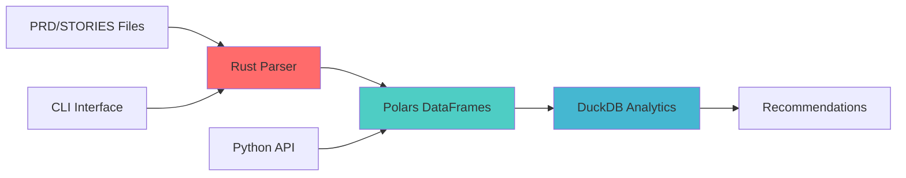

# ADR-012: Use Polars Instead of Pandas for Data Processing

**Status:** Accepted  
**Date:** 2025-07-27  
**Decision Makers:** Project Lead, Performance Team

## Context

Data processing is a critical component in our intelligent recommendation system for parsing PRD/STORIES files and analyzing technology patterns. The choice of data processing library significantly impacts:

- Performance of technology detection
- Memory usage during parsing
- Installation time (dependency size)
- Cross-platform compatibility

### Performance Comparison

| Aspect | Pandas | Polars |
|--------|--------|--------|
| Speed | 1x (baseline) | 5-10x faster |
| Memory Usage | High | 2-4x more efficient |
| API | Eager evaluation | Lazy evaluation available |
| Dependencies | NumPy, many C extensions | Rust-based, fewer deps |
| Type Safety | Runtime errors | Compile-time guarantees |

## Decision

**We will use Polars exclusively for all data processing tasks. Pandas is explicitly prohibited.**

### Technology Stack
- **Polars** - Primary DataFrame library (Python and Rust APIs)
- **DuckDB** - SQL analytics engine for complex queries
- **Rust** - Performance-critical backend components
- **Arrow** - Columnar memory format (Polars native)

### Integration Architecture



## Implementation Guidelines

### 1. Python Data Processing
```python
# ❌ NEVER DO THIS
import pandas as pd
df = pd.read_csv('data.csv')

# ✅ ALWAYS DO THIS
import polars as pl
df = pl.read_csv('data.csv')

# ✅ Lazy evaluation for large files
df = pl.scan_csv('data.csv')
result = df.filter(pl.col('tech') == 'rust').collect()
```

### 2. Installation Scripts
```bash
# In scripts/common/install-dependencies.sh
install_data_tools() {
    echo "Installing high-performance data tools..."
    
    # Python: Polars
    pip install polars
    # NEVER: pip install pandas
    
    # Rust toolchain for native performance
    curl --proto '=https' --tlsv1.2 -sSf https://sh.rustup.rs | sh
    
    # DuckDB for SQL analytics
    pip install duckdb
}
```

### 3. Technology Detection Parser
```python
# In modules/parser/tech_detector.py
import polars as pl
import duckdb

class TechDetector:
    def parse_prd(self, file_path: str) -> pl.DataFrame:
        # Lazy reading for performance
        return pl.scan_csv(file_path, separator=None)
    
    def analyze_with_sql(self, df: pl.DataFrame) -> dict:
        # Use DuckDB for complex analytics
        conn = duckdb.connect()
        conn.register('tech_data', df)
        return conn.execute("""
            SELECT tech, COUNT(*) as mentions
            FROM tech_data
            GROUP BY tech
            ORDER BY mentions DESC
        """).fetchall()
```

## Consequences

### Positive
- ✅ **5-10x Performance Gain** - Faster PRD/STORIES parsing
- ✅ **Lower Memory Usage** - Can handle larger configuration files
- ✅ **Better Error Messages** - Rust's type system catches issues early
- ✅ **Faster Installation** - Smaller dependency footprint
- ✅ **Future-Proof** - Polars is actively developed with modern architecture

### Negative
- ⚠️ **Learning Curve** - Team needs to learn Polars API
- ⚠️ **Less Ecosystem** - Fewer third-party integrations
- ⚠️ **Migration Effort** - Existing pandas code must be rewritten

### Mitigation
1. Provide Polars cheat sheet in docs/
2. Create migration guide from pandas
3. Use AI assistants trained on Polars

## Migration Strategy

### Phase 1: New Development (Immediate)
- All new data processing code uses Polars
- Update installation scripts to include Polars
- Create examples/ directory with Polars patterns

### Phase 2: Existing Code (v3.2.0)
- Audit for any pandas usage
- Rewrite technology detection parser
- Update test data generators

### Phase 3: Documentation (v3.2.0)
- Add Polars examples to README
- Create performance benchmarks
- Document DuckDB integration patterns

## Enforcement

### CI/CD Checks
```yaml
# In .github/workflows/code-quality.yml
- name: Check for pandas usage
  run: |
    if grep -r "import pandas" --include="*.py" .; then
      echo "❌ ERROR: pandas is not allowed. Use polars instead!"
      exit 1
    fi
```

### Pre-commit Hook
```bash
#!/bin/bash
# In .git/hooks/pre-commit
if git diff --cached --name-only | xargs grep -l "import pandas"; then
    echo "❌ Commit blocked: pandas usage detected. Use polars!"
    exit 1
fi
```

## References

- [Polars Documentation](https://pola-rs.github.io/polars-book/)
- [Polars vs Pandas Benchmarks](https://www.pola.rs/benchmarks.html)
- [DuckDB + Polars Integration](https://duckdb.org/docs/guides/python/polars)
- [Rust Performance Benefits](https://www.rust-lang.org/learn/get-started)

## Review Schedule

This ADR is permanent and should only be reconsidered if:
- Polars is discontinued or abandoned
- A significantly superior alternative emerges
- Project requirements fundamentally change

---

*"Performance is a feature. Choose tools that respect your users' time."*