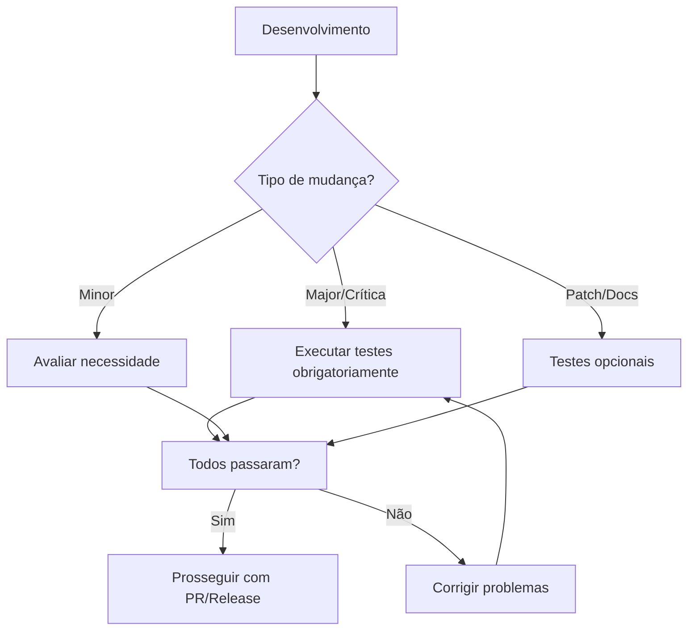

# Diretrizes para Execução de Testes CI/CD

## 🎯 Filosofia de Testes

Este repositório adota uma abordagem **sob demanda** para execução de testes CI/CD, economizando recursos e executando testes apenas quando realmente necessário.

## 📋 Quando Executar Testes

### Testes OBRIGATÓRIOS em:

1. **Mudanças Major (vX.0.0)**
   - Sempre executar suite completa antes do release
   - Testar em todas as plataformas suportadas
   - Validar compatibilidade reversa

2. **Alterações Críticas**
   - Mudanças em scripts de instalação core
   - Modificações em lógica de detecção de OS
   - Alterações em scripts de segurança

3. **Antes de Releases**
   - Qualquer versão sendo preparada para release público
   - Hotfixes em produção

### Testes OPCIONAIS em:

1. **Mudanças Minor (vX.Y.0)**
   - A critério do desenvolvedor
   - Recomendado se afetar múltiplos componentes

2. **Patches (vX.Y.Z)**
   - Apenas se o patch tocar em áreas sensíveis
   - Correções de documentação não precisam

## 🚀 Como Executar Testes

### Via GitHub Actions (Interface Web)

1. Vá para a aba **Actions** no repositório
2. Selecione o workflow desejado:
   - `Test Scripts` - Testa scripts em diferentes versões Ubuntu
   - `ShellCheck` - Análise estática de código shell
   - `Dependency Check` - Verifica dependências e licenças
   - `Documentation Check` - Valida documentação

3. Clique em **Run workflow**
4. Preencha os campos:
   - **Reason**: Motivo da execução (obrigatório)
   - **Outros campos**: Específicos de cada workflow

### Via GitHub CLI

```bash
# Instalar GitHub CLI se necessário
brew install gh  # macOS
# ou visite: https://cli.github.com/

# Autenticar
gh auth login

# Executar workflow
gh workflow run test-scripts.yml \
  -f reason="Testing before v3.0.0 release" \
  -f confirm_major_change="yes"

# Verificar status
gh run list --workflow=test-scripts.yml
```

## 📊 Interpretando Resultados

### ✅ Sucesso
- Todos os jobs passaram
- Nenhuma ação necessária

### ⚠️ Avisos
- ShellCheck encontrou melhorias sugeridas
- Links quebrados na documentação
- Avaliar se correções são necessárias

### ❌ Falhas
- Erros de sintaxe em scripts
- Vulnerabilidades de segurança críticas
- Dependências com licenças incompatíveis
- **Ação obrigatória antes de merge/release**

## 🔄 Fluxo Recomendado



## 💡 Dicas de Economia

1. **Agrupe mudanças** relacionadas em um único PR
2. **Execute localmente** primeiro:
   ```bash
   # ShellCheck local
   shellcheck scripts/*.sh
   
   # Teste de sintaxe
   bash -n script.sh
   ```

3. **Use o campo "check_type"** no Dependency Check:
   - `security-only` para verificações rápidas
   - `license-only` quando adicionar dependências
   - `all` apenas antes de releases

## ⚡ Testes Locais Rápidos

Antes de executar CI/CD, teste localmente:

```bash
# Verificar sintaxe de todos os scripts
find . -name "*.sh" -exec bash -n {} \;

# ShellCheck básico
find . -name "*.sh" -exec shellcheck {} \;

# Verificar line endings
file scripts/*.sh | grep CRLF
```

## 📝 Notas Importantes

- **Não há execução automática** em push/PR/schedule
- **Sempre documente** o motivo da execução nos inputs
- **Para mudanças major**, sempre confirme com `confirm_major_change=yes`
- **Mantenha registro** dos testes executados no CHANGELOG

---

> **Lembre-se**: A execução consciente de testes economiza recursos e tempo, mas nunca comprometa a qualidade por economia. Na dúvida, execute os testes!