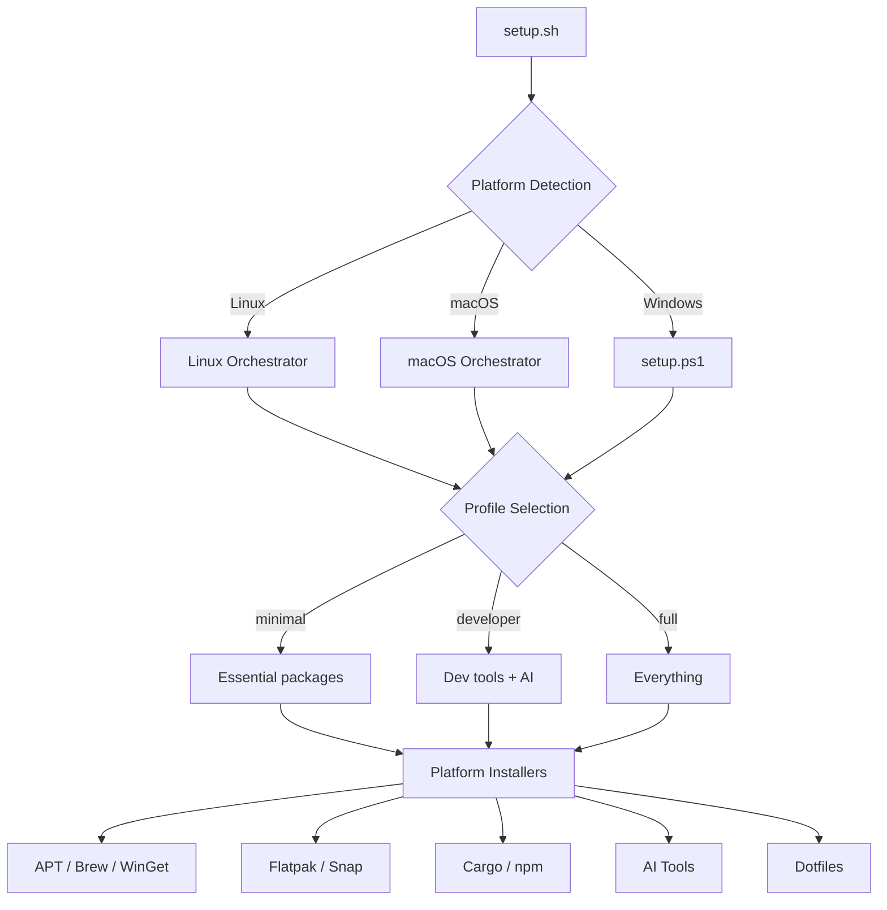

# Phase 8: Documentation - Research

**Researched:** 2026-02-07
**Domain:** Technical documentation, GitHub repository presentation, open-source project showcasing
**Confidence:** HIGH

## Summary

This phase transforms the existing scattered documentation into a single, cohesive README.md (replacing the current emoji-heavy version) plus a rewritten CONTRIBUTING.md, CODE_OF_CONDUCT.md, and updated GitHub templates. The domain is well-understood: Markdown authoring, shields.io badges, Mermaid diagrams rendered natively by GitHub, asciinema/agg for terminal GIF recording, and Contributor Covenant v2.1 for Code of Conduct.

The codebase is fully built (425+ commits, 9 ADRs, 8 completed phases). All technical content exists -- it just needs to be organized, written clearly, and presented for dual purpose: functional user docs AND portfolio showcase for senior DevOps/Platform Engineering.

**Primary recommendation:** Write README.md section-by-section following the 23-section structure defined in CONTEXT.md. Rewrite CONTRIBUTING.md from scratch (current one is BMAD-centric boilerplate, not project-specific). Add CODE_OF_CONDUCT.md (Contributor Covenant v2.1). Update GitHub templates to match current project reality.

## Standard Stack

The "stack" for documentation is tools and services, not libraries.

### Core

| Tool | Version/Source | Purpose | Why Standard |
|------|---------------|---------|--------------|
| Markdown (GFM) | GitHub Flavored | All documentation format | Native GitHub rendering, universal |
| shields.io | shields.io/badges | Badge SVG generation | Industry standard, 1.6B+ images/month |
| Mermaid | Native GitHub support | Architecture flowcharts | Renders in-browser on GitHub, no build step |
| Contributor Covenant | v2.1 | Code of Conduct | Most adopted open-source CoC worldwide |
| asciinema | CLI tool | Terminal session recording | Standard for dotfiles/CLI project demos |
| agg | github.com/asciinema/agg | asciicast-to-GIF conversion | Official companion to asciinema, uses gifski |
| socialify.git.ci | Web service | Social preview image (1280x640) | Generates from repo metadata, auto-updates |

### Supporting

| Tool | Purpose | When to Use |
|------|---------|-------------|
| `gh` CLI | Set repo description + topics | After README is done, update repo metadata |
| HTML `<details>` tags | Collapsible sections | Package lists, troubleshooting, platform-specific instructions |
| HTML `<div align="center">` | Badge centering | Badge rows at top of README |

### Alternatives Considered

| Instead of | Could Use | Tradeoff |
|------------|-----------|----------|
| Mermaid in-repo | Static PNG diagrams | Mermaid is editable as text, renders natively on GitHub. PNGs require re-generation. Use Mermaid. |
| asciinema GIF | SVG player embed | GIFs work everywhere (GitHub, social, Slack). SVG player requires JS. Use GIF. |
| socialify.git.ci | Custom Figma/Canva image | Socialify auto-updates from repo metadata. Custom needs re-uploading. Use socialify. |
| Contributor Covenant | Custom CoC | Contributor Covenant is recognized industry-wide. Don't write custom. |

## Architecture Patterns

### Documentation File Structure

After Phase 8, the repo root should contain:

```
os-postinstall-scripts/
├── README.md                          # Single expanded document (23 sections)
├── CONTRIBUTING.md                    # Rewritten, project-specific
├── CODE_OF_CONDUCT.md                 # NEW - Contributor Covenant v2.1
├── LICENSE                            # EXISTS - MIT (already correct)
├── SECURITY.md                        # EXISTS - already adequate
├── .github/
│   ├── ISSUE_TEMPLATE/
│   │   ├── bug_report.md              # UPDATE - align with current project
│   │   ├── feature_request.md         # UPDATE - align with current project
│   │   └── config.yml                 # EXISTS - adequate
│   └── pull_request_template.md       # UPDATE - add ShellCheck requirement
└── assets/                            # NEW - for demo GIF
    └── demo.gif                       # Terminal recording (~30s)
```

### Pattern 1: Single Expanded README with Collapsible Sections

**What:** All documentation in one README.md, using HTML `<details>` for long content.

**When to use:** Projects where users need a single reference point and discovery through scrolling is preferred over navigating between files.

**Why this pattern:** The CONTEXT decision explicitly chose this over separate INSTALL.md/USAGE.md/CUSTOMIZE.md files. The reference repos (mathiasbynens/dotfiles, thoughtbot/laptop) all use single README approach.

**Example structure:**

```markdown
# Title + Tagline

<div align="center">

<!-- Badge Row 1 -->
[](LICENSE)
...

</div>

<!-- Terminal demo GIF -->
<div align="center">
  
</div>

## Why This Exists

[2-3 sentences motivation]

## Table of Contents

- [Quick Start](#quick-start)
- [Features](#features)
...

## Quick Start

```bash
git clone https://github.com/BragatteMAS/os-postinstall-scripts
cd os-postinstall-scripts
./setup.sh --dry-run    # Preview first
./setup.sh              # Run it
```

<details>
<summary>Platform-specific instructions</summary>

### Linux
...

### macOS
...

### Windows
...

</details>
```

### Pattern 2: Inverted Pyramid Information Architecture

**What:** Most important information first, details progressively deeper.

**When to use:** Any documentation that serves both casual browsers and deep readers.

**Structure applied to this project:**

1. **Instant value** (first screen): Title, tagline, badges, demo GIF
2. **Quick start** (30 seconds): 3 commands to get running
3. **Features overview** (1 minute): What it does, bullet list
4. **Decision-making** (2 minutes): Platform support, profiles, CLI tools mapping
5. **Architecture** (5 minutes): How it works, Mermaid diagram, directory tree
6. **Portfolio depth** (10 minutes): Engineering highlights, AI integration, tech stack
7. **Reference** (as needed): Customization, CLI flags, dotfiles, troubleshooting

### Pattern 3: Badge Layout Convention

**What:** Functional badges arranged in centered rows of 3.

**Row 1 (Status):**
```markdown
[](LICENSE)
[](...)
[](...)
```

**Row 2 (Quality + AI):**
```markdown
[](...)
[](...)
[](...)
```

**Style recommendation:** Use `flat` style (default). Consistent, readable, professional. The `for-the-badge` style is too large for 6 badges.

### Pattern 4: Mermaid Flowchart for Architecture

**What:** GitHub natively renders ```mermaid code blocks.

**Recommended diagram:**



**Known limitations on GitHub:**
- No hyperlinks in nodes
- No tooltips
- Some emoji/special chars cause errors
- Keep diagrams under ~30 nodes for readability
- Use `flowchart` (not `graph`) for best compatibility

### Anti-Patterns to Avoid

- **Wall of text without structure:** Use headings, bullets, tables, and collapsible sections
- **Outdated project structure in README:** The current README shows an old `scripts/` tree. Must match actual `src/` structure
- **Emoji overload:** Current README has emojis in every heading. CONTEXT decision: no emojis in documentation text
- **Referencing non-existent files:** Current README links to `GUIDING-PRINCIPLES.md` (does not exist). Clean all broken references
- **BMAD-specific content in CONTRIBUTING:** Current CONTRIBUTING references Discord, BMad Method, expansion packs -- none of which apply to this project. Rewrite entirely

## Don't Hand-Roll

Problems that look simple but have existing solutions:

| Problem | Don't Build | Use Instead | Why |
|---------|-------------|-------------|-----|
| Badge generation | Custom SVG/images | shields.io URL patterns | Consistent styling, auto-updates, CDN-hosted |
| Architecture diagrams | Static images in Paint/Figma | Mermaid code blocks | Text-editable, version-controlled, GitHub-native |
| Code of Conduct | Write from scratch | Contributor Covenant v2.1 template | Industry standard, recognized, legally vetted |
| Social preview image | Custom design | socialify.git.ci | Auto-generates from repo metadata, correct dimensions |
| Terminal demo | Screen recording + manual GIF | asciinema + agg pipeline | Scriptable, reproducible, high quality gifski output |
| Table of Contents | Manual anchor links | Manual anchors (GitHub has no auto-ToC) | Manual is actually correct here -- GitHub doesn't auto-generate ToC for README |

**Key insight:** Documentation tooling in the GitHub ecosystem is mature. Every visual element has a standard tool. The work is in content creation, not tool building.

## Common Pitfalls

### Pitfall 1: Broken Internal Links

**What goes wrong:** Markdown links reference files that were moved or renamed during refactoring phases.
**Why it happens:** 8 phases of structural changes. File paths changed multiple times.
**How to avoid:** After writing README, grep all `](` link patterns and verify each target exists. The current README has at least one broken link (`GUIDING-PRINCIPLES.md`).
**Warning signs:** 404 pages when clicking links on GitHub.

### Pitfall 2: Information Staleness on First Write

**What goes wrong:** README describes features/structure from Phase 1-2 but misses Phase 3-7 improvements (dotfiles backup system, dry-run mode, progress feedback, completion summary, Windows support).
**Why it happens:** Writer references old documentation instead of reading actual source code.
**How to avoid:** Source content from actual code files, not from existing docs. Key sources:
- `setup.sh` for CLI flags and entry point behavior
- `config.sh` for profiles and env vars
- `src/core/*.sh` for engineering patterns
- `data/packages/profiles/*.txt` for profile definitions
- `src/installers/dotfiles-install.sh` for dotfiles symlink map
- `src/platforms/*/main.sh` for platform dispatch
**Warning signs:** README mentions features that don't exist, or misses features that do.

### Pitfall 3: Mermaid Diagram Too Complex

**What goes wrong:** Diagram tries to show every script and becomes unreadable.
**Why it happens:** Desire to be complete.
**How to avoid:** Keep Mermaid diagrams to high-level flow (setup.sh -> detection -> profile -> installers). Use ASCII directory tree for file structure. Max ~15-20 nodes.
**Warning signs:** Diagram overflows horizontally on standard screen width.

### Pitfall 4: CONTRIBUTING.md Copy-Paste from Template

**What goes wrong:** CONTRIBUTING is generic boilerplate that doesn't match the project's actual workflow.
**Why it happens:** Current CONTRIBUTING was copied from BMAD Method and references Discord, expansion packs, and `next` branch -- none applicable here.
**How to avoid:** Write CONTRIBUTING from scratch based on actual project patterns:
- Branch strategy: GitHub Flow (main + feature branches)
- Commit convention: Conventional Commits (already used: `feat:`, `fix:`, `docs:`, `test:`, `refactor:`)
- CI requirement: ShellCheck zero warnings
- PR template: already exists at `.github/pull_request_template.md`
- No Discord, no `next` branch, no BMAD-specific content
**Warning signs:** CONTRIBUTING references tools/channels that project doesn't use.

### Pitfall 5: Missing DRY_RUN Emphasis

**What goes wrong:** Quick Start doesn't prominently recommend `--dry-run` first.
**Why it happens:** Writer assumes users will read all docs before running.
**How to avoid:** Make `--dry-run` the FIRST command in Quick Start, before the actual run. Pattern from thoughtbot/laptop: "Review the script (avoid running without reading)."
**Warning signs:** Users run setup.sh without preview and are surprised by changes.

### Pitfall 6: asciinema Recording in Wrong Environment

**What goes wrong:** Terminal demo shows wrong colors, broken prompts, or non-representative output.
**Why it happens:** Recording done in a shell with custom config that differs from clean install experience.
**How to avoid:** Record in a clean environment (fresh VM or container). Show: `./setup.sh --dry-run developer` running with progress steps and completion summary. Target ~30s. Keep terminal width to 80-100 cols for GIF readability.
**Warning signs:** Demo GIF shows personal shell customizations or takes >1 minute.

## Code Examples

Since this phase is documentation (Markdown), "code examples" are content patterns.

### Collapsible Section Pattern

```html
<details>
<summary><b>Section Title</b></summary>

Content here. Can include:
- Bullet lists
- Tables
- Code blocks

| Column 1 | Column 2 |
|----------|----------|
| Data     | Data     |

</details>
```

**Note:** GitHub requires a blank line after `<summary>` and before content for Markdown rendering inside `<details>`.

### Profile Comparison Table Pattern

```markdown
| Feature | Minimal | Developer | Full |
|---------|:-------:|:---------:|:----:|
| System packages (APT/Brew/WinGet) | x | x | x |
| Development tools (Cargo, npm) | | x | x |
| Flatpak applications | | x | x |
| Snap packages | | x | x |
| AI/MCP tools | | x | x |
| Post-install extras | | | x |
| **Estimated time** | ~5 min | ~15 min | ~30 min |
| **Package files** | 1 per platform | 6-8 | 10+ |
```

### CLI Flags Table Pattern

```markdown
| Flag | Short | Env Var | Description |
|------|-------|---------|-------------|
| `--dry-run` | `-n` | `DRY_RUN=true` | Show what would be done without making changes |
| `--verbose` | `-v` | `VERBOSE=true` | Enable debug output with timestamps |
| `--unattended` | `-y` | `UNATTENDED=true` | Skip confirmation prompts |
| `--help` | `-h` | - | Show help message |
```

### Dotfiles Managed Table Pattern

```markdown
| Source | Target | Description |
|--------|--------|------------|
| `data/dotfiles/zsh/zshrc` | `~/.zshrc` | Zsh configuration |
| `data/dotfiles/bash/bashrc` | `~/.bashrc` | Bash configuration |
| `data/dotfiles/git/gitconfig` | `~/.gitconfig` | Git configuration |
| `data/dotfiles/git/gitignore` | `~/.config/git/ignore` | Global gitignore |
| `data/dotfiles/starship/starship.toml` | `~/.config/starship.toml` | Starship prompt |
```

Source: verified from `/Users/bragatte/Documents/GitHub/os-postinstall-scripts/src/installers/dotfiles-install.sh` lines 145-151.

### Modern CLI Tools Mapping Table Pattern

```markdown
| Traditional | Modern | Category | Description |
|-------------|--------|----------|-------------|
| `cat` | `bat` | File viewing | Syntax highlighting, line numbers |
| `ls` | `eza` | File listing | Icons, Git status, tree view |
| `find` | `fd` | File search | Intuitive syntax, fast |
| `grep` | `ripgrep` (`rg`) | Content search | Blazing fast, respects .gitignore |
| `cd` | `zoxide` (`z`) | Navigation | Smart, frequency-based |
| `diff` | `delta` | Diffing | Syntax-highlighted diffs |
```

### asciinema + agg Recording Pipeline

```bash
# 1. Install tools
cargo install --git https://github.com/asciinema/agg  # or: brew install agg
pip install asciinema                                    # or: brew install asciinema

# 2. Record terminal session (~30 seconds)
asciinema rec demo.cast --cols 100 --rows 30

# During recording:
# ./setup.sh --dry-run developer
# Wait for completion summary, then Ctrl+D

# 3. Convert to GIF
agg demo.cast assets/demo.gif --font-size 14 --speed 2

# 4. Optimize (optional - gifski already produces optimized output)
# The GIF is ready for README embedding
```

### Contributor Covenant v2.1 Template

Obtain from: `https://www.contributor-covenant.org/version/2/1/code_of_conduct/code_of_conduct.md`

Replace placeholders:
- `[INSERT CONTACT METHOD]` -> `marcelobragatte@gmail.com` (consistent with SECURITY.md)

### socialify.git.ci Social Preview

URL pattern:
```
https://socialify.git.ci/BragatteMAS/os-postinstall-scripts/image?description=1&font=Inter&language=1&name=1&owner=1&pattern=Plus&theme=Dark
```

Generate at: `https://socialify.git.ci/BragatteMAS/os-postinstall-scripts`
Download as PNG (1280x640px), upload via GitHub Settings > Social preview.

### GitHub Repo Metadata via gh CLI

```bash
# Update description
gh repo edit BragatteMAS/os-postinstall-scripts \
  --description "Cross-platform post-install automation for Linux, macOS & Windows. One command to set up your entire dev environment with 10+ installer types, 3 profiles, dry-run mode, and production-grade error handling."

# Update topics (max 20)
gh repo edit BragatteMAS/os-postinstall-scripts \
  --add-topic bash,powershell,shell-script,automation,devops,dotfiles,post-install,setup-script,cross-platform,linux,macos,windows,apt,homebrew,winget,flatpak,snap,developer-tools,ai-tools,mcp
```

## State of the Art

| Old Approach | Current Approach | When Changed | Impact |
|-------------|------------------|--------------|--------|
| Multiple doc files (INSTALL, USAGE, CUSTOMIZE) | Single README with collapsible sections | User decision, Phase 8 | Simpler navigation, single reference |
| Static PNG diagrams | Mermaid in Markdown | GitHub native support (2022+) | Text-editable, version-controlled |
| asciicast2gif | agg (asciinema gif generator) | agg replaced asciicast2gif | Better quality (gifski), maintained |
| Custom badges | shields.io standardized patterns | shields.io matured | Consistent, CDN-hosted, auto-updating |
| Separate GUIDING-PRINCIPLES.md | Inline in CONTRIBUTING.md | Phase 8 cleanup | Remove dead link, consolidate |

**Deprecated/outdated:**
- `asciicast2gif`: Replaced by `agg`. Don't use asciicast2gif.
- Current README: Contains outdated project structure, BMAD-era references, emoji-heavy formatting, and broken links. Must be rewritten completely.
- Current CONTRIBUTING.md: Copied from BMAD Method project. References Discord, expansion packs, `next` branch. Must be rewritten for this project.

## Codebase Inventory for Documentation

Verified facts from source code analysis (HIGH confidence -- read directly from files):

### Project Statistics
- Total commits: 425+
- ADRs: 9 (with 3 more in .github/PROJECT_DOCS/adrs/)
- Completed phases: 7 (core infra, consolidation, dotfiles, macOS, Linux enhancements, Windows, UX polish)
- Package files: 12 (apt, apt-post, brew, brew-cask, cargo, flatpak, flatpak-post, snap, snap-post, npm, winget, ai-tools)
- Total package lines: 414 across all files
- Core modules: 8 (logging, platform, errors, progress, idempotent, dotfiles, packages, interactive)
- Platform handlers: 3 (Linux, macOS, Windows)
- Installer types: 10+ (APT, Brew, Brew Cask, Flatpak, Snap, Cargo, WinGet, npm, fnm, uv, AI tools, dev-env)

### CLI Interface (from setup.sh)
- Entry point: `./setup.sh [options] [action|profile]`
- Flags: `--dry-run` (`-n`), `--verbose` (`-v`), `--unattended` (`-y`), `--help` (`-h`)
- Actions: `dotfiles`, `unlink`
- Profiles: `minimal`, `developer` (default), `full`
- Env vars: `DRY_RUN`, `VERBOSE`, `UNATTENDED`
- Windows entry: `.\setup.ps1 [-Profile <name>] [-Help]`

### Dotfiles Symlink Map (from dotfiles-install.sh)
- `data/dotfiles/zsh/zshrc` -> `~/.zshrc`
- `data/dotfiles/bash/bashrc` -> `~/.bashrc`
- `data/dotfiles/git/gitconfig` -> `~/.gitconfig`
- `data/dotfiles/git/gitignore` -> `~/.config/git/ignore`
- `data/dotfiles/starship/starship.toml` -> `~/.config/starship.toml`
- Backup location: `~/.dotfiles-backup/`
- Manifest: `~/.dotfiles-backup/backup-manifest.txt`

### Engineering Highlights (for Portfolio Section)
1. **Idempotent operations** (`src/core/idempotent.sh`): `is_installed()`, `is_apt_installed()`, `is_brew_installed()`, `ensure_line_in_file()`, `ensure_symlink()`, `backup_if_exists()`
2. **Cross-process failure tracking** (`src/core/errors.sh`): Shared `FAILURE_LOG` file for parent/child process communication
3. **Dry-run mode** (`src/core/progress.sh`): `DRY_RUN` flag checked at every mutation point, prominent banner, full simulation
4. **Profile-based architecture** (`data/packages/profiles/`): Text files list package files, platform-specific filtering in orchestrators
5. **Progress feedback** (`src/core/progress.sh`): `[Step N/M]` counters, elapsed time, completion summary with failure report
6. **Platform abstraction** (`setup.sh` -> `src/platforms/*/main.sh`): Single entry point dispatches to Linux/macOS/Windows handlers
7. **Backup system** (`src/core/dotfiles.sh`): Date-stamped backups with manifest, collision handling, restore capability
8. **Error resilience**: No `set -e` (continue-on-failure strategy), `record_failure()` + summary at end, `retry_with_backoff()`

### What Needs sudo
- Linux: APT operations, Snap operations
- macOS: Some Homebrew cask installations, shell change (`chsh`)
- Windows: None (WinGet runs as user)
- Dry-run mode: Skips sudo entirely

### Existing Files to UPDATE (not create from scratch)
- `README.md` -- exists, rewrite completely
- `CONTRIBUTING.md` -- exists, rewrite completely (current is BMAD boilerplate)
- `LICENSE` -- exists, MIT, correct as-is
- `SECURITY.md` -- exists, adequate as-is
- `.github/ISSUE_TEMPLATE/bug_report.md` -- exists, update to match current project
- `.github/ISSUE_TEMPLATE/feature_request.md` -- exists, update to match current project
- `.github/ISSUE_TEMPLATE/config.yml` -- exists, adequate as-is
- `.github/pull_request_template.md` -- exists, update to add ShellCheck requirement

### Files to CREATE
- `CODE_OF_CONDUCT.md` -- does not exist, add Contributor Covenant v2.1
- `assets/demo.gif` -- does not exist, terminal recording (deferred until asciinema is available)

## Open Questions

Things that couldn't be fully resolved:

1. **asciinema/agg availability for recording**
   - What we know: agg requires Rust 1.75+ and can be installed via cargo. asciinema is a Python tool.
   - What's unclear: Whether the user has these tools installed or wants to record the demo in this phase vs. later.
   - Recommendation: Create placeholder in README (`assets/demo.gif` with alt text note) and provide the recording pipeline in a separate task. The README can ship without the GIF and add it later. Don't block Phase 8 on this.

2. **socialify.git.ci social preview**
   - What we know: Generates 1280x640 PNG from repo metadata. Requires browser visit to generate.
   - What's unclear: Whether this should be done programmatically or is a manual step.
   - Recommendation: Document the URL and manual upload steps. This is a one-time operation done after README is published.

3. **Exact package counts per profile**
   - What we know: Package files have comments and blank lines, so line count != package count.
   - What's unclear: Exact installable package counts after filtering comments/blanks.
   - Recommendation: Count non-comment, non-blank lines from each .txt file during plan execution. Not critical for research.

4. **GitHub repo description character limit**
   - What we know: GitHub allows up to 350 characters for repository description.
   - What's unclear: Whether the proposed description fits comfortably.
   - Recommendation: The proposed description at ~172 characters is well within the 350-char limit. Verified.

## Sources

### Primary (HIGH confidence)
- Source code files read directly: `setup.sh`, `config.sh`, `src/core/logging.sh`, `src/core/platform.sh`, `src/core/errors.sh`, `src/core/progress.sh`, `src/core/idempotent.sh`, `src/core/dotfiles.sh`, `src/installers/dotfiles-install.sh`, `src/platforms/linux/main.sh`, `src/platforms/macos/main.sh`, `setup.ps1`, `quick-setup.sh`, `data/packages/profiles/*.txt`
- Existing documentation: `README.md`, `CONTRIBUTING.md`, `LICENSE`, `SECURITY.md`, `.github/ISSUE_TEMPLATE/*`, `.github/pull_request_template.md`
- shields.io official site: https://shields.io/
- Contributor Covenant v2.1: https://www.contributor-covenant.org/version/2/1/code_of_conduct/
- GitHub Mermaid docs: https://docs.github.com/en/get-started/writing-on-github/working-with-advanced-formatting/creating-diagrams
- GitHub social preview docs: https://docs.github.com/en/repositories/managing-your-repositorys-settings-and-features/customizing-your-repository/customizing-your-repositorys-social-media-preview

### Secondary (MEDIUM confidence)
- asciinema agg docs: https://docs.asciinema.org/manual/agg/
- agg GitHub: https://github.com/asciinema/agg
- socialify.git.ci: https://github.com/wei/socialify
- Reference READMEs analyzed: mathiasbynens/dotfiles, thoughtbot/laptop

### Tertiary (LOW confidence)
- Exact install time estimates (minimal ~5min, developer ~15min, full ~30min) -- from CONTEXT.md user estimates, not benchmarked
- Badge styling preferences -- subjective, but `flat` style is most common for professional projects

## Metadata

**Confidence breakdown:**
- Standard stack: HIGH -- tools are well-established and documented
- Architecture: HIGH -- patterns verified against reference repos and actual codebase
- Pitfalls: HIGH -- identified from reading actual source code and existing documentation
- Content inventory: HIGH -- every fact verified by reading source files directly

**Research date:** 2026-02-07
**Valid until:** 2026-03-07 (documentation tooling is stable; content depends on codebase which is complete)
