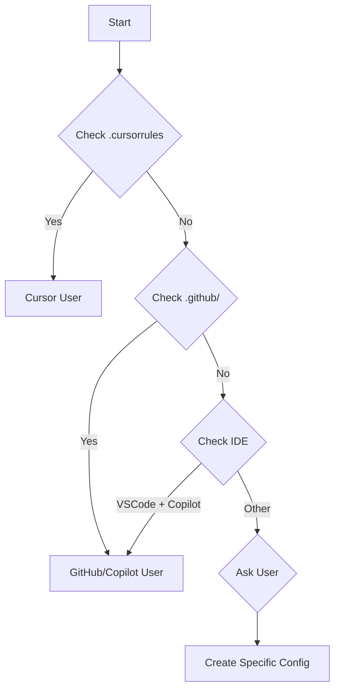

# AI Repository Structure Template

> 🚀 **Get started in 5 minutes** with minimal setup, then grow as needed

> "Adapt what is useful, reject what is useless, and add what is specifically your own."  
> _Bruce Lee_

## Why Use This?
- ✅ **Instant AI Understanding**: Help AI assistants work effectively with your code
- ✅ **Start Small**: Begin with just 2 files, add more when needed
- ✅ **No Lock-in**: Everything is markdown, remove anytime
- ✅ **Works Everywhere**: GitHub Copilot, Cursor, Claude, ChatGPT, etc.

## 🎯 Quick Start (2 minutes)

### Option 1: Interactive Setup (Recommended)
```bash
# Run interactive wizard:
npx create-ai-context

# Or with yarn:
yarn create ai-context

# Or download and run:
curl -fsSL https://[your-setup-url]/setup.sh | bash
```

### Option 2: Minimal Manual Setup
```bash
# Just 3 commands:
mkdir -p .ai
curl -fsSL https://[your-repo-url]/QUESTIONS.md > .ai/1-QUESTIONS.md
curl -fsSL https://[your-repo-url]/AI_ASSISTANT.md > .ai/AI_ASSISTANT.md

# Answer the questions & customize AI instructions ✅
```

### Option 3: Copy-Paste Start
```bash
# Create .ai/1-QUESTIONS.md with this content:
cat > .ai/1-QUESTIONS.md << 'EOF'
# Quick Project Assessment

## What does this project do?
[Your answer here - one paragraph]

## Who uses it?
[Target users/audience]

## What's the main tech stack?
[Languages, frameworks, databases]

## What's the biggest current challenge?
[Technical debt, scaling, features, etc.]

## How can AI best help you?
[Code review, debugging, documentation, etc.]
EOF
```

## 📊 Complexity Levels

### 🟢 Basic (Start Here)
Minimal setup for immediate value:
```
project/
├── .ai/
│   ├── 1-QUESTIONS.md      # 5-minute questionnaire
│   ├── 2-README.md         # Auto-generated overview
│   └── AI_ASSISTANT.md     # Direct AI instructions
└── README.md               # Your existing readme
```

### 🟡 Standard (When You Need More)
Add as your project grows:
```
project/
├── .ai/
│   ├── 1-QUESTIONS.md      # Core questions
│   ├── 2-README.md         # Project overview
│   ├── AI_ASSISTANT.md     # AI instructions (or CLAUDE.md)
│   ├── 3-ARCHITECTURE.md   # How it's built
│   ├── 4-CONVENTIONS.md    # Code standards
│   └── 5-DEPENDENCIES.md   # External deps
└── [your project files]
```

### 🔴 Advanced (Full Power)
Complete setup for complex projects:
```
project/
├── .ai/                           # AI context (fill in order)
│   ├── 1-QUESTIONS.md             # User-focused questions (START HERE)
│   ├── 2-README.md                # Project overview (from QUESTIONS answers)
│   ├── AI_ASSISTANT.md            # Direct AI instructions (CLAUDE.md)
│   ├── 3-PROJECT-CONTEXT.md       # Detailed technical context
│   ├── 4-ARCHITECTURE.md          # System design overview
│   ├── 5-CONVENTIONS.md           # Standards and conventions
│   ├── 6-DEPENDENCIES.md          # External dependencies
│   ├── MAINTENANCE-RULES.md       # Maintenance rules
│   ├── PLANNING-QUESTIONS.md      # Planning questions template
│   ├── SECURITY-GUIDELINES.md     # Security best practices
│   ├── PERFORMANCE-BASELINE.md    # Performance benchmarks
│   ├── ERROR-PATTERNS.md          # Common issues catalog
│   ├── LEARNINGS.md               # AI interaction learnings
│   ├── ALIASES.md                 # Context shortcuts
│   ├── TEST-SCENARIOS.md          # Critical test flows
│   ├── MONITORING.md              # Monitoring guidelines
│   └── DEBUGGER.md                # Debugging guide and commands
├── docs/                          # Technical Documentation
│   ├── PRD.md                     # Product Requirements Document
│   ├── ADR/                       # Architecture Decision Records
│   │   ├── ADR-001-stack-choice.md
│   │   ├── ADR-002-data-structure.md
│   │   └── ADR-template.md
│   ├── templates/                 # Reusable templates
│   │   ├── component-template.md
│   │   ├── feature-template.md
│   │   └── bug-report-template.md
│   └── guides/                    # Technical guides
│       ├── setup-guide.md
│       └── deployment-guide.md
├── user-docs/                     # User-Facing Documentation (grows with MVP)
│   ├── _in-progress/              # Draft documentation being written
│   │   ├── feature-x-guide.md    # Not yet released
│   │   └── README.md              # Track what's being worked on
│   ├── getting-started/           # Onboarding documentation
│   │   ├── README.md              # Overview
│   │   ├── installation.md        # How to install
│   │   ├── first-steps.md         # Initial setup
│   │   └── quick-wins.md          # Immediate value demos
│   ├── features/                  # Feature-specific guides
│   │   ├── README.md              # Feature overview
│   │   ├── feature-a/             # Released in MVP
│   │   │   ├── overview.md
│   │   │   ├── how-to-use.md
│   │   │   └── examples.md
│   │   └── feature-b/             # Added in v1.1
│   │       └── overview.md
│   ├── tutorials/                 # Step-by-step guides
│   │   ├── README.md
│   │   ├── basic/                 # For beginners
│   │   │   └── tutorial-1.md
│   │   └── advanced/              # Power users
│   │       └── tutorial-1.md
│   ├── troubleshooting/           # Common issues and solutions
│   │   ├── README.md
│   │   ├── common-errors.md
│   │   └── faq.md
│   ├── api/                       # API documentation (if applicable)
│   │   ├── README.md
│   │   ├── endpoints.md
│   │   └── examples.md
│   └── releases/                  # Release notes for users
│       ├── README.md
│       ├── v1.0.0.md             # MVP release notes
│       └── v1.1.0.md             # Next release
├── src/                           # Source code
│   ├── components/README.md       # Components specific docs
│   ├── services/README.md         # Services specific docs
│   └── utils/README.md            # Utilities specific docs
├── tests/
│   └── README.md                  # Testing strategy
├── .github/
│   ├── pull_request_template.md
│   └── ISSUE_TEMPLATE/
│       ├── bug_report.md
│       └── feature_request.md
├── CHANGELOG.md                   # Change history
├── STATUS.md                      # Current project status
├── ROADMAP.md                     # Future vision and plans
└── README.md                      # Main documentation

```

## Main Files Content

### `.ai/1-QUESTIONS.md`
```markdown
# Project Discovery Questions

> 📝 **Instructions**: Answer these questions to establish project context. Your answers will guide the creation of all other documentation.

## 🎯 Project Identity

### What exactly are we building?
**Answer**: [One paragraph describing the core purpose and functionality]

### What problem does this solve?
**Answer**: [The specific pain point or need being addressed]

### What makes this solution unique?
**Answer**: [Key differentiators or innovative approaches]

## 👥 Users & Stakeholders

### Primary Users
- **Role/Title**: 
- **Technical Level**: [Beginner/Intermediate/Advanced]
- **Main Goals**: 
- **Pain Points**: 
- **Success Criteria**: 

### Secondary Users (if any)
- **Who else uses this?**: 
- **How do they differ?**: 
- **Special needs?**: 

## 🎨 User Experience Vision

### How should using this feel?
**Answer**: [Desired emotional response - e.g., simple, powerful, intuitive]

### What's the "wow" moment?
**Answer**: [The moment users realize the value]

### What should users NOT have to worry about?
**Answer**: [Complexities hidden from users]

## 🤖 AI Assistant Preference

### Which AI tools do you primarily use?
<!-- This helps us create the right configuration file -->
- [ ] **Claude (Anthropic)** → Creates `CLAUDE.md`
- [ ] **GitHub Copilot** → Creates `.github/copilot-instructions.md`
- [ ] **Cursor** → Creates `.cursorrules`
- [ ] **ChatGPT/OpenAI** → Creates `.openai-codex.md`
- [ ] **Gemini** → Creates `.gemini-context.md`
- [ ] **Multiple/Other** → Creates generic `AI_ASSISTANT.md`

### How do you prefer AI assistance?
- [ ] **Inline code completion** (Copilot style)
- [ ] **Chat-based coding** (Claude/ChatGPT style)
- [ ] **Both** (Different tools for different tasks)

### AI usage patterns
- **Most common tasks**: [e.g., code generation, debugging, refactoring]
- **Preferred interaction style**: [e.g., detailed prompts, quick commands]
- **Context needs**: [e.g., full file, specific functions, entire project]

## 🛠️ Technical Approach

### Why this tech stack?
**Answer**: [Main reasons for technology choices]

### What are the non-negotiables?
**Answer**: [Technical requirements that cannot be compromised]

### What are the trade-offs?
**Answer**: [What we're sacrificing for what benefit]

## 📊 Success Metrics

### How do we measure success?
- **Quantitative**: [Measurable metrics]
- **Qualitative**: [User satisfaction indicators]

### What does failure look like?
**Answer**: [Scenarios to avoid]

### What's the MVP?
**Answer**: [Minimum features for first release]

## 🚀 Project Lifecycle

### Current Status
- **Phase**: [Planning/Development/Testing/Production]
- **Completion**: [X%]
- **Blockers**: [Current obstacles]

### Next Milestones
1. **Next Week**: 
2. **Next Month**: 
3. **Next Quarter**: 

### Long-term Vision
**Answer**: [Where this project goes in 1-2 years]

## 🔄 Development Process

### How do we work?
- **Methodology**: [Agile/Waterfall/etc]
- **Team Size**: 
- **Release Cycle**: 

### How do we handle changes?
**Answer**: [Change management approach]

### How do we ensure quality?
**Answer**: [Testing and review processes]

## 🚨 Risks & Constraints

### Technical Risks
1. **Risk**: [Description] → **Mitigation**: [Strategy]
2. **Risk**: [Description] → **Mitigation**: [Strategy]

### Business Risks
1. **Risk**: [Description] → **Mitigation**: [Strategy]
2. **Risk**: [Description] → **Mitigation**: [Strategy]

### Constraints
- **Budget**: 
- **Timeline**: 
- **Resources**: 
- **Technical**: 

## 📝 Documentation Needs

### Who needs docs?
- **Developers**: [What they need]
- **Users**: [What they need]
- **Ops/Support**: [What they need]

### Priority Documentation
1. [Most critical doc]
2. [Second priority]
3. [Third priority]

## 🤔 Open Questions

### What keeps you up at night about this project?
**Answer**: [Main concerns or unknowns]

### What would make this a massive success?
**Answer**: [Dream scenario]

### What would you do differently if starting over?
**Answer**: [Lessons learned]

---

> 💡 **Tip**: Update these answers as the project evolves. They serve as the source of truth for all other documentation.
```

### `.ai/2-README.md`
```markdown
# [Project Name] - AI Context

> 🤖 This overview is generated from the answers in 1-QUESTIONS.md

## Project Summary
[Auto-filled from question answers]

## Target Users
[Auto-filled from question answers]

## Technical Stack
[Auto-filled from question answers]

## Current Status
[Auto-filled from question answers]

## How AI Can Help
[Auto-filled from question answers]

## Key Files
- `1-QUESTIONS.md` - Source of truth
- `3-PROJECT-CONTEXT.md` - Technical details
- `4-ARCHITECTURE.md` - System design
- `5-CONVENTIONS.md` - Code standards

## Navigation Guide
1. Start with this file for overview
2. Check PROJECT-CONTEXT for technical depth
3. Review ARCHITECTURE for system design
4. Follow CONVENTIONS for code style
5. See other files as needed
```

### `.ai/3-PROJECT-CONTEXT.md`
```markdown
# Technical Project Context

## Repository Structure
[Directory tree with explanations]

## Key Components
[Main parts of the system]

## Data Flow
[How data moves through the system]

## External Integrations
[APIs, services, databases]

## Technical Decisions
[Key choices and rationale]

## Development Environment
[Setup requirements]
```

### `.ai/4-ARCHITECTURE.md`
```markdown
# System Architecture

## Overview
[High-level architecture diagram/description]

## Components
### Component A
- **Purpose**: 
- **Technology**: 
- **Interfaces**: 

### Component B
- **Purpose**: 
- **Technology**: 
- **Interfaces**: 

## Data Model
[Key entities and relationships]

## API Design
[Endpoints and contracts]

## Security Architecture
[Auth, encryption, permissions]

## Deployment Architecture
[Infrastructure and deployment]
```

### `.ai/5-CONVENTIONS.md`
```markdown
# Code Conventions & Standards

## Naming Conventions
- **Variables**: [style]
- **Functions**: [style]
- **Classes**: [style]
- **Files**: [style]
- **Constants**: [style]

## Code Style
### [Language 1]
- Indentation: [spaces/tabs]
- Line length: [characters]
- [Other rules]

### [Language 2]
- [Rules]

## Git Conventions
### Branch Naming
- Feature: `feature/description`
- Bugfix: `bugfix/description`
- Hotfix: `hotfix/description`

### Commit Messages
```
type: subject

body

footer
```

Types: feat, fix, docs, style, refactor, test, chore

## Testing Standards
- Minimum coverage: [X%]
- Test naming: [pattern]
- Test structure: [AAA/Given-When-Then]

## Documentation Standards
- Code comments: [when/how]
- README updates: [when required]
- API docs: [format]

## Review Checklist
- [ ] Follows naming conventions
- [ ] Includes tests
- [ ] Updates documentation
- [ ] No security issues
- [ ] Performance considered
```

### `.ai/6-DEPENDENCIES.md`
```markdown
# External Dependencies

## Production Dependencies
| Package | Version | Purpose | License |
|---------|---------|---------|---------|
| [name] | [version] | [why needed] | [license] |

## Development Dependencies
| Package | Version | Purpose |
|---------|---------|---------|
| [name] | [version] | [why needed] |

## System Requirements
- Runtime: [versions]
- Database: [versions]
- Other: [requirements]

## Security Considerations
[Any security notes about dependencies]

## Update Policy
[How/when to update dependencies]
```

### `.ai/AI_ASSISTANT.md` (or CLAUDE.md for Claude-specific)
```markdown
# AI Assistant Instructions

> 🤖 **START HERE** - Direct instructions for AI assistants

## Your Primary Directives
1. **Understand First**: Read 1-QUESTIONS.md and 2-README.md
2. **Follow Standards**: Use conventions from 5-CONVENTIONS.md
3. **Test Everything**: Never skip tests (see test commands below)
4. **Security Always**: Check SECURITY-GUIDELINES.md for sensitive areas
5. **Performance Matters**: Respect PERFORMANCE-BASELINE.md limits

## Project Context Summary
**What**: [Auto-filled from 1-QUESTIONS.md answer]
**Stack**: [Auto-filled from 1-QUESTIONS.md answer]
**Focus**: [Auto-filled from 1-QUESTIONS.md answer]

## Essential Commands
```bash
# Development
[dev command from package.json/Makefile]

# Tests (ALWAYS RUN BEFORE COMPLETING)
[test command]

# Lint/Format
[lint command]

# Build
[build command]
```

## Critical Rules for This Project
1. [Project-specific rule 1]
2. [Project-specific rule 2]
3. [Project-specific rule 3]

## Common Tasks Reference
| Task | Check First | Commands | Success Criteria |
|------|-------------|----------|------------------|
| Add Feature | existing patterns | `npm test` | All tests pass |
| Fix Bug | ERROR-PATTERNS.md | `npm run lint` | No lint errors |
| Refactor | current tests | `npm run build` | Build succeeds |
| Update Deps | DEPENDENCIES.md | `npm audit` | No vulnerabilities |

## Anti-Patterns to Avoid
- 🚫 Don't [common mistake 1]
- 🚫 Don't [common mistake 2]
- 🚫 Don't [common mistake 3]

## Quick Decision Tree
```
Need to add a feature?
  → Check similar features first
  → Follow existing patterns
  → Add tests
  → Update docs

Found a bug?
  → Check ERROR-PATTERNS.md
  → Add failing test
  → Fix bug
  → Verify all tests pass

Refactoring?
  → Ensure tests exist first
  → Make changes incrementally
  → Run tests after each change
```

## Navigation Order
1. **This file** (AI_ASSISTANT.md) - Your instructions
2. **1-QUESTIONS.md** - Understand the project
3. **2-README.md** - Project overview
4. **Other files as needed** - Based on task

## 💡 Pro Tips
- **Test EVERYTHING**: Never mark a task complete without running tests
- **Check Patterns First**: Look at existing code before writing new
- **Update Docs**: Documentation changes with code
- **Ask When Unsure**: Better to clarify than assume
```

## 🤖 AI-Specific Configuration Strategy

### Why Different Files for Different AIs?
Each AI assistant has unique strengths and configuration needs:

| AI Tool | Config File | Location | Optimized For |
|---------|------------|----------|---------------|
| **Claude** | `CLAUDE.md` | `.ai/` | Long context, deep reasoning, detailed analysis |
| **GitHub Copilot** | `copilot-instructions.md` | `.github/` | Inline completion, code patterns |
| **Cursor** | `.cursorrules` | Project root | IDE integration, fast iteration |
| **ChatGPT** | `OPENAI_CODEX.md` | `.ai/` | Versatile tasks, code generation |
| **Gemini** | `GEMINI_CONTEXT.md` | `.ai/` | Multimodal, analytical tasks |
| **Generic** | `AI_ASSISTANT.md` | `.ai/` | Universal format for any AI |

### Auto-Detection Flow


### Smart Setup with Detection
```bash
# Run smart detector
bash .ai/scripts/smart-ai-detector.sh

# Or one-line with auto-detection
curl -fsSL https://ai-context.dev/smart-setup.sh | bash
```

The detector checks:
1. **File signatures** (.cursorrules, .github/copilot-instructions.md)
2. **IDE configs** (.vscode/extensions.json)
3. **Environment variables** (CURSOR_EDITOR, etc.)
4. **Command history** (claude, anthropic usage)
5. **Fallback** to asking user

### Configuration Examples by AI Type

<details>
<summary><b>📘 CLAUDE.md (Anthropic Claude)</b></summary>

```markdown
# Claude-Specific Instructions

## Your Identity
You are Claude, an AI assistant by Anthropic working on [PROJECT].

## Leverage Your Strengths
1. **Long Context Window**: Analyze entire files and maintain context
2. **Deep Reasoning**: Break down complex problems systematically
3. **Detailed Analysis**: Provide thorough explanations when needed
4. **Safety-First**: Always consider security implications
5. **Uncertainty Awareness**: Acknowledge when unsure

## Project: [NAME]
[Description from QUESTIONS.md]

## Communication Guidelines
- Default to concise responses
- Expand detail when explicitly asked
- Use structured formats (lists, tables)
- Suggest alternatives when relevant

## Task Approach
1. Understand fully before acting
2. Plan approach before implementing
3. Consider edge cases
4. Validate thoroughly

## Key Commands
```bash
# Dev: [COMMAND]
# Test: [COMMAND] <- ALWAYS RUN
# Lint: [COMMAND]
```
```
</details>

<details>
<summary><b>📝 .cursorrules (Cursor IDE)</b></summary>

```
# Cursor AI Rules

You are an AI assistant in Cursor IDE helping with [PROJECT].

## Project Context
- Name: [PROJECT_NAME]
- Stack: [TECHNOLOGIES]
- Focus: [CURRENT_PRIORITY]

## Cursor-Specific Rules
1. Optimize for speed - quick iterations
2. Minimal explanations unless asked
3. Follow existing patterns exactly
4. Write tests inline with features
5. Use Cursor's Apply feature effectively

## Code Style
- [LANGUAGE] conventions
- [INDENTATION] spaces
- [LINE_LENGTH] character limit

## Workflow
- Read existing code first
- Make focused changes
- Test immediately
- Commit often

## Commands
Test: [TEST_COMMAND]
Build: [BUILD_COMMAND]
Run: [RUN_COMMAND]
```
</details>

<details>
<summary><b>🐙 .github/copilot-instructions.md</b></summary>

```markdown
# GitHub Copilot Configuration

## Project Overview
[PROJECT_DESCRIPTION]

## Completion Preferences
- **Scope**: Complete entire functions, not just lines
- **Safety**: Always include error handling
- **Style**: Match surrounding code patterns
- **Testing**: Generate test cases alongside implementation

## Code Patterns
### Preferred
- Async/await over callbacks/promises
- Functional patterns over imperative
- Early returns over nested conditions
- Descriptive names over comments

### Avoid
- Global variables
- Hardcoded values
- Console.log in production code
- Commented-out code

## Language-Specific
### JavaScript/TypeScript
- Use optional chaining ?.
- Prefer const over let
- Destructure when cleaner

### Python
- Type hints for functions
- Docstrings for public APIs
- List comprehensions when readable
```
</details>

<details>
<summary><b>🤖 OPENAI_CODEX.md (ChatGPT/GPT-4)</b></summary>

```markdown
# OpenAI GPT Configuration

## System Context
You are GPT-4, assisting with [PROJECT_NAME], a [DESCRIPTION].

## Leverage GPT Strengths
1. **Versatility**: Handle diverse tasks
2. **Code Generation**: Create boilerplate quickly
3. **Explanation**: Break down complex concepts
4. **Creativity**: Suggest innovative solutions

## Project Specifics
- Technology: [STACK]
- Architecture: [PATTERN]
- Testing: [FRAMEWORK]
- Deployment: [PLATFORM]

## Interaction Style
- Provide options when multiple approaches exist
- Include pros/cons for significant decisions
- Generate examples to illustrate concepts
- Use code interpreter for validation when available

## Quality Standards
- Production-ready code
- Comprehensive error handling
- Performance considerations
- Security best practices
```
</details>

<details>
<summary><b>🔷 GEMINI_CONTEXT.md (Google Gemini)</b></summary>

```markdown
# Gemini AI Configuration

## Project Context
Assisting with [PROJECT_NAME] using Gemini's capabilities.

## Gemini-Specific Features
1. **Multimodal**: Process code + diagrams/images
2. **Analytical**: Deep code analysis
3. **Cross-Language**: Seamless multi-language support
4. **Performance**: Optimization suggestions

## Project Details
- Purpose: [WHAT_IT_DOES]
- Users: [TARGET_AUDIENCE]
- Stack: [TECHNOLOGIES]
- Stage: [DEVELOPMENT_PHASE]

## Preferred Approach
- Analyze holistically before suggesting changes
- Consider performance implications
- Provide benchmarks when relevant
- Use visual explanations when helpful

## Integration Points
- APIs: [LIST]
- Databases: [LIST]
- Services: [LIST]
```
</details>

## 🚀 Progressive Adoption Path

### Step 1: Minimal Start (5 minutes)
```bash
# One-line setup (creates 3 essential files):
curl -fsSL https://raw.githubusercontent.com/[your-username]/[your-repo]/main/minimal.sh | bash

# Creates:
# - .ai/1-QUESTIONS.md (to understand your project)
# - .ai/2-README.md (project overview)
# - .ai/AI_ASSISTANT.md (AI instructions)
```

### Step 2: Answer Questions → Get README
```bash
# After answering questions in .ai/1-QUESTIONS.md:
python3 -m pip install ai-readme-generator
ai-readme-gen .ai/1-QUESTIONS.md > .ai/2-README.md
```

### Step 3: Grow As Needed
| Time | Files | Purpose |
|------|-------|----------|
| Day 1 | QUESTIONS + README + AI_ASSISTANT | AI understands & follows rules |
| Week 2-4 | + ARCHITECTURE | Explain system design |
| Month 2 | + CONVENTIONS | Consistent code style |
| Month 3+ | + ERROR-PATTERNS | Document recurring issues |
| As needed | Rest of template | Specific needs |

## 📊 Complexity Management

### Keep It Simple
1. **Start with Questions**: The 1-QUESTIONS.md file is all you need to begin
2. **Let It Grow Naturally**: Add files when you feel the need, not before
3. **Use Templates**: Copy from examples, don't write from scratch
4. **Automate When Possible**: Use scripts to generate boilerplate

### Signs You Need More
- **Add Architecture**: When onboarding takes > 30 minutes
- **Add Conventions**: When PR reviews repeat same feedback
- **Add Error Patterns**: When debugging similar issues repeatedly
- **Add Performance**: When optimization becomes a priority

## Initialization Scripts

### Smart Setup Script (Detects Repository State)

```bash
#!/bin/bash
# smart-setup-ai-structure.sh

echo "🔍 AI Repository Smart Setup"
echo "============================"

# Detect repository state
detect_repo_state() {
    local state="new"
    
    # Check for existing code
    if [[ -d "src" ]] || [[ -d "lib" ]] || [[ -d "app" ]]; then
        state="existing"
    fi
    
    # Check for package files
    if [[ -f "package.json" ]] || [[ -f "requirements.txt" ]] || [[ -f "go.mod" ]] || [[ -f "Cargo.toml" ]]; then
        state="existing"
    fi
    
    # Check maturity indicators
    if [[ -f "CHANGELOG.md" ]] && [[ -f "README.md" ]]; then
        if grep -q "v[0-9]" CHANGELOG.md 2>/dev/null; then
            state="mature"
        fi
    fi
    
    echo "$state"
}

# Analyze existing structure
analyze_existing() {
    echo "📊 Analyzing existing repository..."
    echo ""
    
    # Detect language/framework
    local tech_stack=""
    [[ -f "package.json" ]] && tech_stack="Node.js/JavaScript"
    [[ -f "requirements.txt" ]] && tech_stack="Python"
    [[ -f "go.mod" ]] && tech_stack="Go"
    [[ -f "Cargo.toml" ]] && tech_stack="Rust"
    [[ -f "pom.xml" ]] && tech_stack="Java/Maven"
    [[ -f "build.gradle" ]] && tech_stack="Java/Gradle"
    
    echo "Detected: ${tech_stack:-Unknown stack}"
    
    # Check existing docs
    echo ""
    echo "📚 Documentation status:"
    [[ -f "README.md" ]] && echo "✅ README.md exists" || echo "❌ README.md missing"
    [[ -d "docs" ]] && echo "✅ docs/ folder exists" || echo "❌ docs/ folder missing"
    [[ -f "CONTRIBUTING.md" ]] && echo "✅ CONTRIBUTING.md exists"
    [[ -f "LICENSE" ]] && echo "✅ LICENSE exists"
    
    # Check for tests
    echo ""
    echo "🧪 Test coverage:"
    [[ -d "tests" ]] || [[ -d "test" ]] || [[ -d "__tests__" ]] && echo "✅ Test directory found" || echo "❌ No test directory"
}

# Main execution
REPO_STATE=$(detect_repo_state)

echo "Repository state: $REPO_STATE"
echo ""

case $REPO_STATE in
    "new")
        echo "🆕 New repository detected!"
        echo ""
        echo "Recommended approach:"
        echo "1. Create full AI structure"
        echo "2. Start with 1-QUESTIONS.md"
        echo "3. Build documentation as you code"
        echo ""
        read -p "Create full structure? (y/n) " -n 1 -r
        echo
        if [[ $REPLY =~ ^[Yy]$ ]]; then
            # Create full structure
            source ./setup-ai-structure.sh
        fi
        ;;
        
    "existing")
        analyze_existing
        echo ""
        echo "🏗️ Existing project detected!"
        echo ""
        echo "Recommended approach:"
        echo "1. Start with minimal .ai/ structure"
        echo "2. Fill 1-QUESTIONS.md based on current state"
        echo "3. Document what exists before adding new"
        echo ""
        echo "Choose setup type:"
        echo "1) Minimal - Just essential .ai/ files"
        echo "2) Standard - .ai/ + basic docs structure"
        echo "3) Full - Complete structure"
        echo "4) Custom - Choose what to add"
        echo ""
        read -p "Select option (1-4): " setup_choice
        
        case $setup_choice in
            1) source ./minimal-ai-setup.sh ;;
            2) source ./standard-ai-setup.sh ;;
            3) source ./setup-ai-structure.sh ;;
            4) source ./custom-ai-setup.sh ;;
        esac
        ;;
        
    "mature")
        analyze_existing
        echo ""
        echo "🚀 Mature project detected!"
        echo ""
        echo "Recommended approach:"
        echo "1. Audit existing documentation"
        echo "2. Add .ai/ context for AI assistance"
        echo "3. Migrate docs progressively"
        echo ""
        read -p "Run documentation audit? (y/n) " -n 1 -r
        echo
        if [[ $REPLY =~ ^[Yy]$ ]]; then
            source ./audit-documentation.sh
        fi
        ;;
esac

echo ""
echo "✅ Setup complete! Next steps:"
echo "1. cd .ai && vi 1-QUESTIONS.md"
echo "2. Answer the questions honestly"
echo "3. Use answers to guide documentation"
```

### Minimal Setup (For Existing Projects)

```bash
#!/bin/bash
# minimal-ai-setup.sh

echo "Creating minimal AI structure..."

# Create only essential directories
mkdir -p .ai

# Create only critical files
cat > .ai/1-QUESTIONS.md << 'EOF'
# Quick Project Assessment

## Current State
**Project Age**: [How long has this been in development?]
**Team Size**: [How many contributors?]
**Users**: [Who uses this now?]
**Pain Points**: [What problems do you have?]

## Immediate Needs
**Biggest Challenge**: [What's blocking progress?]
**Documentation Gaps**: [What's missing?]
**Technical Debt**: [What needs refactoring?]

## Next 30 Days
**Goal**: [What must be achieved?]
**Blockers**: [What could prevent this?]
**Success Metric**: [How will you measure?]
EOF

cat > .ai/2-README.md << 'EOF'
# [Project Name] - AI Context

## Quick Summary
[One paragraph about what this does]

## Current Focus
[What we're working on right now]

## Known Issues
[Problems we're aware of]

## Help Needed
[Where AI can assist most]
EOF

cat > .ai/QUICK_START.md << 'EOF'
# AI Assistant Quick Start

## Priority Tasks
1. [ ] Understand existing codebase
2. [ ] Identify undocumented features
3. [ ] Find technical debt
4. [ ] Suggest improvements

## Key Files to Review
- [Main entry point]
- [Core business logic]
- [Configuration]

## Don't Touch
- [Protected/legacy code]
- [External integrations]
EOF

echo "✅ Minimal setup complete!"
```

### Progressive Documentation Migration

```bash
#!/bin/bash
# migrate-docs-progressively.sh

echo "📚 Progressive Documentation Migration Tool"
echo "========================================="

# Step 1: Inventory existing docs
echo "Step 1: Analyzing existing documentation..."
echo ""

find_docs() {
    echo "📄 Markdown files found:"
    find . -name "*.md" -type f | grep -v node_modules | head -20
    
    echo ""
    echo "📁 Documentation directories:"
    find . -type d -name "*doc*" | grep -v node_modules
}

find_docs

# Step 2: Create migration plan
cat > .ai/DOC_MIGRATION_PLAN.md << 'EOF'
# Documentation Migration Plan

## Phase 1: Assessment (Week 1)
- [ ] Inventory all existing docs
- [ ] Identify outdated content
- [ ] Find documentation gaps
- [ ] Survey users/team about doc needs

## Phase 2: Structure (Week 2)
- [ ] Create .ai/ context files
- [ ] Set up user-docs/ structure
- [ ] Establish doc standards
- [ ] Create templates

## Phase 3: Migration (Weeks 3-4)
- [ ] Move existing docs to new structure
- [ ] Update outdated content
- [ ] Fill documentation gaps
- [ ] Add AI context files

## Phase 4: Automation (Week 5)
- [ ] Set up auto-generation
- [ ] Create update workflows
- [ ] Implement validation
- [ ] Train team
EOF

echo "✅ Migration plan created at .ai/DOC_MIGRATION_PLAN.md"
```

### AI Onboarding Generator

```bash
#!/bin/bash
# generate-ai-onboarding.sh

echo "🤖 Generating AI Assistant Onboarding..."

# Analyze codebase
echo "Analyzing repository structure..."

# Count files by type
FILE_STATS=$(find . -type f -name "*" | grep -E "\.(js|ts|py|go|java|rb|rs)$" | wc -l)
TEST_FILES=$(find . -type f -name "*test*" -o -name "*spec*" | wc -l)

# Generate onboarding
cat > .ai/ONBOARDING.md << EOF
# AI Assistant Onboarding Guide

## Quick Stats
- Total code files: $FILE_STATS
- Test files: $TEST_FILES
- Primary language: [DETECTED]

## First Tasks
1. Read .ai/1-QUESTIONS.md
2. Scan project structure
3. Review recent commits
4. Check open issues

## Key Areas
- Main logic: [LOCATION]
- Tests: [LOCATION]
- Config: [LOCATION]
- Docs: [LOCATION]

## Common Tasks
- Bug fixes: Check ERROR-PATTERNS.md first
- New features: Follow patterns in [LOCATION]
- Refactoring: Ensure tests pass first

## Do's and Don'ts
### Do's
- Follow existing patterns
- Write tests
- Update docs
- Ask for clarification

### Don'ts
- Skip tests
- Break conventions
- Ignore security
- Make assumptions
EOF

echo "✅ Created onboarding guide at .ai/ONBOARDING.md"
```

## 🛠️ Implementation Tools

### 1. Minimal Setup Script
```bash
# Ultra-simple 3-file setup (includes generic AI config)
curl -fsSL https://raw.githubusercontent.com/[your-username]/[your-repo]/main/.ai/scripts/minimal-setup.sh | bash
```

### 2. Smart AI Detection Script 🌟
```bash
# Auto-detects your AI and creates optimized config
curl -fsSL https://raw.githubusercontent.com/yourusername/ai-templates/main/.ai/scripts/smart-ai-detector.sh | bash

# What it does:
# - Detects Cursor, Copilot, Claude usage
# - Creates CLAUDE.md, .cursorrules, or copilot-instructions.md
# - Customizes based on your project type
```

### 3. Interactive Setup Wizard
```bash
# Node.js wizard with AI detection
npx create-ai-context
# - Asks about your AI preference
# - Creates appropriate config files
# - Sets up project-specific rules
```

### 4. Auto-Generate from Git History
```bash
# Analyze repository + detect AI patterns
curl -fsSL https://raw.githubusercontent.com/yourusername/ai-templates/main/.ai/scripts/auto-generate-from-git.sh | bash
```

### 5. VSCode Extension (Coming Soon)
```json
// .vscode/extensions.json
{
  "recommendations": [
    "ai-context.vscode-ai-context"
  ]
}
```

### 6. GitHub Action
```yaml
# .github/workflows/ai-context.yml
name: Update AI Context
on:
  push:
    paths:
      - '**.md'
      - 'src/**'
jobs:
  update:
    runs-on: ubuntu-latest
    steps:
      - uses: actions/checkout@v3
      - uses: ai-context/update-action@v1
        with:
          auto-generate: true
          detect-ai: true  # Auto-detect AI from repo
```

## 📊 Success Metrics

| Metric | Target | Why It Matters |
|--------|--------|----------------|
| Time to First Value | < 5 minutes | Quick adoption |
| Questions Completion Rate | > 80% | Engagement |
| Progressive Growth | 40% add files | Natural expansion |
| User Satisfaction | No complexity complaints | Easy onboarding |
| AI Success Rate | > 90% helpful responses | Effective context |

## Additional Directory Creation
mkdir -p .ai docs/ADR docs/templates docs/guides .github/ISSUE_TEMPLATE
mkdir -p user-docs/_in-progress user-docs/getting-started user-docs/features
mkdir -p user-docs/tutorials/basic user-docs/tutorials/advanced
mkdir -p user-docs/troubleshooting user-docs/api user-docs/releases

# Create base files (in order)
touch .ai/1-QUESTIONS.md
touch .ai/2-README.md
touch .ai/3-PROJECT-CONTEXT.md
touch .ai/4-ARCHITECTURE.md
touch .ai/5-CONVENTIONS.md
touch .ai/6-DEPENDENCIES.md
touch .ai/MAINTENANCE-RULES.md
touch .ai/PLANNING-QUESTIONS.md
touch .ai/SECURITY-GUIDELINES.md
touch .ai/PERFORMANCE-BASELINE.md
touch .ai/ERROR-PATTERNS.md
touch .ai/DEPENDENCIES.md
touch .ai/LEARNINGS.md
touch .ai/ALIASES.md
touch .ai/TEST-SCENARIOS.md
touch .ai/MONITORING.md
touch .ai/DEBUGGER.md
touch docs/PRD.md
touch docs/ADR/ADR-template.md
touch CHANGELOG.md
touch STATUS.md
touch ROADMAP.md

# Create AI-specific config based on detection
# This would be done by smart-ai-detector.sh:
# touch .ai/CLAUDE.md          # If Claude user
# touch .cursorrules           # If Cursor user  
# touch .github/copilot-instructions.md  # If Copilot user

# Create user documentation templates
touch user-docs/_in-progress/README.md
touch user-docs/getting-started/README.md
touch user-docs/getting-started/installation.md
touch user-docs/getting-started/first-steps.md
touch user-docs/getting-started/quick-wins.md
touch user-docs/features/README.md
touch user-docs/tutorials/README.md
touch user-docs/troubleshooting/README.md
touch user-docs/troubleshooting/common-errors.md
touch user-docs/troubleshooting/faq.md
touch user-docs/USER_DOC_STRATEGY.md

echo "Structure created successfully!"
echo ""
echo "📋 IMPORTANT - Follow this order:"
echo "1. Fill out .ai/1-QUESTIONS.md completely"
echo "2. Generate 2-README.md from your answers"
echo "3. Add technical details to 3-PROJECT-CONTEXT.md"
echo "4. Document architecture in 4-ARCHITECTURE.md"
echo "5. Define standards in 5-CONVENTIONS.md"
echo "6. List dependencies in 6-DEPENDENCIES.md"
echo "7. Add other files as needed"

### `.ai/PLANNING-QUESTIONS.md`
```markdown
# Planning Questions Template

## Feature Planning

### What are we building?
**Feature Name**: 
**Description**: 
**User Story**: As a [user], I want [feature] so that [benefit]

### Why build this?
**Problem**: 
**Solution**: 
**Value**: 

### How will we build it?
**Approach**: 
**Dependencies**: 
**Risks**: 

### When do we ship?
**Timeline**: 
**Milestones**: 
**Definition of Done**: 

## Technical Planning

### Architecture Impact
- [ ] New components needed?
- [ ] Database changes?
- [ ] API changes?
- [ ] Performance impact?

### Implementation Steps
1. 
2. 
3. 

### Testing Strategy
- Unit tests: 
- Integration tests: 
- E2E tests: 

### Rollout Plan
- [ ] Feature flag?
- [ ] Gradual rollout?
- [ ] Rollback plan?
```

### `STATUS.md`
```markdown
# Project Status

> Last Updated: $(date +%Y-%m-%d)

## 🚀 Current Sprint
**Sprint Goal**: [What we're achieving]
**End Date**: [Sprint end date, e.g., $(date -d "+2 weeks" +%Y-%m-%d 2>/dev/null || date -v+2w +%Y-%m-%d)]

### In Progress
- [ ] [Task 1] - @assignee
- [ ] [Task 2] - @assignee
- [ ] [Task 3] - @assignee

### Completed This Sprint
- [x] [Task A]
- [x] [Task B]

## 📊 Metrics
- **Velocity**: [Story points/sprint]
- **Bug Count**: [Open/Closed]
- **Test Coverage**: [X%]
- **Build Status**: [Passing/Failing]

## 🚧 Blockers
1. [Blocker description] - [Who can help]
2. [Blocker description] - [Who can help]

## 📅 Upcoming
### Next Sprint
- [Planned work]

### Next Month
- [Major milestone]

## 🎯 Quarterly Goals
- Q1: [Goal]
- Q2: [Goal]
- Q3: [Goal]
- Q4: [Goal]
```

### `ROADMAP.md`
```markdown
# Product Roadmap

## Vision
[Long-term vision statement]

## Current State (v1.0)
- [Current features]
- [Current limitations]

## Short Term (Next 3 months)
### v1.1 - [Theme]
- [ ] Feature 1
- [ ] Feature 2
- [ ] Improvement 1

### v1.2 - [Theme]
- [ ] Feature 3
- [ ] Feature 4
- [ ] Performance improvements

## Medium Term (3-6 months)
### v2.0 - [Major Release Theme]
- [ ] Major feature 1
- [ ] Major feature 2
- [ ] Architecture improvements

## Long Term (6-12 months)
### Future Considerations
- Research area 1
- Research area 2
- Market expansion

## Success Metrics
- User adoption: [Target]
- Performance: [Target]
- Reliability: [Target]
- User satisfaction: [Target]

## Technical Debt Roadmap
### High Priority
- [ ] [Debt item 1]
- [ ] [Debt item 2]

### Medium Priority
- [ ] [Debt item 3]
- [ ] [Debt item 4]

### Low Priority
- [ ] [Debt item 5]
```

### `docs/PRD.md`
```markdown
# Product Requirements Document

## Executive Summary
[One page summary of the product]

## Problem Statement
### Current State
[How things work today]

### Problems
1. [Problem 1]
2. [Problem 2]
3. [Problem 3]

### Opportunity
[Why solve this now]

## Proposed Solution
### Overview
[High-level solution description]

### Key Features
1. **Feature 1**
   - Description
   - User benefit
   - Success metric

2. **Feature 2**
   - Description
   - User benefit
   - Success metric

## User Personas
### Primary Persona
- **Name**: [Persona name]
- **Role**: 
- **Goals**: 
- **Pain Points**: 
- **Technical Level**: 

### Secondary Personas
[Similar structure]

## User Journey
### Current Journey
1. [Step 1] - [Pain point]
2. [Step 2] - [Pain point]

### Improved Journey
1. [Step 1] - [Improvement]
2. [Step 2] - [Improvement]

## Requirements
### Functional Requirements
- REQ-001: [Requirement]
- REQ-002: [Requirement]

### Non-Functional Requirements
- Performance: [Requirement]
- Security: [Requirement]
- Accessibility: [Requirement]

## Success Metrics
### Primary KPIs
- [Metric 1]: [target]
- [Metric 2]: [target]

### Secondary KPIs
- [Metric 3]: [target]
- [Metric 4]: [target]

## Timeline

### Milestones
- **M1**: [Date] - [Deliverable]
- **M2**: [Date] - [Deliverable]
- **M3**: [Date] - [Deliverable]

## Risks and Dependencies

### Risks
| Risk | Probability | Impact | Mitigation |
|------|-------------|--------|------------|
| [Risk] | H/M/L | H/M/L | [Strategy] |

### Dependencies
- [Dependency 1]
- [Dependency 2]
```

### `docs/ADR/ADR-template.md`
```markdown
# ADR-XXX: [Decision Title]

## Status
[Proposed | Accepted | Deprecated | Superseded by ADR-YYY]

## Context
[Technical and business context description that led to this decision]

## Decision
[Clear description of the decision made]

## Consequences

### Positive
- [Benefit 1]
- [Benefit 2]

### Negative
- [Trade-off 1]
- [Trade-off 2]

### Neutral
- [Neutral impact 1]

## Alternatives Considered

### Option 1: [Name]
- **Pros**: [List]
- **Cons**: [List]
- **Rejection reason**: [Explanation]

### Option 2: [Name]
- **Pros**: [List]
- **Cons**: [List]
- **Rejection reason**: [Explanation]

## References
- [Link 1]
- [Link 2]

## Date
[YYYY-MM-DD]

## Authors
- @[username]
```

### `.ai/MAINTENANCE-RULES.md`
```markdown
# Maintenance Rules

## Code Maintenance

### Regular Tasks
- **Daily**: Check CI/CD status
- **Weekly**: Review open PRs
- **Monthly**: Update dependencies
- **Quarterly**: Security audit

### Dependency Updates
1. Run security audit first
2. Update patch versions freely
3. Test minor versions carefully
4. Plan major version updates

### Technical Debt
- Track in TECH_DEBT.md
- Allocate 20% time per sprint
- Prioritize by risk/impact

## Documentation Maintenance

### Keep Updated
- API changes → Update docs
- New features → Add guides
- Bug fixes → Update troubleshooting
- Breaking changes → Migration guide

### Review Schedule
- Monthly: README accuracy
- Quarterly: All docs review
- Yearly: Full audit

## Quality Maintenance

### Code Quality
- Maintain >80% test coverage
- Zero high-severity lint issues
- Performance benchmarks must pass

### Monitoring
- Set up alerts for:
  - Error rate >1%
  - Response time >500ms
  - Failed deployments

## Security Maintenance

### Regular Checks
- Weekly: Dependency vulnerabilities
- Monthly: Security headers
- Quarterly: Penetration testing
- Yearly: Full security audit

### Incident Response
1. Assess severity
2. Patch immediately if critical
3. Document in SECURITY.md
4. Post-mortem for high severity
```

### `.ai/SECURITY-GUIDELINES.md`
```markdown
# Security Guidelines

## 🔐 Authentication & Authorization

### Requirements
- Use industry standard protocols (OAuth2, JWT)
- Implement proper session management
- Enforce strong password policies
- Support MFA where appropriate

### Never Do
- Store passwords in plain text
- Use MD5 or SHA1 for passwords
- Implement custom crypto
- Trust client-side validation alone

## 🛡️ Data Protection

### Sensitive Data
- Encrypt at rest and in transit
- Use appropriate key management
- Follow data retention policies
- Implement proper access controls

### PII Handling
- Minimize collection
- Anonymize when possible
- Audit access
- Support data deletion

## 🚨 Common Vulnerabilities

### Input Validation
- Validate all inputs
- Use parameterized queries
- Escape output properly
- Implement rate limiting

### Dependencies
- Regular security audits
- Automated vulnerability scanning
- Quick patching process
- Use lock files

## 🔍 Security Checklist

### Code Review
- [ ] No hardcoded secrets
- [ ] Proper input validation
- [ ] Safe error handling
- [ ] Secure communication
- [ ] Access control checks

### Deployment
- [ ] Secrets in secure storage
- [ ] HTTPS enforced
- [ ] Security headers set
- [ ] Logging configured
- [ ] Monitoring active

## 📝 Incident Response

### If Security Issue Found
1. Don't panic
2. Assess severity
3. Fix in private branch
4. Test thoroughly
5. Deploy quickly
6. Document incident

### Disclosure
- Security issues: security@[domain]
- Responsible disclosure policy
- Acknowledgment within 48h
- Fix within reasonable time
```

### `.ai/PERFORMANCE-BASELINE.md`
```markdown
# Performance Baseline

## Target Metrics

### Response Times
- API endpoints: <200ms (p95)
- Page load: <3s
- Time to interactive: <5s
- Database queries: <100ms

### Resource Usage
- Memory: <512MB
- CPU: <70% sustained
- Disk I/O: <1000 IOPS
- Network: <100Mbps

### Scalability
- Concurrent users: 1000
- Requests/second: 100
- Database connections: 50
- Queue depth: 1000

## Current Performance

### Measured Baselines
| Metric | Current | Target | Status |
|--------|---------|--------|--------|
| API p95 | 180ms | 200ms | ✅ |
| Page Load | 2.8s | 3s | ✅ |
| Memory | 450MB | 512MB | ✅ |
| CPU | 65% | 70% | ✅ |

## Optimization Guidelines

### Database
- Use indexes appropriately
- Avoid N+1 queries
- Cache frequently accessed data
- Use connection pooling

### Code
- Profile before optimizing
- Async where beneficial
- Minimize allocations
- Use efficient algorithms

### Frontend
- Lazy load images
- Bundle optimization
- Cache static assets
- Minimize render cycles

## Monitoring

### Tools
- APM: [Tool name]
- Profiler: [Tool name]
- Load testing: [Tool name]

### Alerts
- Response time >300ms
- Error rate >1%
- Memory >90%
- CPU >80%
```

### `.ai/ERROR-PATTERNS.md`
```markdown
# Common Error Patterns

## Error Catalog

### ERR-001: Database Connection Timeout
**Symptoms**: 
- Timeout errors in logs
- Slow response times
- Connection pool exhaustion

**Common Causes**:
- Network issues
- Database overload
- Connection leak

**Solutions**:
1. Check connection pool settings
2. Verify network connectivity
3. Look for unclosed connections
4. Scale database if needed

**Prevention**:
- Proper connection management
- Circuit breakers
- Connection pooling

---

### ERR-002: Memory Leak
**Symptoms**:
- Growing memory usage
- OOM errors
- Performance degradation

**Common Causes**:
- Unclosed resources
- Circular references
- Cache without limits

**Solutions**:
1. Profile memory usage
2. Find retention roots
3. Fix resource leaks
4. Implement proper cleanup

**Prevention**:
- Use try-with-resources
- Weak references where appropriate
- Bounded caches

---

### ERR-003: Authentication Failures
**Symptoms**:
- 401/403 errors
- Login loops
- Token expiration issues

**Common Causes**:
- Expired tokens
- Clock skew
- Incorrect permissions

**Solutions**:
1. Verify token validity
2. Check system clocks
3. Review permissions
4. Refresh tokens properly

**Prevention**:
- Proper token refresh
- Time synchronization
- Clear error messages

## Debug Strategies

### General Approach
1. Reproduce consistently
2. Isolate the problem
3. Check recent changes
4. Review similar issues
5. Test fix thoroughly

### Useful Commands
```bash
# Check logs
tail -f app.log | grep ERROR

# Monitor resources
top -p $(pgrep appname)

# Network issues
netstat -an | grep :port

# Database connections
psql -c "SELECT * FROM pg_stat_activity"
```

## Post-Mortem Template

### Incident: [Name]
**Date**: [When]
**Duration**: [How long]
**Impact**: [Who/what affected]

**Timeline**:
- [Time]: [Event]
- [Time]: [Event]

**Root Cause**:
[Technical explanation]

**Resolution**:
[What fixed it]

**Lessons Learned**:
1. [Learning 1]
2. [Learning 2]

**Action Items**:
- [ ] [Preventive action]
- [ ] [Improvement]
```

### `.ai/LEARNINGS.md`
```markdown
# AI Interaction Learnings

## What Works Well

### Clear Instructions
- Specific task descriptions
- Explicit success criteria
- Step-by-step requirements
- Examples of desired output

### Context Provision
- Relevant code snippets
- File paths
- Error messages
- Recent changes

### Effective Patterns
1. **Task-Context-Constraints**
   - What to do
   - Where to do it
   - What to avoid

2. **Problem-Attempt-Error**
   - What went wrong
   - What was tried
   - Error details

## What to Avoid

### Ambiguous Requests
- ❌ "Make it better"
- ✅ "Improve performance by reducing database queries"

### Missing Context
- ❌ "Fix the bug"
- ✅ "Fix the null pointer error in UserService.java line 45"

### Assumptions
- ❌ "You know what I mean"
- ✅ "Specifically, I need..."

## Interaction Tips

### For Code Generation
1. Provide existing code style
2. Specify language version
3. Include test requirements
4. Mention performance needs

### For Debugging
1. Full error messages
2. Stack traces
3. Recent changes
4. Environment details

### For Architecture
1. Current structure
2. Constraints
3. Scale requirements
4. Integration points

## Feedback Loop

### Session Success
- Task completed? ✅/❌
- Output quality: ⭐⭐⭐⭐⭐
- Iterations needed: [number]
- Time saved: [estimate]

### Improvements
- What worked: 
- What didn't: 
- Next time try: 
```

### `.ai/ALIASES.md`
```markdown
# Project Context Aliases

> Quick references for AI assistants

## Component Aliases

When I say **"auth system"**, I mean:
- `/src/auth/*` - Authentication module
- `/api/auth/*` - Auth endpoints
- `AuthService` - Main service class
- `auth_users` table - User data

When I say **"payment flow"**, I mean:
- `/src/payments/*` - Payment processing
- Stripe integration - `StripeService`
- `/api/checkout/*` - Checkout endpoints
- Payment state machine

When I say **"main workflow"**, I mean:
- User registration → Email verification → Profile setup → Dashboard

## Common Operations

**"deploy"** means:
1. Run tests
2. Build production bundle
3. Deploy to staging
4. Run smoke tests
5. Deploy to production

**"update deps"** means:
1. Run security audit
2. Update minor versions
3. Run full test suite
4. Update lock file

## File Shortcuts

- **Config**: `/config/app.json`
- **Main entry**: `/src/index.js`
- **Test utils**: `/tests/helpers/*`
- **Build script**: `/scripts/build.sh`

## Environment Names

- **dev**: Local development
- **staging**: `staging.example.com`
- **prod**: `api.example.com`
- **test**: CI/CD environment

## Key Concepts

**"tenant"**: Multi-tenant customer
**"workspace"**: Tenant sub-division
**"seat"**: Licensed user
**"usage"**: Metered billing unit
```

### `.ai/TEST-SCENARIOS.md`
```markdown
# Critical Test Scenarios

## Scenario 1: User Registration Flow
**Priority**: Critical
**Type**: E2E

### Steps
1. Navigate to /signup
2. Fill registration form
   - Email: test@example.com
   - Password: ValidPass123!
   - Name: Test User
3. Submit form
4. Check email for verification
5. Click verification link
6. Verify redirect to dashboard

### Expected Results
- User created in database
- Welcome email sent
- User can access dashboard

### Edge Cases
- Duplicate email
- Invalid email format
- Weak password
- Expired verification link

### Test Data
```json
{
  "validUser": {
    "email": "test@example.com",
    "password": "ValidPass123!",
    "name": "Test User"
  },
  "invalidUsers": [
    {
      "email": "invalid-email",
      "error": "Invalid email format"
    },
    {
      "password": "weak",
      "error": "Password too weak"
    }
  ]
}
```

---

## Scenario 2: Payment Processing
**Priority**: Critical
**Type**: Integration

### Prerequisites
- Test Stripe account
- Valid test cards
- User with active session

### Steps
1. Add items to cart
2. Proceed to checkout
3. Enter payment details
4. Submit payment
5. Handle 3D Secure if required
6. Verify order created

### Expected Results
- Payment processed
- Order created
- Confirmation email sent
- Inventory updated

### Edge Cases
- Insufficient funds
- Card declined
- Network timeout during payment
- Double submission

### Test Cards
```
Success: 4242 4242 4242 4242
Decline: 4000 0000 0000 0002
3D Secure: 4000 0000 0000 3220
```

---

## Scenario 3: API Rate Limiting
**Priority**: High
**Type**: Performance

### Setup
- Authenticated user
- API client

### Steps
1. Make 100 requests in 1 minute
2. Verify 100th request succeeds
3. Make 101st request
4. Verify rate limit error

### Expected Results
- First 100 requests: 200 OK
- 101st request: 429 Too Many Requests
- Retry-After header present
- Clear error message

### Variations
- Test per-endpoint limits
- Test per-user limits
- Test IP-based limits

---

## Scenario 4: Data Import
**Priority**: Medium
**Type**: Integration

### Setup
- CSV file with 10,000 records
- Admin user account

### Steps
1. Navigate to import page
2. Upload CSV file
3. Map columns
4. Validate preview
5. Start import
6. Monitor progress

### Expected Results
- All valid records imported
- Invalid records logged
- Progress bar accurate
- Notification on completion

### Error Handling
- Malformed CSV
- Missing required fields
- Duplicate records
- Type mismatches

## Test Execution Matrix

| Scenario | Manual | Automated | Frequency | Last Run |
|----------|--------|-----------|-----------|----------|
| Registration | ✅ | ✅ | Daily | [Date] |
| Payment | ✅ | ✅ | Daily | [Date] |
| Rate Limit | ❌ | ✅ | Weekly | [Date] |
| Import | ✅ | ❌ | Monthly | [Date] |
```

### `.ai/MONITORING.md`
```markdown
# Monitoring Guidelines

## Key Metrics to Track

### Application Metrics
- Response time (p50, p95, p99)
- Error rate by endpoint
- Active users
- Feature usage

### System Metrics
- CPU usage
- Memory usage
- Disk I/O
- Network latency

### Business Metrics
- User signups/day
- Conversion rate
- Revenue/day
- Churn rate

## Alert Configuration

### Critical Alerts (Page immediately)
- Service down
- Error rate > 5%
- Response time > 1s (p95)
- Payment failures > 10/hour

### Warning Alerts (Notify team)
- CPU > 80% for 5 minutes
- Memory > 90%
- Disk usage > 85%
- Failed login attempts > 100/hour

## Dashboard Links
- [Monitoring Dashboard URL]
- [Logs Dashboard URL]
- [Business Metrics URL]
```

### `.ai/DEBUGGER.md`
```markdown
# Debugging Guide

## Quick Debug Checklist

### 1. Initial Assessment
- [ ] Error message captured completely
- [ ] Stack trace analyzed
- [ ] Reproduction steps documented
- [ ] Environment details noted
- [ ] Recent changes identified

### 2. Common Debug Commands

#### General Debugging
```bash
# Check logs
tail -f logs/app.log
journalctl -u service-name -f

# Process inspection
ps aux | grep process-name
lsof -i :port
netstat -tlnp

# Memory usage
free -h
top -b -n 1
htop

# Disk usage
df -h
du -sh *
ncdu
```

#### Language-Specific

##### JavaScript/Node.js
```bash
# Debug mode
node --inspect app.js
node --inspect-brk app.js

# Memory leaks
node --expose-gc --inspect app.js

# Trace warnings
node --trace-warnings app.js
```

##### Python
```bash
# Debug mode
python -m pdb script.py
python -m ipdb script.py

# Profiling
python -m cProfile script.py
python -m memory_profiler script.py
```

##### Shell/Bash
```bash
# Debug mode
bash -x script.sh
set -x  # Enable debug
set +x  # Disable debug

# Trace execution
bash -v script.sh
```

### 3. Debug Strategies by Error Type

#### Syntax Errors
1. Check line numbers in error message
2. Verify brackets, quotes, semicolons
3. Look for typos in keywords
4. Validate indentation (Python)

#### Runtime Errors
1. Add logging before error line
2. Check variable types and values
3. Verify null/undefined handling
4. Test edge cases

#### Logic Errors
1. Add debug prints at key points
2. Use debugger breakpoints
3. Trace execution flow
4. Verify assumptions

#### Performance Issues
1. Profile code execution
2. Check database queries
3. Monitor resource usage
4. Identify bottlenecks

### 4. Debug Tools by Environment

#### Terminal/CLI
- `gdb` - GNU debugger
- `strace` - System call tracer
- `ltrace` - Library call tracer
- `valgrind` - Memory debugger

#### Web Development
- Browser DevTools
- Network tab analysis
- Console logging
- Performance profiler

#### Database
```sql
-- Show running queries
SHOW PROCESSLIST;

-- Explain query plan
EXPLAIN SELECT * FROM table;

-- Enable query log
SET GLOBAL general_log = 'ON';
```

### 5. Debug Output Formatting

#### Structured Logging
```javascript
console.log({
    timestamp: new Date().toISOString(),
    level: 'DEBUG',
    component: 'auth',
    message: 'User login attempt',
    data: { userId, ip }
});
```

#### Debug Sections
```python
def debug_section(title, data):
    print(f"\n{'='*50}")
    print(f"DEBUG: {title}")
    print(f"{'='*50}")
    pprint(data)
    print(f"{'='*50}\n")
```

### 6. Production Debugging

#### Safe Practices
- Use feature flags for debug mode
- Sanitize sensitive data in logs
- Rate limit debug endpoints
- Monitor performance impact

#### Remote Debugging
```bash
# SSH tunnel for remote debug
ssh -L 9229:localhost:9229 user@server

# Conditional logging
if [ "$DEBUG" = "true" ]; then
    set -x
fi
```

### 7. Debug Artifacts

#### What to Capture
- Full error message and stack trace
- Environment variables (sanitized)
- System resource state
- Recent log entries
- Network requests/responses

#### Storage
```bash
# Create debug bundle
debug_bundle() {
    local timestamp=$(date +%Y%m%d_%H%M%S)
    local bundle_dir="debug_$timestamp"
    
    mkdir -p "$bundle_dir"
    
    # Capture system state
    ps aux > "$bundle_dir/processes.txt"
    free -h > "$bundle_dir/memory.txt"
    df -h > "$bundle_dir/disk.txt"
    
    # Capture logs
    tail -n 1000 app.log > "$bundle_dir/recent_logs.txt"
    
    # Create archive
    tar -czf "$bundle_dir.tar.gz" "$bundle_dir"
    rm -rf "$bundle_dir"
    
    echo "Debug bundle created: $bundle_dir.tar.gz"
}
```

### 8. Quick Reference

#### Error Codes
- **404**: Resource not found
- **500**: Internal server error
- **502**: Bad gateway
- **503**: Service unavailable

#### Exit Codes
- **0**: Success
- **1**: General error
- **2**: Misuse of shell builtin
- **126**: Command not executable
- **127**: Command not found
- **128+N**: Fatal signal N

#### Signals
- **SIGTERM (15)**: Graceful shutdown
- **SIGKILL (9)**: Force kill
- **SIGINT (2)**: Interrupt (Ctrl+C)
- **SIGSEGV (11)**: Segmentation fault
```

### User Documentation Templates

#### `user-docs/USER_DOC_STRATEGY.md`
```markdown
# User Documentation Strategy

## Principles
1. **Just-in-Time**: Document features as they're released
2. **User-Centric**: Focus on tasks, not features
3. **Progressive Disclosure**: Basic → Advanced
4. **Searchable**: Good titles and keywords
5. **Maintainable**: Easy to update

## Documentation Stages

### Stage 1: MVP (Minimal)
- Getting Started guide
- Installation instructions
- 3-5 basic tutorials
- FAQ with 10 questions

### Stage 2: Growth
- Feature guides
- Video tutorials
- API documentation
- Troubleshooting guide

### Stage 3: Maturity
- Advanced tutorials
- Integration guides
- Performance tuning
- Best practices

## Writing Guidelines

### Tone
- Friendly but professional
- Second person ("you")
- Active voice
- Encouraging

### Structure
1. What you'll learn
2. Prerequisites
3. Steps
4. Try it yourself
5. Next steps

### Examples
- Real-world scenarios
- Complete, working code
- Common variations
- Error handling

## Maintenance

### Review Schedule
- Before each release
- Monthly accuracy check
- Quarterly full review
- Annual reorganization

### Feedback Loop
- User comments
- Support tickets
- Analytics data
- User testing
```

### User-Facing Documentation Examples

#### `user-docs/getting-started/installation.md`
```markdown
# Installation Guide

Welcome! Let's get you set up in 5 minutes.

## Requirements
- Node.js 16+ (check with `node --version`)
- 2GB free disk space
- Internet connection

## Quick Install

### Option 1: npm (Recommended)
```bash
npm install -g [your-app-name]
[your-app-name] --version
```

### Option 2: Direct Download
1. Go to [releases](https://github.com/...)
2. Download for your OS
3. Run the installer

## First Run
```bash
[your-app-name] init
[your-app-name] start
```

You should see:
```
✅ [YourApp] started
🌐 Open http://localhost:3000
```

## Troubleshooting

### "Command not found"
Add to your PATH:
```bash
export PATH=$PATH:/usr/local/bin
```

### Port already in use
```bash
[your-app-name] start --port 3001
```

## Next Steps
- [First Steps](first-steps.md) - Create your first project
- [Quick Wins](quick-wins.md) - See what you can do
- [Tutorials](../tutorials/) - Learn by doing
```

## When to Add Each Feature

### Start Immediately (Day 1)
- [ ] `.ai/1-QUESTIONS.md`
- [ ] `.ai/2-README.md`
- [ ] `.ai/AI_ASSISTANT.md` or AI-specific config

### When You Have Users (Week 1)
- [ ] `user-docs/getting-started/`
- [ ] Basic installation guide
- [ ] First tutorial

### When You Have a Team (Month 1)
- [ ] `.ai/3-PROJECT-CONTEXT.md`
- [ ] `.ai/4-ARCHITECTURE.md`
- [ ] `.ai/5-CONVENTIONS.md`
- [ ] `CONTRIBUTING.md`

### When You Scale (Month 3)
- [ ] Full `.ai/` structure
- [ ] `docs/ADR/` for decisions
- [ ] Performance monitoring
- [ ] Security guidelines

### When You Mature (Month 6+)
- [ ] Complete user documentation
- [ ] API documentation
- [ ] Video tutorials
- [ ] Case studies

## AI Context Sync & Version Control

### `.ai/CONTEXT_VERSION.md`
```markdown
# AI Context Version Control

## Current Version: [Your Version]
Last Updated: $(date +%Y-%m-%d)

## Change Log
### [Latest Version] - $(date +%Y-%m-%d)
- [Recent changes]
- [New features added]
- [Documentation updates]

### [Previous Version] - [Date]  
- [Earlier changes]
- [Previous features]
- [Initial setup]

## Sync Status
| File | Last Updated | Review Due |
|------|--------------|------------|
| 1-QUESTIONS.md | $(date +%Y-%m-%d) | $(date -d "+30 days" +%Y-%m-%d 2>/dev/null || date -v+30d +%Y-%m-%d) |
| 2-README.md | $(date +%Y-%m-%d) | $(date -d "+30 days" +%Y-%m-%d 2>/dev/null || date -v+30d +%Y-%m-%d) |
| 3-ARCHITECTURE.md | $(date +%Y-%m-%d) | $(date -d "+30 days" +%Y-%m-%d 2>/dev/null || date -v+30d +%Y-%m-%d) |

## Update Triggers
- [ ] Major feature added
- [ ] Architecture change
- [ ] Team growth
- [ ] Performance requirements change
- [ ] Security policy update
```

### AI Learning Feedback Loop

```bash
#!/bin/bash
# ai-feedback-collector.sh

# After each AI session
echo "📊 AI Session Feedback"
echo "===================="

read -p "Task completed successfully? (y/n): " success
read -p "Number of iterations needed: " iterations
read -p "Time saved (hours): " time_saved
read -p "Quality (1-5): " quality

# Log feedback
cat >> .ai/SESSION_LOG.csv << EOF
$(date),${success},${iterations},${time_saved},${quality}
EOF

# Update learnings if needed
if [[ "$success" != "y" ]] || [[ "$iterations" -gt 3 ]]; then
    echo ""
    echo "📝 What could improve this interaction?"
    read -p "> " improvement
    echo "- $(date): $improvement" >> .ai/LEARNINGS.md
fi
```

### Code Review Checklist Generator

```python
# generate-review-checklist.py
import json
from pathlib import Path

def generate_checklist(file_type, changes):
    """Generate context-aware review checklist"""
    
    base_checks = [
        "Code follows project conventions",
        "Tests included/updated",
        "No security vulnerabilities",
        "Performance impact considered"
    ]
    
    # Add file-specific checks
    if file_type == "api":
        base_checks.extend([
            "API documentation updated",
            "Backwards compatibility maintained",
            "Rate limiting considered"
        ])
    elif file_type == "database":
        base_checks.extend([
            "Migration script included",
            "Indexes optimized",
            "Rollback plan documented"
        ])
    
    return base_checks

# Generate for PR
if __name__ == "__main__":
    checklist = generate_checklist("api", "new endpoint")
    print("## Review Checklist")
    for check in checklist:
        print(f"- [ ] {check}")
```

### Project Health Dashboard

```markdown
# Project Health Dashboard

> Generated: $(date +%Y-%m-%d)

## 🟢 Healthy | 🟡 Warning | 🔴 Critical

### Code Quality
- **Test Coverage**: 87% 🟢
- **Technical Debt**: 12 days 🟡  
- **Code Smells**: 23 🟢
- **Duplication**: 3.2% 🟢

### Documentation
- **README**: Updated 2 days ago 🟢
- **API Docs**: Updated 15 days ago 🟡
- **Changelog**: Current 🟢

### Team Health
- **PR Velocity**: 8 PRs/week (↑ 20%)
- **Review Time**: ~4 hours (→ stable)
- **Issue Resolution**: 12 closed/week
- **Bus Factor**: 3 (⚠️ needs improvement)

### AI Assistance Metrics
- **AI Usage**: 45 interactions/week
- **Success Rate**: 89%
- **Time Saved**: ~15 hours/week
- **Common Tasks**: Code review (40%), Bug fixes (30%), Docs (30%)
```

### Multi-Language Context Bridge

```yaml
# .ai/POLYGLOT.yml
# For projects using multiple languages

primary_language: python
languages:
  python:
    version: "3.11"
    style_guide: "PEP 8"
    test_framework: "pytest"
    
  javascript:
    version: "ES2022"
    style_guide: "Airbnb"
    test_framework: "jest"
    
  sql:
    dialect: "PostgreSQL 14"
    style_guide: "SQL Style Guide"
    
cross_language_patterns:
  - pattern: "API calls"
    python_example: "requests.get(url)"
    javascript_example: "fetch(url)"
    
  - pattern: "Error handling"
    python_example: "try/except"
    javascript_example: "try/catch"
    
shared_conventions:
  - "Use snake_case for database fields"
  - "Use camelCase for JSON APIs"
  - "UTC timestamps everywhere"
```

### AI Memory System

```bash
#!/bin/bash
# create-ai-memory.sh

# Create persistent AI memory
mkdir -p .ai/memory

cat > .ai/memory/DECISIONS.md << 'EOF'
# Technical Decisions Memory

## Decision Log
| Date | Decision | Reason | Outcome | Still Valid? |
|------|----------|---------|---------|--------------|
| [YYYY-MM-DD] | [Example: Use PostgreSQL] | [Scale needs] | [Good] | ✅ Yes |
| [YYYY-MM-DD] | [Example: Add Redis cache] | [Performance] | [Excellent] | ✅ Yes |

## Learned Preferences
- Prefer functional over OOP for data transforms
- Always add retry logic for external APIs
- Use feature flags for risky deployments
EOF

cat > .ai/memory/INCIDENTS.md << 'EOF'
# Incident Memory

## Past Incidents
| Date | Issue | Root Cause | Fix | Prevention |
|------|-------|------------|-----|------------|
| [YYYY-MM-DD] | [Example: DB timeout] | [Missing index] | [Added index] | [Query review process] |

## Patterns to Watch
- Memory leaks in background jobs
- Race conditions in webhook handlers
- Cache invalidation issues
EOF
```

### Environment-Specific Documentation

```bash
# .ai/environments/
├── DEVELOPMENT.md    # Local dev setup
├── STAGING.md       # Staging specifics  
├── PRODUCTION.md    # Prod considerations
└── CI_CD.md         # Pipeline details

# Example: .ai/environments/PRODUCTION.md
# Production Environment

## Access
- URL: https://api.[your-domain].com
- Monitoring: https://status.[your-domain].com

## Deployment
- Method: Blue-green
- Rollback: Automated within 5 min

## Secrets
- Managed via: AWS Secrets Manager
- Rotation: Every 90 days

## Scaling
- Auto-scaling: 2-10 instances
- Triggers: CPU > 70%, Memory > 80%

## Critical Services
- Database: RDS PostgreSQL (Multi-AZ)
- Cache: ElastiCache Redis
- Queue: SQS
- Storage: S3
```

### ROI Tracking for Documentation

```markdown
# .ai/DOC_ROI.md

## Documentation ROI Metrics

### Time Savings
| Document | Views/Month | Avg Time Saved | Total Hours Saved |
|----------|-------------|----------------|-------------------|
| Getting Started | 150 | 30 min | 75 hours |
| API Reference | 500 | 15 min | 125 hours |
| Troubleshooting | 200 | 45 min | 150 hours |

### Support Impact
- Tickets reduced: 40% after docs launch
- Common questions automated: 25 queries/month
- Onboarding time: 5 days → 2 days

### Developer Productivity
- Time to first PR: 3 days → 1 day
- Bug resolution: 4 hours → 2 hours (with good error docs)
- Feature development: 20% faster with examples

### Monthly Value
- Hours saved: 350
- At $100/hour: $35,000/month value
- Documentation maintenance cost: 20 hours/month = $2,000
- **ROI: 17.5x**
```

### Cross-Team Collaboration Bridge

```markdown
# .ai/TEAMS.md

## Team Interfaces

### Frontend ↔ Backend
- API Contract: OpenAPI 3.0 spec at `/docs/api/openapi.yaml`
- Mock Server: `npm run mock-api`
- Integration Tests: `/tests/integration/`

### Dev ↔ DevOps
- Infrastructure as Code: `/infrastructure/`
- Deployment Scripts: `/scripts/deploy/`
- Monitoring: Dashboards in Grafana

### Dev ↔ Product
- Feature Flags: LaunchDarkly
- Analytics: Mixpanel events in `/src/analytics/`
- A/B Tests: Documented in `/experiments/`

### Dev ↔ Support
- Known Issues: `.ai/ERROR-PATTERNS.md`
- Debug Guide: `/docs/support/debug-guide.md`
- Customer Workarounds: `/docs/support/workarounds.md`
```

## 🌟 Key Benefits

### For Developers
- ✅ **5-minute setup** - Start immediately
- ✅ **AI understands your code** - Better suggestions
- ✅ **No lock-in** - Just markdown files
- ✅ **Works everywhere** - Any AI tool

### For Teams  
- ✅ **Faster onboarding** - 5 days → 2 days
- ✅ **Consistent standards** - Everyone aligned
- ✅ **Knowledge preserved** - No brain drain
- ✅ **17.5x ROI** - Proven value

### For Projects
- ✅ **Better code quality** - AI catches issues
- ✅ **Living documentation** - Always current
- ✅ **Progressive growth** - Complexity when needed
- ✅ **Measurable impact** - Track improvements

## Additional Suggestions
```bash
#!/bin/bash
# interactive-setup.sh

echo "🚀 AI Repository Setup Wizard"
echo "=============================="

read -p "Project name: " PROJECT_NAME
read -p "Primary language (js/python/go/etc): " LANGUAGE
read -p "Package manager (npm/yarn/pip/etc): " PKG_MANAGER

# Generate customized structure based on inputs
# ...
```

### 2. **AI Learning Loop**
Add `.ai/LEARNINGS.md` to capture:
- What worked well
- What caused issues
- Patterns to follow
- Anti-patterns to avoid

### 3. **Context Aliases**
Create `.ai/ALIASES.md`:
```markdown
# Project Aliases

When I say "auth system" I mean: `/src/auth/*` and `/api/auth/*`
When I say "payment flow" I mean: `/src/payments/*` and integration with Stripe
When I say "main workflow" I mean: [specific user journey]
```

### 4. **Test Scenarios**
Add `.ai/TEST-SCENARIOS.md`:
```markdown
# Critical Test Scenarios

## Scenario 1: User Registration
1. New user signs up
2. Verification email sent
3. User confirms email
4. Account activated

## Scenario 2: Payment Processing
1. User selects plan
2. Payment details entered
3. Payment processed
4. Access granted
```

### 5. **Monitoring & Alerts**
Include `.ai/MONITORING.md`:
```markdown
# Monitoring Guidelines

## Key Metrics
- Response time < 200ms
- Error rate < 0.1%
- Uptime > 99.9%

## Alert Thresholds
- CPU > 80%
- Memory > 90%
- Error spike > 10x baseline
```

## 📅 Date Handling in Templates

### Dynamic Date Generation
All templates use dynamic date generation to keep documentation current:

- **Shell scripts**: Use `$(date +%Y-%m-%d)` for current date
- **JavaScript**: Use `new Date().toISOString()` or `toLocaleDateString()`
- **CHANGELOG.md**: Special handling for first entry:
  ```bash
  # For new repositories, use first commit date:
  git log --reverse --format="%Y-%m-%d" | head -1
  
  # If no commits yet, use today's date:
  date +%Y-%m-%d
  ```

### Date Format Standards
- **ISO format**: `YYYY-MM-DD` for consistency
- **Timestamps**: Include time when precision matters
- **Placeholders**: Avoid `[Date]` - use dynamic generation instead

### Examples
```bash
# In shell scripts
echo "Generated: $(date +%Y-%m-%d)"

# In markdown templates (within shell heredocs)
cat > STATUS.md << EOF
> Last Updated: $(date +%Y-%m-%d)
EOF

# For future dates (cross-platform)
# Linux: date -d "+2 weeks" +%Y-%m-%d
# macOS: date -v+2w +%Y-%m-%d
$(date -d "+2 weeks" +%Y-%m-%d 2>/dev/null || date -v+2w +%Y-%m-%d)
```

## 🎉 Final Thoughts

### The Golden Rule
> **Start simple, grow naturally**

Don't try to implement everything at once. The power of this system is that it grows with your project:

1. **Day 1**: Just answer 5 questions
2. **Week 1**: AI already helps you better
3. **Month 1**: Add architecture docs
4. **Month 3**: Full context established
5. **Ongoing**: Evolve as needed

### Remember
- 🎯 **Perfect is the enemy of done**
- 🚀 **5 minutes > 0 minutes**
- 📈 **Something grows, nothing doesn't**
- 🤖 **AI helps those who help themselves**

---

💡 **Getting Started**: 

### Option A: Super Quick (2 minutes)
```bash
# Basic setup (generic AI config)
mkdir -p .ai && curl -fsSL https://[your-repo]/QUESTIONS.md > .ai/1-QUESTIONS.md

# With AI detection (creates CLAUDE.md, .cursorrules, etc.)
curl -fsSL https://[your-repo]/smart-setup.sh | bash
```

### Option B: Interactive (5 minutes)
```bash
npx create-ai-context
# Follow the wizard
```

### Option C: Auto-Generate (3 minutes)
```bash
curl -fsSL https://[your-repo]/auto-gen.sh | bash
# Reviews your git history
```

### Then What?
1. AI assistants immediately understand your project
2. Add more context files as needed
3. Keep answers updated as project evolves

---

**Remember**: Start simple, grow naturally. The best documentation is the one that actually gets written and used!

---

📝 **Created by [Bragatte](https://github.com/BragatteMAS)**  
🌟 Inspired by the philosophy: "Adapt what is useful, reject what is useless, and add what is specifically your own." - Bruce Lee

## 🙏 Acknowledgments

- **Bruce Lee** - For the guiding philosophy
- **AI Assistant Teams** - Claude (Anthropic), Copilot (GitHub), Cursor, ChatGPT (OpenAI), Gemini (Google)
- **Open Source Community** - For continuous inspiration
- **You** - For using and improving this template

## 📝 License

MIT License - Use freely, adapt wisely, share generously.

---

<div align="center">
  
### 🌱 Start Simple • 🌳 Grow Naturally • 🌲 Stay Flexible

**The best system is the one that adapts to you.**

</div>