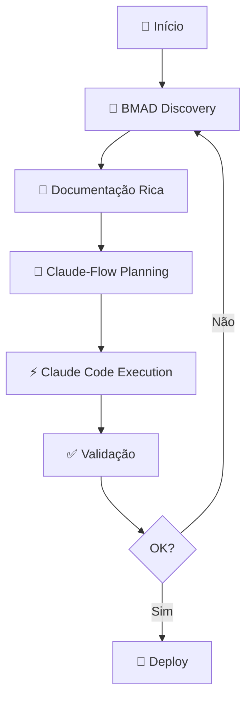

# Guia de Integração BMAD Method + Claude-Flow

> **Versão:** 1.0.0 | **Data:** 2025-08-01 | **Autor:** Bragatte
> **Objetivo:** Maximizar sinergia entre descoberta (BMAD) e execução (Claude-Flow)

## 🎯 Visão Geral da Integração

### Filosofia Core
- **BMAD Method**: Discovery, documentação e gestão através de conversas estruturadas
- **Claude-Flow**: Execução técnica coordenada com swarms de agentes especializados
- **Claude Code**: Executor final que realiza todo trabalho real

### Fluxo de Trabalho Sinérgico



## 📋 Fase 1: BMAD Discovery & Documentation

### 1.1 Instalação e Setup

```bash
# Em um novo repositório
cd /path/to/your/project

# Instalar BMAD Method completo
pnpm dlx bmad-method@latest install --full --ide claude-code --ide cursor

# Verificar instalação
ls -la .claude/commands/BMad/
```

### 1.2 Agentes BMAD para Discovery

#### **Product Owner (PO) Agent**
```bash
# Inicia sessão de elicitação de requisitos
bmad po start-discovery

# O agente PO irá:
# - Fazer perguntas sobre objetivos de negócio
# - Identificar stakeholders
# - Mapear requisitos funcionais/não-funcionais
# - Gerar PRD.md estruturado
```

#### **UX Expert Agent**
```bash
# Mapeia jornadas do usuário
bmad ux map-journeys

# O agente UX irá:
# - Identificar personas
# - Mapear fluxos principais
# - Criar user stories detalhadas
# - Gerar STORIES.md com critérios de aceitação
```

#### **Architect Agent**
```bash
# Define arquitetura e decisões técnicas
bmad architect design-system

# O agente Architect irá:
# - Analisar requisitos técnicos
# - Propor stack tecnológica
# - Documentar decisões em ADRs
# - Criar ARCHITECTURE.md
```

### 1.3 Exemplo de Sessão BMAD

```markdown
## Sessão Discovery com BMAD

**BMAD PM**: Olá! Vamos começar definindo o escopo do projeto. Qual é o problema principal que estamos resolvendo?

**Você**: Precisamos de um sistema de vigilância epidemiológica para monitorar vírus respiratórios em tempo real.

**BMAD PM**: Excelente! Quais são os 3 principais objetivos mensuráveis?

**Você**: 
1. Detectar surtos com 48h de antecedência
2. Dashboard atualizado a cada 24h
3. Alertas automáticos para autoridades

**BMAD PO**: Agora vamos detalhar os requisitos. Quem são os usuários principais?

**Você**: Epidemiologistas, gestores de saúde pública e pesquisadores.

[... continua conversação estruturada ...]
```

### 1.4 Artefatos Gerados pelo BMAD

```
projeto/
├── PRD.md              # Product Requirements Document
├── STORIES.md          # User Stories e Jornadas
├── ARCHITECTURE.md     # Decisões Arquiteturais
├── ADRs/              # Architecture Decision Records
│   ├── ADR-001-stack.md
│   └── ADR-002-database.md
├── STATUS.md          # Status e Tracking
└── ROADMAP.md         # Planejamento de Releases
```

## 🤖 Fase 2: Claude-Flow Execution

### 2.1 Setup Claude-Flow

```bash
# Adicionar Claude-Flow MCP
claude mcp add claude-flow npx claude-flow@latest mcp start

# Verificar instalação
npx claude-flow@latest --version
```

### 2.2 Transição BMAD → Claude-Flow

```bash
# Claude-Flow lê contexto BMAD e prepara execução
npx claude-flow@latest init --from-bmad

# Isso irá:
# 1. Ler todos documentos BMAD (PRD, STORIES, etc.)
# 2. Analisar complexidade e requisitos
# 3. Sugerir topologia de swarm apropriada
# 4. Preparar plano de execução
```

### 2.3 Spawning de Agentes Especializados

```javascript
// Claude-Flow usa contexto BMAD para spawnar agentes corretos
[BatchTool - Single Message]:
  // Inicializa swarm com contexto
  - mcp__claude-flow__swarm_init { 
      topology: "hierarchical",
      maxAgents: 8,
      context: {
        source: "bmad-discovery",
        prd: "PRD.md",
        stories: "STORIES.md",
        architecture: "ARCHITECTURE.md"
      }
    }
  
  // Spawn de agentes baseado em requisitos
  - mcp__claude-flow__agent_spawn { type: "researcher", task: "Analyze BMAD PRD" }
  - mcp__claude-flow__agent_spawn { type: "architect", task: "Validate ADRs" }
  - mcp__claude-flow__agent_spawn { type: "sparc-coder", task: "Implement with TDD" }
  - mcp__claude-flow__agent_spawn { type: "tester", task: "Create tests from STORIES" }
  - mcp__claude-flow__agent_spawn { type: "reviewer", task: "Validate against PRD" }
  
  // TodoWrite com todas tarefas
  - TodoWrite { todos: [
      { id: "1", content: "Analisar contexto BMAD completo", status: "in_progress", priority: "high" },
      { id: "2", content: "Implementar arquitetura base", status: "pending", priority: "high" },
      { id: "3", content: "Criar testes baseados em STORIES", status: "pending", priority: "high" },
      { id: "4", content: "Desenvolver features core", status: "pending", priority: "high" },
      { id: "5", content: "Integrar componentes", status: "pending", priority: "medium" },
      { id: "6", content: "Validar contra critérios PRD", status: "pending", priority: "medium" }
    ]}
```

### 2.4 Execução com SPARC Methodology

```bash
# Usar SPARC com contexto BMAD
npx claude-flow@latest sparc tdd "implement user authentication" \
  --use-bmad-context \
  --validate-against-prd

# Fluxo SPARC otimizado:
# 1. Specification: Lê requisitos do PRD.md
# 2. Pseudocode: Baseado em STORIES.md
# 3. Architecture: Segue ARCHITECTURE.md e ADRs
# 4. Refinement: TDD com critérios de aceitação
# 5. Completion: Validação contra documentação
```

## 🔄 Ciclo de Feedback Contínuo

### 3.1 Validação Automática

```bash
# Validar implementação contra documentação BMAD
npx claude-flow@latest validate \
  --check-prd \
  --check-stories \
  --check-architecture

# Gera relatório:
# ✅ Requisito FR-001: Implementado
# ✅ User Story US-001: Critérios atendidos
# ⚠️ ADR-002: Revisar escolha de cache
```

### 3.2 Atualização de Documentação

```bash
# Atualizar STATUS.md com progresso
bmad update-status --from-claude-flow

# Sincronizar learnings
npx claude-flow@latest export-learnings | bmad import-feedback
```

## 📁 Estrutura Completa do Projeto

```
projeto/
├── 📄 Context Engineering (BMAD)
│   ├── CLAUDE.md           # Guia principal com instruções
│   ├── PRD.md             # Requisitos detalhados
│   ├── STORIES.md         # Jornadas e critérios
│   ├── ARCHITECTURE.md    # Decisões técnicas
│   ├── STATUS.md          # Tracking contínuo
│   └── ADRs/              # Decision records
│       ├── ADR-001.md
│       └── ADR-002.md
│
├── 🤖 Configuração
│   ├── .claude/
│   │   ├── settings.json   # Hooks e automação
│   │   ├── commands/       # Comandos customizados
│   │   │   ├── BMad/      # Discovery commands
│   │   │   └── sparc/     # Execution commands
│   │   └── agents/        # Definições de agentes
│   │
│   ├── claude.json        # MCPs configuration
│   └── pyproject.toml     # Dependências Python
│
├── 💻 Implementação
│   ├── src/               # Código fonte
│   ├── tests/             # Testes (TDD)
│   └── docs/              # Documentação técnica
│
└── 📊 Saídas
    ├── _reports/          # Relatórios gerados
    ├── dashboards/        # Visualizações
    └── _scripts/          # Scripts auxiliares
```

## 🚀 Comandos Rápidos

### Setup Completo
```bash
# 1. Clonar estrutura base
git clone https://github.com/seu-usuario/bmad-claude-template novo-projeto
cd novo-projeto

# 2. Instalar ferramentas
pnpm dlx bmad-method@latest install --full --ide claude-code
claude mcp add claude-flow npx claude-flow@latest mcp start

# 3. Iniciar discovery
bmad start-discovery --interactive

# 4. Executar com contexto
npx claude-flow@latest swarm init --from-bmad
```

### Comandos Frequentes
```bash
# Discovery
bmad po elicit-requirements      # Requisitos com PO
bmad ux map-user-journeys        # Jornadas com UX
bmad architect design-system     # Arquitetura

# Execução
npx claude-flow@latest sparc tdd  # TDD com SPARC
npx claude-flow@latest validate   # Validar contra docs
npx claude-flow@latest monitor    # Monitorar swarm

# Feedback
bmad update-from-execution       # Atualizar docs
npx claude-flow@latest learnings  # Exportar aprendizados
```

## 💡 Melhores Práticas

### 1. **Sempre começar com BMAD Discovery**
- Conversas estruturadas evitam retrabalho
- Documentação rica = execução assertiva
- Critérios claros = validação automática

### 2. **Usar Context Engineering**
- CLAUDE.md como fonte única de verdade
- STORIES.md filtra seções relevantes
- Auto-modulação baseada em contexto

### 3. **Execução Paralela Obrigatória**
- TodoWrite com 5-10+ todos sempre
- Spawn de múltiplos agentes simultâneo
- Batch operations para I/O

### 4. **Validação Contínua**
- Cada commit validado contra PRD
- Testes baseados em STORIES
- Arquitetura seguindo ADRs

## 📊 Métricas de Sucesso

Com esta integração, espera-se:
- **90%+ de aderência** aos requisitos PRD
- **75% menos retrabalho** por contexto claro
- **3-5x mais velocidade** com execução paralela
- **100% rastreabilidade** requisito → implementação

## 🔗 Recursos Adicionais

- [BMAD Method Documentation](https://github.com/bmadcode/BMAD-METHOD)
- [Claude-Flow Guide](https://github.com/ruvnet/claude-flow)
- [SPARC Methodology](https://github.com/ruvnet/claude-flow/docs/sparc.md)
- [Context Engineering Best Practices](./.agent-os/documentation/CLAUDE-EXTENDED.mdc)

---

> **Lembre-se**: BMAD descobre e documenta, Claude-Flow coordena, Claude Code executa!