# Claude.md - Guia Global para Interação com Claude.code

> **Versão:** 2.3.0 | **Atualizado:** 2025-01-23 | **Mantenedor:** Bragatte  
> **Método Base:** [BMAD Method](https://github.com/bmadcode/BMAD-METHOD) (recomendado, mas adaptável)  
> **Propósito:** Maximizar qualidade e eficiência na colaboração humano-IA através de práticas estruturadas  
> **📚 Detalhes:** Ver [CLAUDE-EXTENDED.md](./CLAUDE-EXTENDED.md) | **📋 Histórico:** Ver [CHANGELOG.md](./CHANGELOG.md)

---

## 🚀 Quick Start

### Setup Inicial (faça uma vez):
```bash
# Instalar BMAD Method
pnpm dlx bmad-method@latest install --full --ide cursor

# Ativar os 4 MCPs essenciais no seu claude.json:
# - context7: Docs sempre atualizados
# - fetch: Requisições web inteligentes  
# - sequential-thinking: Raciocínio estruturado
# - serena: Busca semântica eficiente
```

### Fluxo de Trabalho:
1. **Check STATUS.md** → Existe? Estado dos docs?
2. **Check PRD.md** → Objetivos claros? Contexto definido?
3. **Check STORIES.md** → Jornadas mapeadas? Decisões de filtro?
4. **Desenvolver** → Com contexto apropriado ativado

💡 **Dica:** Use "use context7" em prompts para docs atualizados

---

## 📖 Navegação para Detalhes

Conteúdo expandido em **[CLAUDE-EXTENDED.md](./CLAUDE-EXTENDED.md)**:
- [Filosofia de Simplicidade](./CLAUDE-EXTENDED.md#filosofia-simplicidade) - Antipadrões e checklist
- [Context Engineering](./CLAUDE-EXTENDED.md#context-engineering) - Estratégias avançadas
- [Testing Trophy](./CLAUDE-EXTENDED.md#testing-trophy) - Implementação prática
- [Padrões de Código](./CLAUDE-EXTENDED.md#padroes-codigo) - Exemplos por linguagem
- [Templates de Documentos](./CLAUDE-EXTENDED.md#documentos-projeto) - PRD, STORIES, STATUS
- [Versionamento Semântico](./CLAUDE-EXTENDED.md#versionamento-semantico) - Estratégia simplificada
- [Comandos Slash](./CLAUDE-EXTENDED.md#comandos-slash) - Criação e uso
- [Cross-Platform](./CLAUDE-EXTENDED.md#cross-platform) - Estratégias por linguagem

---

## 🔄 Fluxo de Auto-Modulação do Sistema

```mermaid
graph TD
    A[Início do Projeto] --> B{STATUS.md existe?}
    B -->|Não| C[Criar STATUS.md]
    B -->|Sim| D{PRD.md existe?}
    D -->|Não| E[Criar PRD.md]
    D -->|Sim| F[Revisar PRD com template]
    
    C --> E
    E --> G[Definir objetivos e contexto]
    F --> G
    
    G --> H[STORIES.md: Perguntas focais]
    H --> I{Precisa de testes?}
    H --> J{É análise de dados?}
    H --> K{Tem frontend?}
    
    I -->|Sim| L[Ativar Testing Trophy]
    I -->|Não| M[Pular seção de testes]
    
    J -->|Sim| N[Ativar padrões R/Python]
    J -->|Não| O[Focar em outras linguagens]
    
    K -->|Sim| P[Ativar React/Next patterns]
    K -->|Não| Q[Backend/API focus]
    
    L --> R[CLAUDE.md filtrado]
    M --> R
    N --> R
    O --> R
    P --> R
    Q --> R
    
    R --> S[Desenvolvimento com contexto apropriado]
    
    style A fill:#e1f5fe
    style R fill:#c8e6c9
    style S fill:#fff9c4
```



> **💡 Princípio Central:** Este documento contém TODAS as possíveis diretrizes, mas apenas o subconjunto relevante é aplicado baseado nas decisões tomadas no PRD.md e STORIES.md. É um sistema adaptativo, não monolítico.

---

## 📌 Nota sobre Nomenclatura

> **IMPORTANTE:** Este arquivo deve sempre ser nomeado `CLAUDE.md` (em MAIÚSCULAS), seguindo a convenção de documentação principal como README.md, LICENSE, CHANGELOG.md. Isso garante:
> - ✅ Consistência visual e organizacional
> - ✅ Compatibilidade cross-platform (evita conflitos em sistemas case-insensitive)
> - ✅ Padronização para ferramentas e automação
> - ⚠️ Evite criar variações como `claude.md` ou `Claude.md`

---

## 🎯 Princípios Fundamentais

1. **STATUS.md primeiro** - SEMPRE cheque STATUS.md antes de qualquer ação
2. **Questione e valide** - Sempre analise premissas antes de implementar
3. **Documentação é código** - Rastreabilidade total com `## razão:`
4. **Metodologia flexível** - BMAD recomendado, mas adaptável a Scrum, Kanban, etc.
5. **Why-What-How** - Estrutura padrão para explicações
6. **Parceria intelectual** - Priorize verdade, clareza e criticidade
7. **Simplicidade é sofisticação** - A elegância está em tornar o complexo simples
8. **Context Engineering > Prompt Engineering** - Forneça contexto completo, não apenas prompts inteligentes

---

## 🎨 Filosofia de Simplicidade e Elegância

> "Simplicidade é a sofisticação suprema" - *Leonardo da Vinci*  
> "A perfeição é atingida não quando não há mais nada para adicionar, mas quando não há mais nada para remover" - *Antoine de Saint-Exupéry*

### Princípios de Design Simples:

1. **KISS (Keep It Simple, Stupid)**
   - Sempre prefira a solução mais simples que resolve o problema
   - Um júnior deve entender a solução em 5 minutos
   - Complexidade deve ser justificada por necessidade real

2. **Checklist de Simplicidade:**
   - [ ] Um desenvolvedor júnior entenderia isso?
   - [ ] Posso explicar em uma frase?
   - [ ] Existe uma biblioteca que já faz isso bem?
   - [ ] A solução é testável sem setup complexo?

---

## 🎭 Context Engineering vs Prompt Engineering

> "Context Engineering is 10x better than prompt engineering and 100x better than vibe coding"

### A Diferença Fundamental:
- **Prompt Engineering:** Como você formula a pergunta (como dar um sticky note)
- **Context Engineering:** Sistema completo de contexto (como escrever um roteiro completo)

### Por que Context Engineering vence:
1. **Reduz falhas da IA** - A maioria dos erros são de contexto, não do modelo
2. **Garante consistência** - IA segue padrões e convenções do projeto
3. **Permite complexidade** - IA consegue implementações multi-step
4. **Auto-correção** - Loops de validação permitem correção automática

---

## 🔧 Configuração e Metodologia

### Metodologia Padrão (Recomendada)
Por padrão, recomendamos o **BMAD Method** para estruturação de projetos:

```bash
# Instalação rápida do BMAD (usando pnpm quando disponível)
pnpm dlx bmad-method@latest install --full --ide cursor
# ou com npx se pnpm não estiver disponível
npx bmad-method@latest install --full --ide cursor
```

**Usando outra metodologia?** Sem problemas! Adapte as diretrizes para Scrum, Kanban, XP ou sua metodologia preferida.

### 🔌 MCP (Model Context Protocol) - OBRIGATÓRIO

#### ⚠️ Os 4 MCPs devem estar SEMPRE ativos:

1. **Context7** - Documentação sempre atualizada
   - ✅ Elimina código baseado em dados de treinamento antigos
   - ✅ Previne APIs alucinadas
   - ✅ Uso: adicione `use context7` ao prompt

2. **fetch** - Requisições web inteligentes
   - ✅ Busca e analisa conteúdo web
   - ✅ Processa HTML em markdown

3. **sequential-thinking** - Raciocínio estruturado
   - ✅ Decomposição de problemas complexos
   - ✅ Auto-correção e revisão de raciocínio

4. **serena** - Busca semântica inteligente em codebases
   - ✅ Economia massiva de tokens em buscas
   - ✅ Compreensão contextual do código
   - ✅ Navegação eficiente por projetos grandes

#### Configuração no claude.json:
```json
{
  "mcpServers": {
    "context7": {
      "command": "npx",
      "args": ["-y", "@context7/mcp-server"]
    },
    "fetch": {
      "command": "npx",
      "args": ["-y", "@modelcontextprotocol/server-fetch"]
    },
    "sequential-thinking": {
      "command": "npx",
      "args": ["-y", "@modelcontextprotocol/server-sequential-thinking"]
    },
    "serena": {
      "command": "/Users/bragatte/.local/bin/uv",
      "args": ["run", "--directory", "/Users/bragatte/Documents/GitHub/serena", "serena-mcp-server"]
    }
  }
}
```

💡 **Verification:** If you don't see `mcp__` in the tools, MCPs are not active!

#### 📍 Configuration file location:
- **macOS**: `~/Library/Application Support/Claude/claude.json`
- **Windows**: `%APPDATA%\Claude\claude.json`  
- **Linux**: `~/.config/Claude/claude.json`

💡 **Note**: The MCP configuration file is `claude.json`.

### 🔨 Custom Slash Commands
Enhance Context Engineering with specific commands in `.claude/commands/`:
- `/generate-prp` - Generate complete PRPs from requirements
- `/execute-prp` - Execute implementation with automatic validation
- `/validate-patterns` - Verify adherence to project patterns


---

## 🎯 Contextual Self-Modulation System

### How STORIES.md Filters This Document

CLAUDE.md is not applied monolithically. Based on responses to focal questions in STORIES.md, only relevant sections are activated:

| Question in STORIES | Answer | Activated Sections | Ignored Sections |
|-------------------|----------|-----------------|------------------|
| Need tests? | Yes | Testing Trophy, Test Patterns | - |
| Need tests? | No | - | Testing Trophy, /tests |
| Is it data analysis? | Yes | Python/R Patterns, ## Comments | React, Frontend |
| Has visual interface? | Yes | React/Next, HTML Artifacts | Pure Backend |
| Processes genomic data? | Yes | Bioinformatics patterns | Web patterns |

### Practical Example: Epidemiological Analysis

```markdown
## STORIES.md (example)
**Q: Project type?** A: Epidemiological data analysis
**Q: Need tests?** A: Only for critical statistical functions  
**Q: Interface?** A: Simple Shiny dashboard
**Q: Deploy?** A: Local/RStudio Server

## Result: Filtered CLAUDE.md applies:
✅ R patterns with ## comments
✅ Epidemiological analysis structure
✅ Tests focused on statistical calculations
❌ React/Next.js patterns (ignored)
❌ Kubernetes deploy (ignored)
❌ E2E testing (ignored)
```

### Structured Projects: Review Process

When applied to existing projects:


---

## 🚦 Session Startup Protocol (MANDATORY)

### When starting ANY project work:

1. **Check STATUS.md**
   ```
   Claude must always:
   1. Look for STATUS.md in the project
   2. If it doesn't exist: "I didn't find STATUS.md. Should we create one to track the project?"
   3. If it exists: Check documentation table
   4. If any doc is ⚠️ or 🔴: Alert IMMEDIATELY
   5. Verify if PRD exists and is aligned
   ```

2. **Check project methodology**
   - Project uses BMAD? Use official templates
   - Other methodology? Adapt practices as needed

3. **Example of first interaction:**
```
Claude: "Checking STATUS.md... I found 2 documents that need attention:
- CLAUDE.md is 3 days overdue ⚠️
- TESTING.md is 15 days outdated 🔴
- PRD.md exists and defines genomic analysis project

Based on the PRD, I see this is a bioinformatics project. 
I suggest reviewing STORIES.md to confirm which CLAUDE.md modules to apply.
Where shall we start?"
```

---

## 📋 Essential Project Documents

### 🔴 Mandatory (ALWAYS create and maintain):

1. **PRD.md (Product Requirements Document)**
   - ALWAYS start with clear PRD
   - Objectives, metrics, assumptions, fundamental questions
   - Acceptance criteria and complete context
   - **In bioinformatics**: Include expected pipeline, data formats
   
2. **STORIES.md**
   - User journey as central guide
   - **Focal questions on user value delivery**
   - Clear acceptance criteria + PRPs for implementation
   - **Decisions that filter CLAUDE.md**

3. **README.md** - Overview, purpose, instructions
4. **CHANGELOG.md** - Semver history (major.minor.patch)
5. **STATUS.md** - Current progress + docs update table
6. **CLAUDE.md** - This document, reviewed monthly
7. **TESTING.md** - Test strategies + `/tests` folder

### 🟣 Critical for Context Engineering:

8. **examples/** - Project code patterns (FUNDAMENTAL)
   - Module and import structure
   - Test and mocking patterns
   - Typical integrations and flows
   - Anti-patterns to avoid
   - **Bioinformatics**: Analysis pipelines, data validation

### 🟡 Desirable (complex projects):

9. **ROADMAP.md** - Planning and future milestones
10. **ARCHITECTURE.md / ADRs** - Critical technical decisions
11. **SECURITY.md** - Security practices + `.env.example`
12. **DATA_DICTIONARY.md** - Schemas and glossary
13. **PROMPTS.md** - Successful prompts library
14. **AI_CONTEXT.md** - Context for agents/AI
15. **DEBUGGING.md** - Logging and troubleshooting
16. **MAINTENANCE.md** - Routines and responsibilities


---

## 🔄 Visual Status Flows

### ADRs - Mandatory Flow
Every ADR must have a Mermaid diagram showing current state:


### README - Optional Flow
Add visual indicators when relevant:


**80/20 Principle:**
- Focus on current state, not complete history
- Use colors/emojis sparingly (🟢🟡🔴)
- Sync with STATUS.md when it exists
- Keep it simple - if you need to explain, it's too complex

---

## 🎯 Prompt and Story Capture

### STORIES.md is fundamental for:
- **Capturing user journeys** that guide development
- **Recording focal questions** about value delivery
- **Maintaining context** of user-oriented decisions
- **Integrating PRPs** for efficient technical implementation
- **Filtering applicable sections** of CLAUDE.md

### Evolution: PRPs (Product Requirements Prompts)
PRPs are evolved specs for Context Engineering:
- **Complete context** of implementation
- **Validation gates** at each stage
- **Error patterns** and recovery
- **Measurable criteria** for success

### Simplified format:
```markdown
## [YYYY-MM-DD] - [Category]: [Title]
**Context:** [Situation that generated the need]
**Prompt:** [What worked]
**Result:** [What was generated/achieved]
**Metrics:** [If applicable: time saved, accuracy, etc.]
**CLAUDE.md Decisions:** [Which sections were applied/ignored]
```

### Automatic trigger:
- Add `[prompt-saved]` to commit to save automatically


---

## 📝 Code and Comment Patterns

### Code Patterns by Language:

#### Python - Modern Patterns:
- Use `##` for EVERY significant line of code
- **UV for virtual environments** (not pip/conda)
- **Polars > pandas** for data manipulation
- Imports must have comments explaining usage
- Declare UTF-8 encoding explicitly
- Use pathlib.Path for file paths
- Type hints whenever possible

#### R - Statistical Analysis:
- Use `##` for line-by-line comments
- Tidyverse for modern manipulation
- Explicit UTF-8 encoding
- here::here() for relative paths


#### Rust - Performance and Security:
- Use `//` for line comments, `///` for doc comments
- **Always explicit typing** for better error diagnostics
- **Explicit memory management** with lifetimes when necessary
- Explicit error handling with custom Result<T, E>
- Always specify UTF-8 encoding
- Input validation before processing
- Zero-cost abstractions when possible
- Prefer `&str` over `String` when ownership isn't needed


#### React with TypeScript - Epic Stack Patterns:
- **Epic Stack patterns** ([epicweb.dev](https://github.com/epicweb-dev/full-stack-foundations))
- Full-stack TypeScript with Remix
- Typed interfaces for props and state
- Modern hooks (useState, useEffect, useMemo)
- Accessibility with aria-labels and roles
- Performance with memoization when necessary
- Functional components, not classes
- Database-backed authentication
- Testing with Vitest and Testing Library
- Tailwind CSS for styling
- Conform for type-safe forms
- Zod for schema validation
- Prisma for type-safe ORM


### General rules:
- `##` for line/function explanations in Python/R
- `//` for comments in Rust (use `///` for doc comments)
- TypeScript: Use explicit types and interfaces
- Imports at the beginning with explanation
- Explicit UTF-8 encoding
- Use `pathlib.Path` (Python) or `std::path::Path` (Rust)
- Dates in ISO format (YYYY-MM-DD)
- **Bioinformatics**: Document expected formats (FASTA, VCF, etc.)


---

## 🚫 Never Do

1. **Implement without validating ADRs** - Respect documented decisions
2. **Code without comments** - In R/Python, ALWAYS comment
3. **Assume environment/encoding** - Always confirm specifications
4. **Create unsolicited tests** - Only when requested in STORIES
5. **Implement without documentation** - PRD and STORIES must exist first
6. **Deploy without clearing cache** - Always start clean
7. **Cite methodology in commits** - Focus on project changes
8. **Use outdated technologies** - Always use modern versions
9. **Hardcode values/versions** - Be agnostic
10. **ADR without status flow** - Every ADR needs Mermaid
11. **Tests with data-testid** - Force accessibility with semantic queries
12. **Test implementation** - Focus on observable user behavior
13. **Over-mocking** - Mock only external dependencies (APIs, DBs)
14. **Apply irrelevant sections** - If STORIES said "not needed", don't do it

---

## 🚀 Stay Modern

### Recommended Versions (always check official sites):
- **Python:** 3.13+ ([python.org](https://python.org)) - Analysis and pipelines
  - **UV** for environment management ([astral.sh/uv](https://astral.sh/uv))
  - **Polars** > pandas for data processing
- **R:** 4.3+ with updated tidyverse ([r-project.org](https://r-project.org)) - Statistics and visualization
- **Rust:** 1.78+ ([rust-lang.org](https://rust-lang.org)) - Critical performance and CLI tools
- **TypeScript:** 5.5+ ([typescriptlang.org](https://typescriptlang.org)) - Type safety in frontend
- **React:** 18.3+ with modern hooks - Interactive interfaces
  - **Remix** for full-stack React apps
  - **Epic Stack** as architecture reference
- **D3.js:** v7+ ([d3js.org](https://d3js.org)) - Custom visualizations
- **Package Manager:** pnpm > yarn > npm ([pnpm.io](https://pnpm.io))
- **Java:** 21 LTS (when necessary for specific tools)

### Legacy Code Red Flags:
🚩 Libraries without updates for 2+ years  
🚩 Nested callbacks (use async/await)  
🚩 jQuery in new projects  
🚩 Python 2.x syntax  
🚩 R without tidyverse in modern analyses
🚩 React class components in new code
🚩 Pure JavaScript when TypeScript is viable
🚩 Static visualizations when interactivity would add value


---

## ✅ Always Do

### 1. Use artifacts for:
- Code > 20 lines
- Structured documents
- Complex analyses
- Reports and visualizations
- **Bioinformatics pipelines**

### 2. Agnostic Code:
- Detect environment at runtime (platform, sys)
- Never hardcode paths or versions
- Use environment variables when appropriate
- Always use pathlib.Path for paths


### 3. Why-What-How Structure:
- **Why:** Why is it important?
- **What:** What exactly to do?
- **How:** How to implement?

### 4. Behavior-focused tests:
- **Testing Trophy:** Prioritize integration tests over unit tests
- **Accessibility first:** Never use `data-testid` - force accessible components
- **Behavior > Implementation:** Test user flows, not internal details
- **Semantic queries:** Use `getByRole`, `getByLabelText`, `getByText`
- **Contextual balance:** Adjust test types according to project complexity
- **Bioinformatics:** Test format validation, not internal parsing

---

## 🌐 Cross-Platform Compatibility

- Always use pathlib.Path (Python) or std::path::Path (Rust)
- Avoid hardcoded path separators (/, \)
- Detect OS with platform.system() when necessary
- UTF-8 as default encoding always
- Consider line ending differences (LF vs CRLF)


---

## 🔄 Protocol for Existing Projects

When adding CLAUDE.md to a structured project:

1. **Initial analysis via STATUS.md**
   ```
   STATUS.md detects:
   - Existing project structure
   - Code conventions in use
   - Current technology stack
   ```

2. **PRD review and alignment**
   - Map existing objectives vs. BMAD template
   - Identify gaps and overlaps
   - Create unified PRD

3. **Adaptive STORIES.md**
   ```markdown
   ## Alignment Questions for Existing Project
   - Keep current conventions? [Y/N]
   - Gradually migrate to new patterns? [Y/N]
   - Which architectural decisions are immutable?
   - Where can we introduce improvements?
   ```

4. **Create ADAPTATIONS.md if necessary**
   - Documents necessary deviations from standard CLAUDE.md
   - Justifies each adaptation
   - Defines convergence timeline (if applicable)

5. **ADR for integration decisions**
   ```markdown
   # ADR-XXX: CLAUDE.md Integration in Legacy Project
   
   ## Status
   Accepted
   
   ## Context
   Existing project with established conventions...
   
   ## Decision
   Apply CLAUDE.md with the following adaptations...
   
   ## Consequences
   - Positive: Gradual standardization, better documentation
   - Negative: Transition period with two standards
   ```

---

## 📝 Commit Patterns

### Use Conventional Commits:
```
feat: add seasonal trend analysis
fix: fix incidence rate calculation
docs: update README with usage examples
test: add tests for data validation
refactor: simplify processing logic
```

**Focus on the PROJECT**, not on methodology or internal tools.

---

## 💡 Maximizing Value with Claude

### Always start with:
- "Should we check STATUS.md first?"
- "What's the current project version?"
- "What methodology does the project use?"
- "What type of analysis/system does the PRD define?"

### Be specific and contextual:

### Provide complete context:
- Data size and format
- Environment (Mac, Windows, WSL2)
- Constraints and requirements
- Reference to PRD/STORIES when it exists

---

## ✅ Quality Checklist

### For code:
- [ ] Appropriate comments (## in R/Python)
- [ ] Organized imports
- [ ] UTF-8 encoding declared
- [ ] Paths with pathlib.Path
- [ ] Modern practices
- [ ] No hardcode
- [ ] **Bioinformatics**: Input format validation

### For documentation:
- [ ] STATUS.md updated
- [ ] Clear PRD with objectives
- [ ] STORIES with user journeys
- [ ] Versioned CHANGELOG
- [ ] ADRs with Mermaid flow
- [ ] **Modulation decisions** documented

### For deploy:
- [ ] Clean cache
- [ ] Variables in .env
- [ ] Repository tag
- [ ] Updated docs
- [ ] Passing tests
- [ ] **Sensitive data**: LGPD/HIPAA compliance

---

## 🔗 Essential References

- **Examples and Details:** [CLAUDE-EXTENDED.md](./CLAUDE-EXTENDED.md)
- **BMAD Method:** [github.com/bmadcode/BMAD-METHOD](https://github.com/bmadcode/BMAD-METHOD)
- **Context7 for examples:** Add "use context7" to prompts

---

> **Continuous evolution:** This document should be reviewed monthly or at each major/minor release. For specific cases, detailed examples and troubleshooting, see [CLAUDE-EXTENDED.md](./CLAUDE-EXTENDED.md)