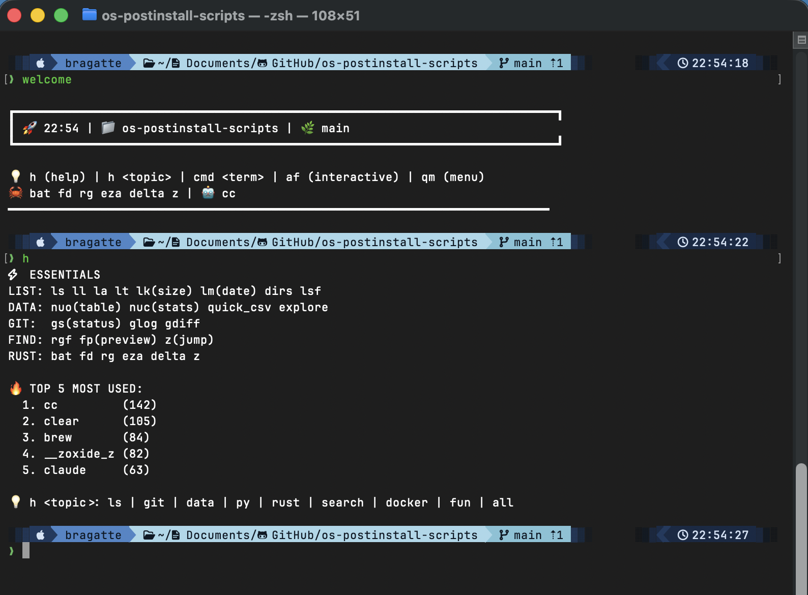
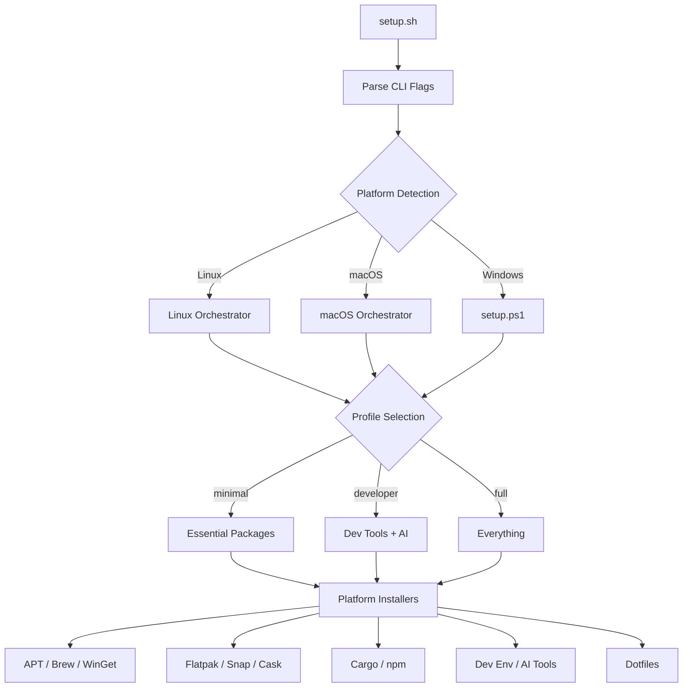
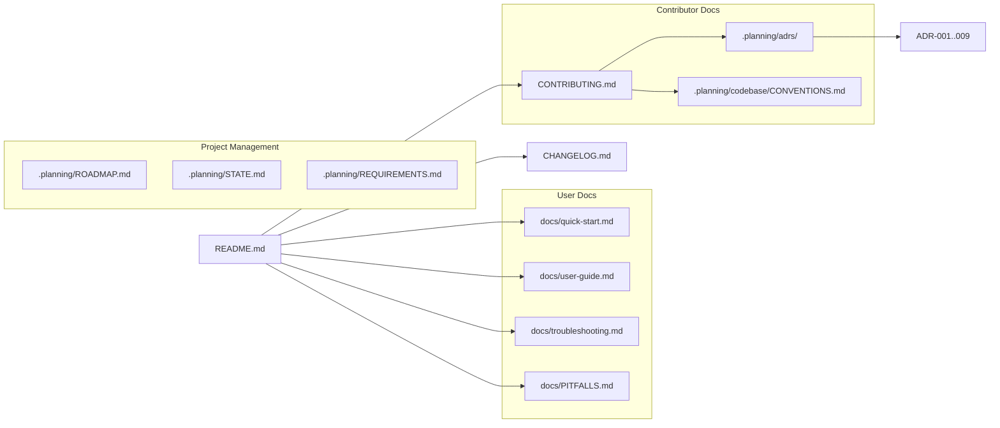

# OS Post-Install Scripts

**One command to transform a fresh OS into a fully configured development environment.**

<div align="center">

[](CHANGELOG.md)
[](LICENSE)
[](README.md)
[](https://www.gnu.org/software/bash/)

[](https://www.shellcheck.net/)
[](https://claude.ai/)
[](https://github.com/BragatteMAS/os-postinstall-scripts/commits/main)

</div>

<div align="center">



*A fully configured terminal: starship prompt, 100+ aliases, and modern Rust CLI tools.*

</div>

## Why This Exists

Every fresh OS installation means hours of manual setup: installing packages, configuring dotfiles, setting up development tools, and tweaking system preferences. This project replaces that repetitive work with a single, idempotent command that works across Linux, macOS, and Windows. Choose a profile (minimal, developer, or full), run the script, and get back to building.

## Table of Contents

- [Quick Start](#quick-start)
- [Just Want the Terminal?](#just-want-the-terminal)
- [Features](#features)
- [Platform Support](#platform-support)
- [Installation Profiles](#installation-profiles)
- [Modern CLI Tools](#modern-cli-tools)
- [Architecture](#architecture)
- [Engineering Highlights](#engineering-highlights)
- [AI / MCP Integration](#ai--mcp-integration)
- [Customization](#customization)
- [CLI Flags](#cli-flags)
- [Dotfiles Managed](#dotfiles-managed)
- [Safety and Security](#safety-and-security)
- [Troubleshooting](#troubleshooting)
- [Uninstall / Restore](#uninstall--restore)
- [Built With](#built-with)
- [Project Documentation](#project-documentation)
- [Credits](#credits)
- [Contributing](#contributing)
- [License](#license)

## Quick Start

```bash
git clone --recurse-submodules https://github.com/BragatteMAS/os-postinstall-scripts
cd os-postinstall-scripts

# Preview first (recommended)
./setup.sh --dry-run

# Run it
./setup.sh
```

The default profile is `developer`. Pass a profile name to change it:

```bash
./setup.sh --dry-run full      # Preview the full profile
./setup.sh minimal             # Install minimal packages only
```

<details>
<summary><b>Linux prerequisites</b></summary>

Requires a Debian-based distribution (Ubuntu, Pop!_OS, Linux Mint, Elementary, Zorin). The script uses APT as its primary package manager.

```bash
# Ensure git is installed
sudo apt update && sudo apt install -y git

# Clone and run
git clone https://github.com/BragatteMAS/os-postinstall-scripts
cd os-postinstall-scripts
./setup.sh --dry-run
```

The script will request `sudo` access for APT and Snap operations.

</details>

<details>
<summary><b>macOS notes</b></summary>

macOS ships with Bash 3.2, which is too old. The script detects this and warns you. Install a modern Bash via Homebrew first:

```bash
# Install Homebrew (if not already installed)
/bin/bash -c "$(curl -fsSL https://raw.githubusercontent.com/Homebrew/install/HEAD/install.sh)"

# Install modern Bash
brew install bash

# Clone and run with modern Bash
git clone https://github.com/BragatteMAS/os-postinstall-scripts
cd os-postinstall-scripts
/opt/homebrew/bin/bash ./setup.sh --dry-run
```

The script auto-detects Intel (`/usr/local`) vs Apple Silicon (`/opt/homebrew`) architecture.

</details>

<details>
<summary><b>Windows (PowerShell)</b></summary>

Windows uses a separate PowerShell entry point. Git is not pre-installed on a fresh Windows -- install it first via WinGet:

```powershell
# Install git (fresh Windows)
winget install Git.Git

# Restart PowerShell, then:
git clone https://github.com/BragatteMAS/os-postinstall-scripts
cd os-postinstall-scripts

# Run with default developer profile
powershell -ExecutionPolicy Bypass -File .\setup.ps1

# Or specify a profile
powershell -ExecutionPolicy Bypass -File .\setup.ps1 -Profile minimal
```

The Windows handler uses WinGet for package installation. No admin elevation is required for standard WinGet operations.

</details>

## Just Want the Terminal?

Don't need the full setup? Get the modern terminal experience in one command:

```bash
git clone https://github.com/BragatteMAS/os-postinstall-scripts
bash os-postinstall-scripts/examples/terminal-setup.sh
```

Or choose what to install with `--interactive`:

```bash
bash os-postinstall-scripts/examples/terminal-setup.sh --interactive
bash os-postinstall-scripts/examples/terminal-setup.sh --dry-run  # preview first
```

**What it does:**

| Component | Details |
|-----------|---------|
| Nerd Font | JetBrainsMono Nerd Font (auto-installed) |
| CLI tools | bat, eza, fd, ripgrep, delta, zoxide, starship |
| Prompt | Minimal Starship config (git branch, status, duration) |
| Aliases | 50+ shortcuts for git, navigation, modern tools |
| Plugins | zsh-autosuggestions, syntax-highlighting, completions |
| Platforms | Linux (apt) and macOS (brew) |
| Safety | `--dry-run` preview, `--interactive` wizard, automatic backups, idempotent |

## Features

- **Cross-platform** -- Single entry point dispatches to Linux, macOS, or Windows handlers
- **Profile-based** -- Three tiers (minimal, developer, full) driven by plain text package files
- **Idempotent** -- Safe to run multiple times; checks before installing each package
- **Dry-run mode** -- Full simulation with `--dry-run` before making any changes
- **Progress feedback** -- Step counters (`[Step 1/5]`), elapsed time, and completion summary
- **Dotfiles management** -- Symlink-based with automatic backup and restore capability
- **Backup system** -- Date-stamped backups with manifest file before overwriting configs
- **Error resilience** -- No `set -e`; failures are tracked and reported at the end, never halt the run
- **Modern CLI tools** -- Replaces cat/ls/find/grep with bat/eza/fd/ripgrep via Cargo or Homebrew
- **AI tools integration** -- Claude Code, Codex, Gemini CLI, Ollama, and MCP servers

<div align="center">

<!-- Re-record: asciinema rec assets/demo.cast && agg --theme monokai --font-size 14 assets/demo.cast assets/demo.gif -->


*Dry-run preview of a minimal profile setup. [Record your own demo](CONTRIBUTING.md).*

</div>

## Platform Support

| Platform | Package Managers | Architecture | Status |
|----------|-----------------|--------------|--------|
| Ubuntu / Pop!_OS / Mint | APT, Snap, Flatpak, Cargo, npm | x86_64, arm64 | Supported |
| macOS | Homebrew, Brew Cask, Cargo, npm | Intel (x86_64), Apple Silicon (arm64) | Supported |
| Windows 10/11 | WinGet | x86_64 | Supported |

## Installation Profiles

| Feature | Minimal | Developer | Full |
|---------|:-------:|:---------:|:----:|
| System packages (APT / Brew / WinGet) | x | x | x |
| Development tools (Cargo, npm) | | x | x |
| AI / MCP tools | | x | x |
| Flatpak applications (Linux) | | x | x |
| Snap packages (Linux) | | x | x |
| Brew Cask apps (macOS) | | x | x |
| Post-install extras | | | x |
| **Estimated time** | ~5 min | ~15 min | ~30 min |

<details>
<summary><b>Profile file contents</b></summary>

Profiles are plain text files listing which package files to process. Each platform orchestrator filters for its relevant files.

**Minimal** (`data/packages/profiles/minimal.txt`):
```
apt.txt          # Linux
brew.txt         # macOS
winget.txt       # Windows
```

**Developer** (`data/packages/profiles/developer.txt`):
```
apt.txt          # Linux
apt-post.txt     # Linux
brew.txt         # macOS
brew-cask.txt    # macOS
winget.txt       # Windows
cargo.txt        # Cross-platform
npm.txt          # Cross-platform
ai-tools.txt     # Cross-platform
flatpak.txt      # Linux
snap.txt         # Linux
```

**Full** (`data/packages/profiles/full.txt`):
```
apt.txt          # Linux
apt-post.txt     # Linux
brew.txt         # macOS
brew-cask.txt    # macOS
winget.txt       # Windows
cargo.txt        # Cross-platform
npm.txt          # Cross-platform
ai-tools.txt     # Cross-platform
flatpak.txt      # Linux
flatpak-post.txt # Linux
snap.txt         # Linux
snap-post.txt    # Linux
```

</details>

<details>
<summary><b>Package counts per file</b></summary>

| File | Packages | Used In |
|------|:--------:|---------|
| `apt.txt` | 46 | All Linux profiles |
| `apt-post.txt` | 34 | Developer, Full |
| `brew.txt` | 19 | All macOS profiles |
| `brew-cask.txt` | 14 | Developer, Full |
| `cargo.txt` | 30 | Developer, Full |
| `npm.txt` | 7 | Developer, Full |
| `winget.txt` | 36 | All Windows profiles |
| `flatpak.txt` | 24 | Developer, Full |
| `flatpak-post.txt` | 49 | Full |
| `snap.txt` | 21 | Developer, Full |
| `snap-post.txt` | 7 | Full |
| `ai-tools.txt` | 11 | Developer, Full |

</details>

## Modern CLI Tools

The developer and full profiles install modern Rust-based replacements for traditional Unix tools:

| Traditional | Modern | Category | Description |
|-------------|--------|----------|-------------|
| `cat` | `bat` | File viewing | Syntax highlighting and line numbers |
| `ls` | `eza` | File listing | Icons, Git status, tree view |
| `find` | `fd` | File search | Intuitive syntax, respects .gitignore |
| `grep` | `ripgrep` (`rg`) | Content search | Fast, respects .gitignore |
| `cd` | `zoxide` (`z`) | Navigation | Frequency-based smart directory jumping |
| `diff` | `delta` | Diffing | Syntax-highlighted side-by-side diffs |

Shell aliases are configured automatically via dotfiles (`data/dotfiles/shared/aliases.sh`).

## Architecture

### How It Works



### Directory Structure

```
os-postinstall-scripts/
├── setup.sh                    # Bash entry point (Linux/macOS)
├── setup.ps1                   # PowerShell entry point (Windows)
├── config.sh                   # User configuration and paths
├── src/
│   ├── core/                   # Shared utilities (8 modules)
│   │   ├── logging.sh          #   Color output, log levels
│   │   ├── platform.sh         #   OS/arch detection, verification
│   │   ├── errors.sh           #   Failure tracking, retry, cleanup
│   │   ├── progress.sh         #   Step counters, completion summary
│   │   ├── idempotent.sh       #   Safe-repeat checks, PATH dedup
│   │   ├── dotfiles.sh         #   Symlink manager, backup/restore
│   │   ├── packages.sh         #   Package file loader
│   │   └── interactive.sh      #   Category menus, user prompts
│   ├── platforms/
│   │   ├── linux/
│   │   │   ├── main.sh         #   Linux orchestrator
│   │   │   └── install/        #   apt.sh, flatpak.sh, snap.sh, cargo.sh
│   │   ├── macos/
│   │   │   ├── main.sh         #   macOS orchestrator
│   │   │   └── install/        #   homebrew.sh, brew.sh, brew-cask.sh
│   │   └── windows/
│   │       ├── main.ps1        #   Windows orchestrator
│   │       ├── core/           #   logging.psm1, errors.psm1, packages.psm1
│   │       └── install/        #   winget.ps1
│   └── install/                # Cross-platform installers
│       ├── rust-cli.sh         #   bat, eza, fd, rg, delta, zoxide
│       ├── dev-env.sh          #   fnm + uv orchestrator, SSH keys
│       ├── fnm.sh              #   Node.js via fnm
│       ├── uv.sh              #   Python via uv
│       ├── ai-tools.sh         #   Claude, Codex, Gemini, Ollama
│       └── dotfiles-install.sh #   Dotfiles symlink installer
├── data/
│   ├── packages/               # Package lists (one file per manager)
│   │   ├── profiles/           #   minimal.txt, developer.txt, full.txt
│   │   ├── apt.txt             #   46 packages
│   │   ├── brew.txt            #   19 formulae
│   │   ├── cargo.txt           #   30 crates
│   │   ├── winget.txt          #   36 packages
│   │   └── ...                 #   12 files total
│   └── dotfiles/               # Dotfile templates
│       ├── zsh/zshrc
│       ├── bash/bashrc
│       ├── git/gitconfig
│       ├── starship/starship.toml
│       └── shared/             #   aliases, env, path
├── docs/                       # User and contributor documentation
│   ├── quick-start.md          #   Quick installation guide
│   ├── user-guide.md           #   Complete usage guide
│   ├── troubleshooting.md      #   Common problems and solutions
│   ├── PITFALLS.md             #   35 cataloged pitfalls
│   ├── installation-profiles.md #  Profile details
│   └── modern-cli-tools.md     #   Modern CLI tool reference
└── tests/                      # bats-core test suites (120+ tests)
    ├── test-core-*.bats        #   Unit tests per core module (9 files)
    ├── test-data-validation.bats #  Package list validation
    ├── test-contracts.bats     #   Bash/PS API parity contracts
    ├── test-integration.bats   #   setup.sh CLI integration tests
    └── lib/                    #   Shared test helpers
```

## Engineering Highlights

This section explains the engineering decisions behind the project, not just what it does but why it works this way.

### Idempotent Operations

Every installer checks before acting. `is_apt_installed()` queries dpkg, `is_brew_installed()` queries brew list, and `snap list` / `flatpak list` prevent redundant installs. Running the script twice produces no side effects. The core module `src/core/idempotent.sh` provides reusable guards: `is_installed()`, `ensure_line_in_file()`, `ensure_symlink()`, `backup_if_exists()`, and `add_to_path()` with PATH deduplication.

### Cross-Process Failure Tracking

Child installer processes (spawned via `bash script.sh`) cannot propagate array variables back to the parent. The solution: a shared log file (`$FAILURE_LOG`) in a temp directory. Each installer appends failures to this file. The parent reads it at exit to produce a consolidated summary. See `src/core/errors.sh` for `record_failure()` and `show_failure_summary()`.

### Dry-Run Mode

Every mutation point in every installer is guarded by `[[ "${DRY_RUN:-}" == "true" ]]`. This includes APT installs, symlink creation, directory creation, sudo requests, and curl downloads. The dry-run banner (`show_dry_run_banner()`) makes the mode visually obvious. No changes, no sudo, no network requests in dry-run.

### Profile-Based Architecture

Profiles are plain text files listing package file names, not packages directly. The orchestrator reads the profile, then dispatches each file name to the appropriate installer. This means adding a new package is a one-line edit to a `.txt` file. Platform orchestrators filter by relevance: Linux skips `brew.txt`, macOS skips `apt.txt`.

### Progress Feedback

Platform orchestrators pre-count their steps with `count_platform_steps()`, then display `[Step N/M]` prefixes during execution. The completion summary (`show_completion_summary()`) reports profile, platform, elapsed time (via the `SECONDS` builtin), and any failures.

### Platform Abstraction

A single `setup.sh` entry point detects the OS via `uname -s`, then dispatches to `src/platforms/{linux,macos}/main.sh`. Windows uses `setup.ps1` as a separate entry point dispatching to `src/platforms/windows/main.ps1`. Each platform handler speaks its own package manager's language while following the same profile-driven architecture.

### Backup System

The dotfiles manager (`src/core/dotfiles.sh`) backs up existing files before creating symlinks. Backups use flat naming (`~/.config/git/ignore` becomes `config-git-ignore.bak.2026-02-05`) stored in `~/.dotfiles-backup/`. A manifest file tracks every backup with timestamps for reliable restore via `./setup.sh unlink`.

### Error Resilience

The project deliberately avoids `set -e`. A failed package install should not halt the entire run. Instead, failures are recorded via `record_failure()`, the script continues, and `show_failure_summary()` lists everything that failed at the end. `retry_with_backoff()` provides automatic retries with exponential delays (5s, 15s, 30s) for transient network failures.

## AI / MCP Integration

The developer and full profiles install AI-powered development tools:

| Tool | Install Method | Description |
|------|---------------|-------------|
| Claude Code | `npm install -g @anthropic-ai/claude-code` | AI coding assistant CLI |
| Codex | `npm install -g @openai/codex` | OpenAI coding assistant |
| Gemini CLI | `npm install -g @google/gemini-cli` | Google AI CLI |
| Ollama | `curl` installer | Local LLM runtime |

MCP (Model Context Protocol) servers are listed in `data/packages/ai-tools.txt` and include context7, fetch, sequential-thinking, and others. These are installed via `npx` for on-demand execution.

### Development Methodology

This project was developed with Claude Code as a co-pilot across 430+ commits and 8 phases. The workflow uses the GSD (Get Stuff Done) methodology with structured planning, research, and execution phases. Nine Architecture Decision Records (ADRs) document key architectural choices. The badge "Built with Claude Code" reflects this AI-assisted development approach.

## Customization

### Adding packages

Edit the appropriate text file in `data/packages/`. One package per line, `#` for comments:

```bash
# data/packages/apt.txt
my-custom-package
another-package
```

### Creating a custom profile

Create a new file in `data/packages/profiles/`:

```bash
# data/packages/profiles/custom.txt
apt.txt
cargo.txt
```

Then run: `./setup.sh custom`

### Environment variables

Two arrays in `config.sh` allow per-run customization without editing package files:

| Variable | Type | Default | Description |
|----------|------|---------|-------------|
| `EXTRA_PACKAGES` | Bash array | `()` | Additional packages appended to the profile's package list |
| `SKIP_PACKAGES` | Bash array | `()` | Packages to exclude even if listed in the profile |

**Usage:**

```bash
# Install extra packages alongside your profile
EXTRA_PACKAGES=(neovim tmux) ./setup.sh

# Skip specific packages from the profile
SKIP_PACKAGES=(kite snapd) ./setup.sh

# Combine both
EXTRA_PACKAGES=(neovim) SKIP_PACKAGES=(snapd) ./setup.sh
```

> **Note:** These variables are declared in `config.sh` (lines 36-41) as hooks for customization. Currently, no installer reads them automatically -- they serve as a configuration point for users who source `config.sh` in custom scripts or for future installer integration.

### Adding dotfiles

1. Place your config file in `data/dotfiles/<topic>/`
2. Add a mapping entry in `src/install/dotfiles-install.sh` (the `symlink_map` array)
3. Run `./setup.sh dotfiles`

### Examples

The `examples/` directory contains reference configurations:

| File | Description |
|------|-------------|
| `terminal-setup.sh` | One-script terminal transformation for Unix/macOS (tools + prompt + aliases + plugins) |
| `terminal-setup.ps1` | One-script terminal transformation for Windows PowerShell (WinGet + Starship + aliases) |
| `starship-example.toml` | Starship prompt configuration |
| `claude-md-example.md` | CLAUDE.md template for AI-assisted development |

These are self-contained snapshots — the operational dotfiles live in `data/dotfiles/`. See [Just Want the Terminal?](#just-want-the-terminal) for quick usage.

## CLI Flags

| Flag | Short | Env Var | Description |
|------|-------|---------|-------------|
| `--dry-run` | `-n` | `DRY_RUN=true` | Show what would be done without making changes |
| `--verbose` | `-v` | `VERBOSE=true` | Enable debug output with timestamps |
| `--unattended` | `-y` | `UNATTENDED=true` | Skip confirmation prompts |
| `--help` | `-h` | - | Show help message |

**Actions** (passed as positional argument):

| Action | Description |
|--------|-------------|
| `dotfiles` | Install dotfiles symlinks and zsh plugins |
| `unlink` | Remove dotfiles symlinks and restore backups |

**Windows flags** (PowerShell):

| Flag | Description |
|------|-------------|
| `-Profile <name>` | Select profile (minimal, developer, full) |
| `-Help` | Show help message |

## Dotfiles Managed

| Source | Target | Description |
|--------|--------|-------------|
| `data/dotfiles/zsh/zshrc` | `~/.zshrc` | Zsh configuration with plugins, completions, prompt |
| `data/dotfiles/bash/bashrc` | `~/.bashrc` | Bash configuration with aliases and functions |
| `data/dotfiles/git/gitconfig` | `~/.gitconfig` | Git config with delta pager, aliases, includes |
| `data/dotfiles/git/gitignore` | `~/.config/git/ignore` | Global gitignore patterns |
| `data/dotfiles/starship/starship.toml` | `~/.config/starship.toml` | Starship cross-shell prompt configuration |

Backups are stored in `~/.dotfiles-backup/` with a manifest at `~/.dotfiles-backup/backup-manifest.txt`.

Git user identity is separated into `~/.gitconfig.local` (created interactively during dotfiles install) so the repo-managed `~/.gitconfig` stays generic.

## Safety and Security

### What needs sudo

| Platform | Operations requiring sudo |
|----------|--------------------------|
| Linux | APT install/update, Snap install |
| macOS | Some Homebrew cask installs, `chsh` for default shell |
| Windows | None (WinGet runs as current user) |

### Recommendations

- Always run `./setup.sh --dry-run` first to preview changes
- Review package lists in `data/packages/` before running
- Existing dotfiles are backed up automatically before symlinking
- The script never deletes files; it only creates symlinks and installs packages
- Dry-run mode skips all sudo requests entirely

For vulnerability reports, see [SECURITY.md](SECURITY.md) for our responsible disclosure policy.

## Troubleshooting

<details>
<summary><b>Bash 3.2 on macOS</b></summary>

**Problem:** macOS ships with Bash 3.2 (from 2007) due to GPL v3 licensing. This project requires Bash 4.0+.

**Solution:**
```bash
brew install bash
# Run the script with the new Bash:
/opt/homebrew/bin/bash ./setup.sh
# Or on Intel Macs:
/usr/local/bin/bash ./setup.sh
```

</details>

<details>
<summary><b>APT lock on Linux</b></summary>

**Problem:** `E: Could not get lock /var/lib/dpkg/lock-frontend`

**Solution:** The script handles this automatically with `DPkg::Lock::Timeout=60`, which waits up to 60 seconds for the lock to release. If another package manager is running (Software Center, unattended-upgrades), wait for it to finish and try again.

</details>

<details>
<summary><b>Permission denied on setup.sh</b></summary>

**Problem:** `bash: ./setup.sh: Permission denied`

**Solution:**
```bash
chmod +x setup.sh
./setup.sh
```

</details>

<details>
<summary><b>Homebrew PATH not found after install</b></summary>

**Problem:** `brew: command not found` after Homebrew installation.

**Solution:** Open a new terminal session, or run:
```bash
# Apple Silicon
eval "$(/opt/homebrew/bin/brew shellenv)"

# Intel
eval "$(/usr/local/bin/brew shellenv)"
```

The dotfiles (`data/dotfiles/shared/path.sh`) configure this automatically for future sessions.

</details>

<details>
<summary><b>WinGet not recognized on Windows</b></summary>

**Problem:** `winget: The term 'winget' is not recognized`

**Solution:** WinGet is included with Windows 10 (1809+) and Windows 11 via the App Installer package. Update it from the Microsoft Store (search "App Installer") or install manually from [github.com/microsoft/winget-cli](https://github.com/microsoft/winget-cli/releases).

</details>

<details>
<summary><b>PowerShell execution policy on Windows</b></summary>

**Problem:** `.\setup.ps1 : File .\setup.ps1 cannot be loaded because running scripts is disabled on this system.`

**Solution:** Windows restricts script execution by default. Run one of:

```powershell
# Option 1: Bypass for this session only (recommended)
powershell -ExecutionPolicy Bypass -File .\setup.ps1

# Option 2: Allow scripts permanently for current user
Set-ExecutionPolicy -ExecutionPolicy RemoteSigned -Scope CurrentUser
.\setup.ps1
```

The `-ExecutionPolicy Bypass` flag is the safest option as it only affects the current invocation.

</details>

<details>
<summary><b>PATH not updated after WinGet install on Windows</b></summary>

**Problem:** A package installed via WinGet is not found when you run it immediately after installation.

**Solution:** WinGet modifies the system PATH, but the current PowerShell session does not pick up changes automatically. Either:

1. **Close and reopen PowerShell** (simplest)
2. **Refresh PATH in the current session:**
   ```powershell
   $env:Path = [System.Environment]::GetEnvironmentVariable("Path","Machine") + ";" + [System.Environment]::GetEnvironmentVariable("Path","User")
   ```

This is a Windows limitation, not a script issue. The same applies to any installer that modifies PATH (Cargo, npm, etc.).

</details>

## Uninstall / Restore

### Remove dotfiles symlinks

```bash
./setup.sh unlink
```

This removes all symlinks created by the script and restores your original files from `~/.dotfiles-backup/` if backups exist.

### Packages

Packages installed via APT, Homebrew, WinGet, Snap, Flatpak, Cargo, or npm are not uninstalled by this script. Use your platform's package manager to remove individual packages:

```bash
# Linux
sudo apt remove <package>
snap remove <package>
flatpak uninstall <app-id>

# macOS
brew uninstall <formula>
brew uninstall --cask <cask>

# Windows
winget uninstall <package>
```

## Built With

| Category | Technologies |
|----------|-------------|
| Shell | Bash 4.0+, Zsh, PowerShell 5.1+ |
| Package Managers | APT, Snap, Flatpak, Homebrew, Brew Cask, Cargo, WinGet, npm, curl |
| Platforms | Ubuntu, Pop!_OS, Linux Mint, macOS (Intel + Apple Silicon), Windows 10/11 |
| Patterns | Idempotency, Data-driven architecture, Cross-process failure tracking, Continue-on-failure |
| Quality | ShellCheck, Conventional Commits, Architecture Decision Records |
| AI | Claude Code (co-pilot), GSD methodology, MCP servers |

## Project Documentation



| Area | Location | Content |
|------|----------|---------|
| Getting started | [`docs/quick-start.md`](docs/quick-start.md) | Quick installation guide |
| Usage guide | [`docs/user-guide.md`](docs/user-guide.md) | Complete usage guide |
| Troubleshooting | [`docs/troubleshooting.md`](docs/troubleshooting.md) | Common problems and solutions |
| Lessons learned | [`docs/PITFALLS.md`](docs/PITFALLS.md) | 35 cataloged pitfalls |
| Profiles | [`docs/installation-profiles.md`](docs/installation-profiles.md) | Profile details |
| CLI tools | [`docs/modern-cli-tools.md`](docs/modern-cli-tools.md) | Modern CLI tool reference |
| Contributing | [`CONTRIBUTING.md`](CONTRIBUTING.md) | Setup, style guide, PRs |
| Changelog | [`CHANGELOG.md`](CHANGELOG.md) | Version history |
| Architecture decisions | [`.planning/adrs/`](.planning/adrs/) | 9 ADRs |
| Code conventions | [`.planning/codebase/`](.planning/codebase/) | ARCHITECTURE, CONVENTIONS, TESTING |
| Roadmap | [`.planning/ROADMAP.md`](.planning/ROADMAP.md) | Phases and progress |

## Credits

### Inspiration

- [mathiasbynens/dotfiles](https://github.com/mathiasbynens/dotfiles) -- Sensible macOS defaults and dotfile organization
- [thoughtbot/laptop](https://github.com/thoughtbot/laptop) -- Script-based setup approach for development machines

### Tools

- [ShellCheck](https://www.shellcheck.net/) -- Static analysis for shell scripts
- [shields.io](https://shields.io/) -- Badge generation
- [Mermaid](https://mermaid.js.org/) -- Diagram rendering on GitHub

### Development

- [Claude Code](https://claude.ai/) -- AI-assisted development co-pilot (430+ commits)

## Contributing

Contributions are welcome. See [CONTRIBUTING.md](CONTRIBUTING.md) for development setup, coding style guide, commit conventions, and the PR process.

## License

This project is licensed under the Apache License 2.0. See [LICENSE](LICENSE) and [NOTICE](NOTICE) for details.

If this project helped you, consider giving it a star — it helps others find it.
