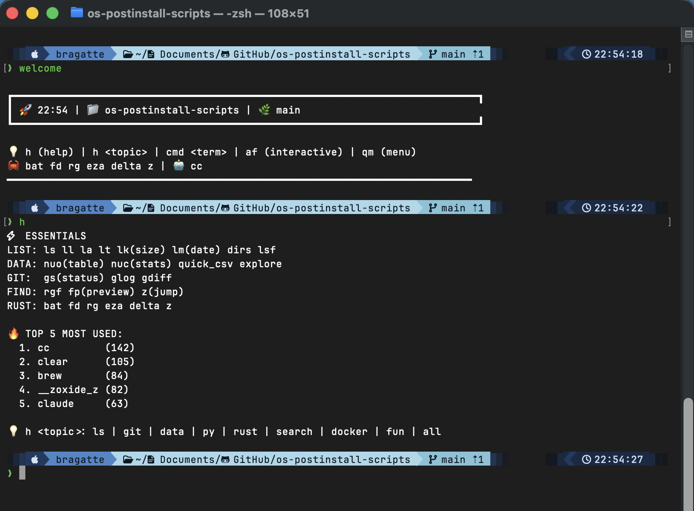

# OS Post-Install Scripts

**Two commands to turn a fresh OS into a fully configured development environment.**

<div align="center">

[](CHANGELOG.md)
[](LICENSE)
[](README.md)
[](https://www.gnu.org/software/bash/)
[](https://www.shellcheck.net/)



*A fully configured terminal: starship prompt, 100+ aliases, modern Rust CLI tools.*

</div>

## Why

Every fresh OS install means hours of manual setup: installing packages, configuring dotfiles, tweaking system preferences. This repo replaces that with two idempotent commands per OS. Pick a profile (`minimal`, `developer`, or `full`), run them, get back to building.

## Quick Start

### macOS / Linux

```bash
git clone https://github.com/BragatteMAS/os-postinstall-scripts
cd os-postinstall-scripts

./bootstrap.sh         # prereqs: Homebrew + Bash 4+ on macOS, git/curl/build-essential on Linux
./setup.sh --dry-run   # preview what will be installed
./setup.sh             # install (default profile: developer)
```

### Windows

```powershell
git clone https://github.com/BragatteMAS/os-postinstall-scripts
cd os-postinstall-scripts

powershell -ExecutionPolicy Bypass -File .\bootstrap.ps1   # prereqs: winget + Git
powershell -ExecutionPolicy Bypass -File .\setup.ps1 -DryRun
powershell -ExecutionPolicy Bypass -File .\setup.ps1 -Profile developer
```

> Don't have Git yet? `winget install Git.Git`, restart PowerShell, then clone.

## Just Want the Terminal?

If you only want a modern terminal (CLI tools + prompt + aliases + zsh plugins) and don't need the full system setup, run the terminal blueprint directly:

```bash
git clone https://github.com/BragatteMAS/os-postinstall-scripts
bash os-postinstall-scripts/terminal-setup.sh --interactive  # wizard — choose components
bash os-postinstall-scripts/terminal-setup.sh --dry-run      # preview first
bash os-postinstall-scripts/terminal-setup.sh                # install everything
```

Windows: `examples/terminal-setup.ps1`.

**What it installs:**

| Component | Details |
|-----------|---------|
| Nerd Font | JetBrainsMono Nerd Font (auto-installed) |
| CLI tools | bat, eza, fd, fzf, ripgrep, delta, zoxide, starship |
| Prompt | MAS Oceanic Theme (powerline, git, languages, status bar) + 3 presets |
| Aliases | 50+ shortcuts for git, navigation, `sysup`, `mkcd`, `gcb` |
| Functions | Welcome message, `h` (help), `preview` (fzf), `aliases` (search) |
| Plugins | zsh-autosuggestions, zsh-syntax-highlighting, zsh-completions |
| Safety | `--dry-run` preview, `--interactive` wizard, automatic backups, idempotent |

Demo:

<div align="center">
<!-- Re-record: asciinema rec assets/demo.cast && agg --theme monokai --font-size 14 assets/demo.cast assets/demo.gif -->

</div>

> Since v5.1.4 the main `setup.sh` also offers to run this at the end (interactive prompt). Skipping the prompt? Run `bash terminal-setup.sh --interactive` whenever you like.

## Profiles

| Feature | Minimal | Developer | Full |
|---------|:-------:|:---------:|:----:|
| System packages (apt / brew / winget) | ✓ | ✓ | ✓ |
| Dev tools + Rust CLI baseline | | ✓ | ✓ |
| GUI apps (cask / flatpak / snap) | | ✓ | ✓ |
| AI / MCP tools | | | ✓ |
| Personal preferences | | | ✓ |
| **Estimated time** | ~5 min | ~15 min | ~30 min |

```bash
./setup.sh minimal      # essentials only
./setup.sh developer    # neutral dev defaults (default)
./setup.sh full         # developer + extras (browsers, AI editors, design apps)
```

> **Note:** `full` adds opinionated personal extras (specific browsers, AI editors, design apps). If you want only neutral dev defaults without the curator's personal apps, use `developer`.

Profile details: [`docs/installation-profiles.md`](docs/installation-profiles.md).

## Modern CLI Tools

The `developer` and `full` profiles install Rust-based replacements for traditional Unix tools:

| Traditional | Modern | Why |
|-------------|--------|-----|
| `cat` | `bat` | syntax highlighting, line numbers |
| `ls` | `eza` | icons, git status, tree view |
| `find` | `fd` | intuitive syntax, respects `.gitignore` |
| `grep` | `ripgrep` (`rg`) | faster, respects `.gitignore` |
| `cd` | `zoxide` (`z`) | frequency-based smart jumping |
| `diff` | `delta` | syntax-highlighted side-by-side |

Aliases configured via `data/dotfiles/shared/aliases.sh`. Full reference: [`docs/modern-cli-tools.md`](docs/modern-cli-tools.md).

## Common Usage

```bash
./setup.sh --dry-run         # preview, no changes
./setup.sh -y full           # unattended full install
./setup.sh dotfiles          # symlink dotfiles only
./setup.sh unlink            # remove dotfile symlinks (restores backups)
./setup.sh defaults          # macOS system defaults (Dock, Finder, etc.)
./setup.sh drift             # report packages no longer in lists
```

| Flag | Short | Env Var | Description |
|------|-------|---------|-------------|
| `--dry-run` | `-n` | `DRY_RUN=true` | preview without installing |
| `--verbose` | `-v` | `VERBOSE=true` | debug output with timestamps |
| `--unattended` | `-y` | `UNATTENDED=true` | skip confirmation prompts |
| `--groups` | `-g` | `GROUPS_MODE=true` | replace all-or-nothing cask install with interactive picker (10 curated groups) |
| `--help` | `-h` | — | show help |

### Cask groups (`--groups` mode)

`bash setup.sh --groups developer` (or `full`) skips the default cask install
and shows an interactive multi-select. You pick which groups to install:

| Group | Apps |
|---|---|
| `browsers` | Firefox, Chromium, Chrome, Zen, Brave, Opera |
| `ai-editors` | Cursor, Zed, Claude (desktop + CLI), ChatGPT, Antigravity |
| `code-editors` | VS Code, Sublime Text, Warp, Positron, RStudio |
| `dev-infra` | Docker, OrbStack, DBeaver, Insomnia, GitHub Desktop |
| `productivity` | Rectangle, Alt-Tab, Raycast, HiddenBar, Caffeine, AppCleaner, Numi, MeetingBar |
| `communication` | Slack, Discord |
| `knowledge` | Obsidian, Zotero |
| `media` | IINA, Spotify, CapCut, Loom, Clop, Wispr Flow |
| `creative` | Inkscape, GIMP, Affinity |
| `essentials` | Bitwarden, Google Drive, LibreOffice, Logi Options+, Karabiner, Nerd fonts |

UI uses `gum choose --no-limit` (Charm's TUI) when available — bash numbered-menu
fallback otherwise. All formulae, Rust CSV tools, and AI tools install as usual.
Edit `data/packages/groups/*.txt` to customise.

Customization (extra packages, custom profiles, dotfiles): [`docs/user-guide.md`](docs/user-guide.md).

## Workflows

Two operational guides folded directly into the README so they don't get lost as separate files. Click to expand.

<details>
<summary><b>Migrating to a new Mac (full runbook)</b></summary>

One-page operational checklist for migrating between macOS machines. Sections in execution order. Keep this open in a second window on the old machine while working on the new one.

### Pre-conditions on the OLD machine

- [ ] `atuin sync` ran (history would be lost otherwise — see Atuin section below)
- [ ] Tarball of secrets/configs to your password vault: `~/.claude`, `~/.ssh`, `~/.gnupg`, GPG keys.
      Use `tools/m1-backup-secrets.sh` — produces ~8 MB tarball that excludes
      regenerable caches. Upload result to your vault as a secure-note attachment.
- [ ] Time Machine final backup (last sanity net)
- [ ] NEW machine: stable network, **≥10 GiB free on /** (preflight will gate this)
- [ ] NEW machine: iCloud Drive **OFF** until after smoke test

### Bootstrap (NEW machine, ~5 min)

Open Terminal on a fresh user account. Skip Migration Assistant — clean install.

```sh
xcode-select --install   # accept the prompt; wait for it to finish
mkdir -p ~/Documents/GitHub && cd ~/Documents/GitHub
git clone https://github.com/BragatteMAS/os-postinstall-scripts.git
cd os-postinstall-scripts
```

> **Stop here** if `git clone` fails — fix network/credentials before
> proceeding. Don't try to work around it.

### Preflight (NEW machine, ~7 s)

Read-only validation that every cask/formula/npm/PyPI name still resolves:

```sh
bash tools/preflight-brew-names.sh
```

**Expected last line:** `[OK] All package names resolve.`

If it shows `[FAIL]` for any name → **STOP**. The cask/formula was renamed
or removed since the last commit. Open an issue, don't continue.

### Install (NEW machine, ~30 min for `full` profile)

```sh
bash setup.sh full
```

**Watch the live output for:**

| Line | Meaning |
|---|---|
| `[skip] X (already installed)` | Idempotent — fine, brew already has X |
| `Summary (file.txt): N installed, M skipped, K failed` | End of each wave — failures should be 0 |
| `[ERROR] Failed to install: X (<reason>)` | Brew classified the failure; check the log |
| `[WARN] Completed with N failure(s)` (final summary) | Read failure list before closing the terminal |

**If failures appear**, look at the diagnostic log path printed in the
final summary (`Diagnostic log: /tmp/os-postinstall-XXXXXX/brew-install.log`)
and **copy it elsewhere immediately** — it lives inside `$TEMP_DIR`,
which is removed on script exit:

```sh
cp /tmp/os-postinstall-*/brew-install.log ~/install-stderr.log
```

### Terminal blueprint (NEW machine, ~3 min)

Since v5.1.4 `setup.sh` prompts for this at the end. To run standalone:

```sh
bash terminal-setup.sh --interactive   # wizard — pick components
bash terminal-setup.sh                 # install everything
bash terminal-setup.sh --dry-run       # preview before applying
```

### Post-install verification (NEW machine, ~5 min)

- [ ] Open a **new** terminal window (so dotfiles re-source)
- [ ] `which starship zoxide atuin` — all three should resolve
- [ ] `h tools` — should list installed CLI tools with one-line descriptions
- [ ] `gh auth status` — should show your GitHub login (or `gh auth login`)
- [ ] `mise --version` — confirm tool-version orchestrator is alive
- [ ] Spot-check casks: `open -a "Visual Studio Code"`, `open -a "DBeaver"`, `open -a "Rectangle"`

### Recovery cookbook

| Symptom | Probable cause | Recovery |
|---|---|---|
| `Failed to install: X (app exists at /Applications)` | App was put there manually before brew (DMG drag-and-drop) | `brew install --cask --force X` — overwrites and registers with brew |
| `Failed to install: X (cask name not found)` | Cask renamed since release; tap missing | `brew search X` to find current name; update `data/packages/brew-cask-*.txt` |
| `Failed to install: X (network error)` | Transient | Re-run `setup.sh full` — idempotent, will retry only the missing items |
| `Failed: codex / claude-code / gemini-cli` (npm tools) | Node/npm not available because fnm chain broke | Reinstall manually: `npm i -g @openai/codex@latest @anthropic-ai/claude-code @google/gemini-cli` |
| `bun installation failed` | `oven-sh/bun` tap unreachable | `brew tap oven-sh/bun` manually, then re-run |
| Wizard skipped — went straight to default | non-TTY (script piped through ssh/curl) | Pass profile explicitly: `bash setup.sh full` |
| Disk space warning aborted | < 10 GiB free | Free space, re-run. Idempotent — only the missing items install |
| `github` cask conflict | Already have `github@beta` (different cask, same app) | Either keep beta (`github@beta` is GitHub Desktop too, just rolling channel) or `brew uninstall --cask github@beta && brew install --cask github` |

For anything not covered above: copy the saved `~/install-stderr.log` plus
the terminal scrollback into a GitHub issue with platform, profile, and
the failing line.

### Post-migration

- [ ] Restore tarball from the password vault: `tar xzf secrets-YYYY-MM-DD.tar.gz -C ~/`
- [ ] Re-run `atuin sync` to pull history forward
- [ ] Turn iCloud Drive back ON
- [ ] Update memory state: migration completed YYYY-MM-DD

**Total expected time** (active): ~45 min. Walk away during install.

</details>

<details>
<summary><b>Persistent shell history with Atuin (sync between machines)</b></summary>

End-to-end encrypted shell history that syncs across machines via the Atuin Hub.
Ctrl+R becomes a fuzzy-search TUI over your full history with cwd/exit-code/duration metadata.

### TL;DR — first-time setup

```sh
brew install atuin
atuin register -u <your-username>          # opens browser; Atuin Hub OAuth
cat ~/.local/share/atuin/key                # COPY → password vault (24-word BIP39)
echo 'eval "$(atuin init zsh)"' >> ~/.zshrc
exec zsh -l                                 # reload shell so atuin init takes effect
atuin import zsh                            # or: atuin import bash, atuin import fish
atuin sync
atuin status                                # confirm "Last sync: <current time>"
```

**Save in your password vault** (text-only, fits free Bitwarden):

- Atuin Hub username + password
- 24 BIP39 words from `cat ~/.local/share/atuin/key`
- Server: `https://api.atuin.sh`

### Why save the encryption key

Atuin is end-to-end encrypted. The server stores ciphertext only; **your key
never leaves your machine**. Lose the key → lose access to your history on
other machines. There is no recovery — it's mathematics.

### Restoring on a new machine

After running `setup.sh` (atuin is in `csv:rust-shell`):

```sh
atuin login -u <your-username>     # asks for password + key (24 words from vault)
eval "$(atuin init zsh)"
atuin sync                         # pulls history from server

# make persistent:
echo 'eval "$(atuin init zsh)"' >> ~/.zshrc
```

Ctrl+R now sees the history from the old machine.

### Common gotchas

| Symptom | Cause | Fix |
|---|---|---|
| `Already authenticated with Atuin Hub` | Already registered on this host | Pulled to step 3 (save the key) |
| `Failed to find $ATUIN_SESSION` | atuin init not loaded in current shell | `eval "$(atuin init zsh)" && atuin sync` |
| `atuin import auto` does nothing | `$HISTFILE` not exported | Pass shell explicitly: `atuin import zsh` |
| `Last sync: 1969-12-31` | Never synced (epoch zero) | Run `atuin sync` (atuin init must be loaded first) |
| Ctrl+R opens Warp's command search | Warp captures Ctrl+R before zsh sees it | Warp Settings → Features → Session → remap "Command search" off `Ctrl+R` |
| `atuin key` seems empty | Output went too fast | `cat ~/.local/share/atuin/key` |

### Web UI shows nothing under sync history?

By design. Atuin Hub stores your shell history encrypted with a key that lives
only on your machine — the web UI cannot decrypt it. Verify sync via CLI:

```sh
atuin status                # Last sync timestamp
atuin search docker         # query that should return historical commands
```

The web UI's **Runbooks** tab is a separate feature — Jupyter-style command
notebooks you create deliberately. It's empty by default; nothing to do with
your synced history.

### Using atuin (after setup)

| Action | How |
|---|---|
| Open search | Ctrl+R (TUI fullscreen) |
| Filter | Type — fuzzy search incremental |
| Navigate | ↑ ↓ |
| Paste command (no execute) | Enter |
| Edit before executing | Tab |
| Close | Esc |
| Toggle global ↔ session-only | Ctrl+R (again, inside the TUI) |

</details>

## Platform Support

| Platform | Package Managers | Architectures |
|----------|------------------|---------------|
| Ubuntu / Pop!_OS / Mint | APT, Snap, Flatpak, Cargo, npm | x86_64, arm64 |
| macOS | Homebrew, Brew Cask, Cargo, npm | Intel + Apple Silicon |
| Windows 10/11 | WinGet | x86_64 |

## Troubleshooting

| Problem | Fix |
|---------|-----|
| `bash 3.2` too old on macOS | run `./bootstrap.sh` (or `brew install bash`) |
| `./setup.sh: Permission denied` | `chmod +x setup.sh` |
| APT lock on Linux | wait for unattended-upgrades / Software Center to finish |
| `winget: command not found` | update App Installer from Microsoft Store |
| PowerShell execution policy blocks script | use `-ExecutionPolicy Bypass` flag (shown in Quick Start) |

For mid-install failures with brew see the **Recovery cookbook** in the
"Migrating to a new Mac" section above. Full pitfalls list:
[`docs/PITFALLS.md`](docs/PITFALLS.md).

## Safety

- Dry-run skips all sudo requests, network calls, and file mutations
- Existing dotfiles are backed up to `~/.dotfiles-backup/` before any symlink
- `./setup.sh unlink` restores original files from backups
- Script never deletes files outside its own backup paths

For vulnerability reports: [`SECURITY.md`](SECURITY.md).

## Documentation

| Topic | Where |
|-------|-------|
| Quick install guide | [`docs/quick-start.md`](docs/quick-start.md) |
| Complete usage | [`docs/user-guide.md`](docs/user-guide.md) |
| Profile details | [`docs/installation-profiles.md`](docs/installation-profiles.md) |
| Modern CLI tools | [`docs/modern-cli-tools.md`](docs/modern-cli-tools.md) |
| 35 cataloged pitfalls | [`docs/PITFALLS.md`](docs/PITFALLS.md) |
| Contributing | [`CONTRIBUTING.md`](CONTRIBUTING.md) |
| Changelog | [`CHANGELOG.md`](CHANGELOG.md) |

> Migration runbook and Atuin setup live above in the **Workflows** section
> (collapsed by default). Previously separate `tools/M5-RUNBOOK.md` and
> `tools/ATUIN-RUNBOOK.md` files were folded in for v5.2.0 — separate ops
> docs lose visibility, single entry point keeps them findable.

## Credits

- Inspired by [mathiasbynens/dotfiles](https://github.com/mathiasbynens/dotfiles), [thoughtbot/laptop](https://github.com/thoughtbot/laptop)
- Static analysis via [ShellCheck](https://www.shellcheck.net/)
- Diagrams via [Mermaid](https://mermaid.js.org/)
- Built with [Claude Code](https://claude.ai/) as co-pilot (430+ commits)

## License

Apache 2.0 — see [`LICENSE`](LICENSE) and [`NOTICE`](NOTICE).

If this project helped you, a star helps others find it.
