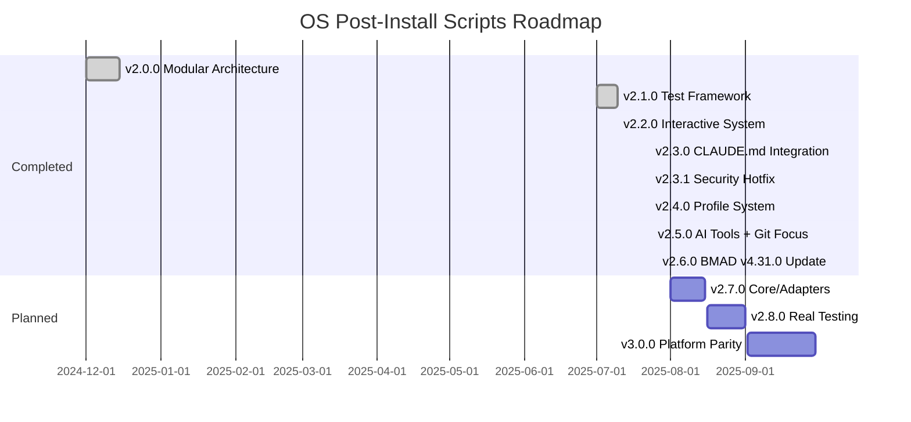

# 🗺️ Roadmap - OS Post-Install Scripts

> **Last Updated:** 2025-07-26 | **Current Version:** v2.6.0

## 🎯 Vision

Transform OS Post-Install Scripts into the definitive cross-platform system configuration toolkit, emphasizing security, reliability, and developer experience through Context Engineering and modern best practices.

## 📊 Release Timeline

## ✅ Completed: v2.6.0 BMAD Method Update

### ✅ v2.6.0 BMAD Method Update - COMPLETED!
- [x] Updated BMAD Method from v4.25.0 to v4.31.0
- [x] Created `update_bmad_github.sh` script for easy updates
- [x] Automatic version checking and comparison
- [x] Backup creation before updates
- [x] Preservation of custom content (expansion packs)
- [x] New templates and workflows included
- [x] Enhanced brainstorming and elicitation features

## 📚 Previous Releases

### ✅ v2.3.1 Security Hotfix - COMPLETED!
- [x] Safe APT lock handling module (`utils/package-manager-safety.sh`)
- [x] Centralized logging system (`utils/logging.sh`)
- [x] Updated all APT scripts to use safe wrappers
- [x] Removed all dangerous lock removal code
- [x] Security tests for APT operations
- [x] CI/CD friendly test suite
- [x] Documentation of security best practices

### ✅ v2.4.0-alpha.1 Features - COMPLETED!
- [x] Profile system implementation
- [x] 5 pre-configured profiles
- [x] YAML-based configuration
- [x] Interactive profile selection
- [x] Comprehensive documentation

### ✅ v2.5.0 AI & Product Focus - COMPLETED!
- [x] AI Development Tools Integration
  - [x] MCPs configuration (context7, fetch, sequential-thinking, serena)
  - [x] BMAD Method v4.31.0 integration
  - [x] Cross-platform installers
  - [x] Diagnostic tools
- [x] Product-Focused Git Configuration
  - [x] Global git templates
  - [x] Smart git hooks
  - [x] Product-focused aliases
  - [x] Shell functions (gnew, ginit, gcheck)
- [x] Context Engineering Documentation
  - [x] CLAUDE.md v2.3.0
  - [x] CLAUDE-EXTENDED.md
- [x] Author attribution updates
- [x] Profile-based installation system
- [x] 5 pre-configured profiles
- [x] Comprehensive user documentation overhaul
- [x] Clear versioning strategy
- [x] Repository cleanup and organization

## 📅 Upcoming Releases

### v2.7.0 - Core/Adapters Architecture (August 2025)
**Theme:** Architectural Improvements

- [ ] Separate core from platform adapters
- [ ] Plugin architecture
- [ ] Improved testability
- [ ] Performance optimizations
- [ ] Architecture documentation

### v2.8.0 - Real Testing Framework (September 2025)
**Theme:** Quality and Trust

- [ ] Implement bats-core testing framework
- [ ] Create 20 critical path integration tests
- [ ] Add security-focused test suite
- [ ] Implement real coverage reporting with kcov
- [ ] Update CI/CD with comprehensive test runs
- [ ] Remove all false coverage claims

### v3.0.0 - Full Platform Parity (September 2025)
**Theme:** Universal Compatibility

- [ ] macOS support expansion to 80%
- [ ] Windows PowerShell improvements
- [ ] Universal installer script
- [ ] Platform-specific optimizations
- [ ] Cross-platform test matrix
- [ ] Unified documentation

## 🔮 Future Vision (v3.1+)

### Developer Experience
- [ ] Plugin system for custom configurations
- [ ] Configuration profiles (minimal, standard, full)
- [ ] Interactive TUI configuration wizard
- [ ] Rollback and recovery system
- [ ] Configuration version control

### Enterprise Features
- [ ] Multi-machine deployment support
- [ ] Ansible/Terraform integration
- [ ] Corporate proxy support
- [ ] Offline installation mode
- [ ] Compliance reporting

### Advanced Automation
- [ ] AI-powered configuration suggestions
- [ ] Hardware-specific optimizations
- [ ] Performance benchmarking
- [ ] Automated dependency resolution
- [ ] Smart conflict resolution

## 🏁 Success Metrics

### v2.3.1 (Current)
- ✅ Zero security vulnerabilities
- ⏳ All APT operations safe
- ⏳ Transparent about limitations

### v2.4.0
- [ ] Real test coverage > 30%
- [ ] All critical paths tested
- [ ] Zero false claims

### v2.5.0
- [ ] 100% scripts using adapters
- [ ] Zero code duplication
- [ ] Clear architecture docs

### v3.0.0
- [ ] 3 platforms at 80%+ support
- [ ] < 5 min average setup time
- [ ] 95% user satisfaction

## 🤝 Contributing

See [CONTRIBUTING.md](CONTRIBUTING.md) for how to help shape our roadmap.

### Priority Areas for Contributors
1. **Security Tests** - Help us verify APT lock handling
2. **macOS Scripts** - Expand platform support
3. **Documentation** - Improve user guides
4. **Testing** - Increase real coverage
5. **Architecture** - Review core/adapters design

## 📝 Notes

- Dates are targets, not commitments
- Security fixes always take priority
- Community feedback shapes priorities
- We value transparency over promises

---

> **Philosophy:** Better to deliver quality late than bugs on time.