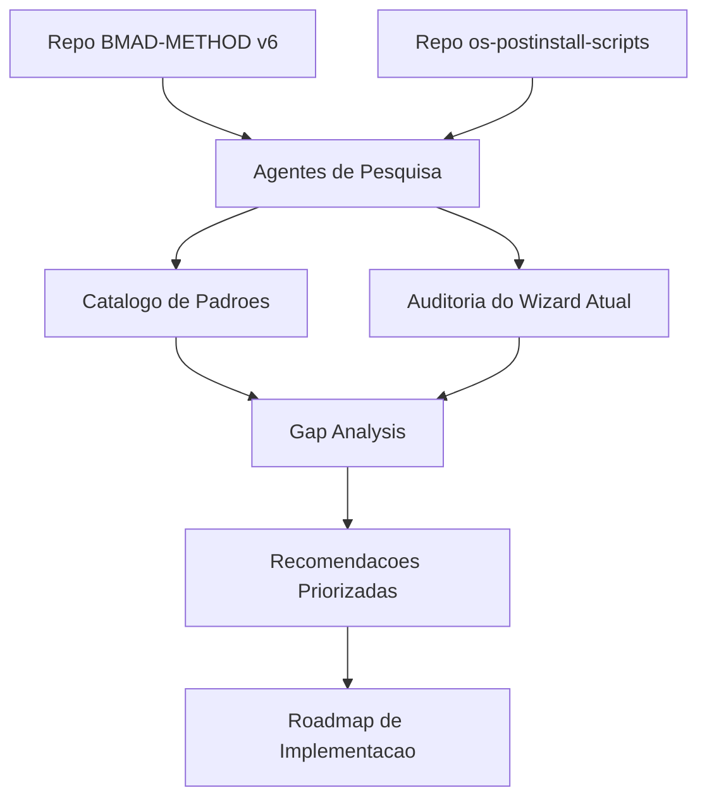
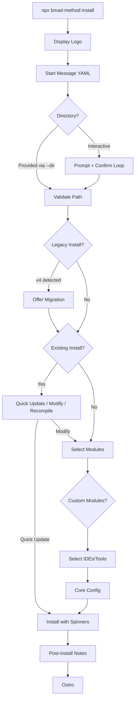
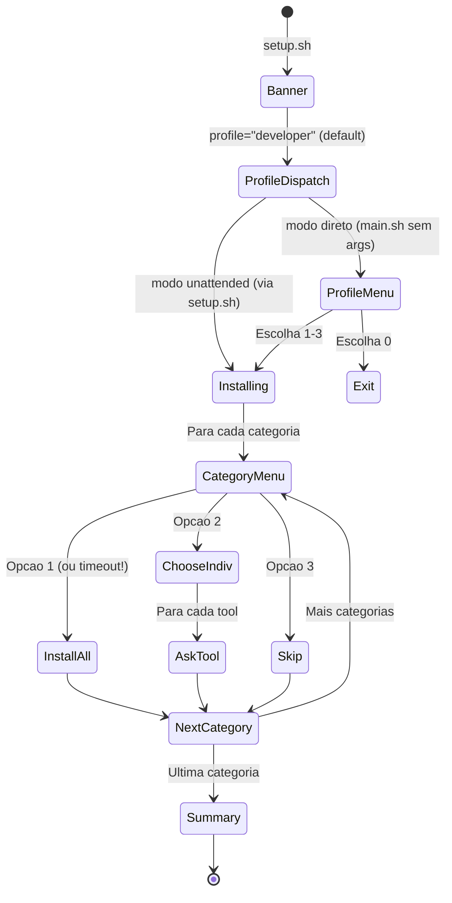
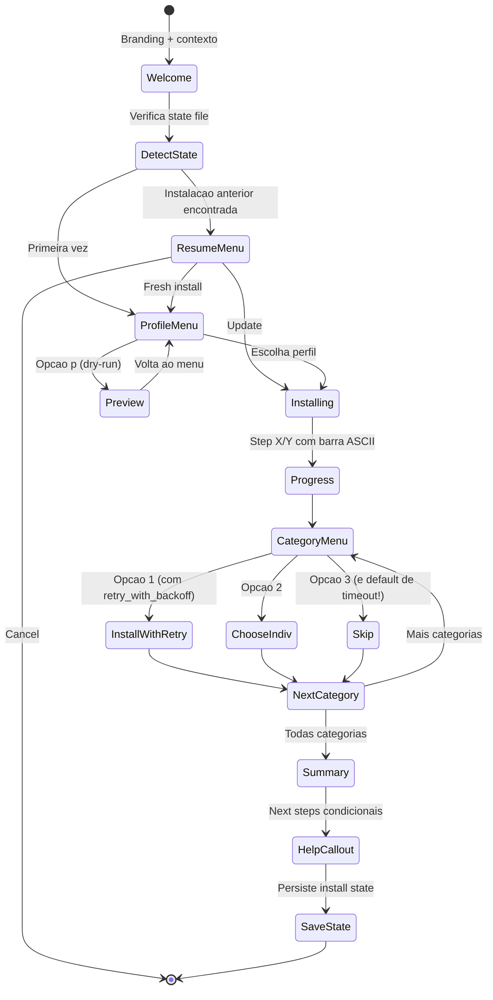

# Nota Metodologica -- Pesquisa UX do Wizard de Instalacao

> **Versao:** 1.1
> **Ultima atualizacao:** 2026-02-24
> **Responsavel:** Bragatte + Claude (pesquisa com agentes especializados)
> **Cobertura temporal:** Fevereiro 2026
> **Frequencia de atualizacao:** Sob demanda
> **Granularidade:** Por componente do wizard
> **Fonte de dados:** BMAD-METHOD repo (v6), os-postinstall-scripts (v4.2+)
> **Destino dos dados:** Roadmap de melhorias do wizard de instalacao
> **Licenca:** MIT

---

## Indice

### Pipeline
- [1. Visao Geral](#1-visao-geral)
- [2. Catalogo de Padroes BMAD](#2-catalogo-de-padroes-bmad)
- [3. Auditoria do Wizard Atual](#3-auditoria-do-wizard-atual)
- [4. Analise Comparativa (Gap Analysis)](#4-analise-comparativa-gap-analysis)
- [5. Recomendacoes de Implementacao](#5-recomendacoes-de-implementacao)

### Dados
- [6. Modelo de Padroes UX](#6-modelo-de-padroes-ux)
- [7. Mapa de Transicoes do Wizard](#7-mapa-de-transicoes-do-wizard)

### Apendices
- [8. Limitacoes Gerais](#8-limitacoes-gerais)
- [9. Referencias](#9-referencias)
- [10. Historico de Versoes](#10-historico-de-versoes)

---

## 1. Visao Geral

### O que e

Este documento sintetiza uma pesquisa de UX sobre padroes de interacao em wizards de instalacao via terminal. A pesquisa foi conduzida por agentes especializados (UX de mensagens, auditoria de wizard, analise de workflows) analisando o repositorio BMAD-METHOD como benchmark, e auditando o wizard atual do os-postinstall-scripts com line references exatas.

O objetivo e produzir um blueprint replicavel: qualquer desenvolvedor deve conseguir pegar este documento e implementar as melhorias no wizard sem ambiguidades.

### Para que serve

- Guiar a evolucao do wizard de instalacao do os-postinstall-scripts
- Documentar padroes de UX para CLI que podem ser reutilizados em outros projetos
- Estabelecer baseline de qualidade mensuravel para interacoes de terminal
- Servir como referencia para decisoes de design futuras

### O que NAO faz

- Nao e uma spec de implementacao (e pesquisa, nao codigo)
- Nao substitui testes de usabilidade com usuarios reais
- Nao cobre UX de aplicacoes web/GUI — foco exclusivo em terminal/CLI
- Padroes BMAD sao de Node.js/@clack — adaptacao para bash puro requer engenharia

### Diagrama geral



---

## 2. Catalogo de Padroes BMAD

### 2.1 Arquitetura de Prompts

**Entrada:** Usuario interage com `npx bmad-method install`
**Saida:** Configuracao completa persistida em `_bmad/{module}/config.yaml`

O BMAD-METHOD usa `@clack/prompts` como base, com um wrapper completo em `tools/cli/lib/prompts.js` (810 linhas).

#### Tipos de Prompt

| Tipo | Uso | Arquivo:Linha |
|------|-----|---------------|
| `select` | Escolha unica com setas | `prompts.js:147` |
| `multiselect` | Multipla escolha com checkbox | `prompts.js:189` |
| `autocompleteMultiselect` | Multiselect com busca type-ahead | `prompts.js:258` |
| `autocomplete` | Select unico com filtro | `prompts.js:627` |
| `selectKey` | Selecao instantanea por tecla | `prompts.js:641` |
| `confirm` | Sim/Nao | `prompts.js:394` |
| `text` | Input livre com placeholder Tab-fill | `prompts.js:420` |
| `password` | Input mascarado | `prompts.js:489` |
| `path` | Input de caminho com autocomplete FS | `prompts.js:610` |
| `group` | Agrupamento sequencial de prompts | `prompts.js:507` |

#### Feedback Visual

| Componente | Descricao | Arquivo:Linha |
|------------|-----------|---------------|
| `spinner` | Animacao durante operacoes async, com state tracking | `prompts.js:95` |
| `progress` | Barra de progresso | `prompts.js:586` |
| `taskLog` | Log scrollavel de subprocesso | `prompts.js:596` |
| `box` | Caixa estilizada com borda e titulo | `prompts.js:576` |
| `note` | Nota informativa destacada | `prompts.js:85` |
| `intro/outro` | Mensagens de abertura/encerramento | `prompts.js:66-77` |
| `log.*` | Logs semanticos (info/success/warn/error/step) | `prompts.js:534-558` |
| `stream.*` | Mensagens com conteudo dinamico (LLM/generators) | `prompts.js:651-676` |

#### Tratamento de Cancelamento

```javascript
// Padrao BMAD: toda interacao checa cancelamento gracioso
async function handleCancel(value, message = 'Operation cancelled') {
  const clack = await getClack();
  if (clack.isCancel(value)) {
    clack.cancel(message);
    process.exit(0);
  }
  return false;
}
```

**Principio:** Ctrl+C em QUALQUER prompt resulta em saida limpa, nunca em stack trace.

#### Padroes de Interacao Avancados

**Locked values em multiselect** (`prompts.js:264,350-360`):
```javascript
// Modulos obrigatorios aparecem marcados e nao podem ser desmarcados
lockedValues: ['core']
// Visual: checkbox verde + "(always installed)"
```

**Tab-to-fill em text inputs** (`prompts.js:467-473`):
```javascript
prompt.on('key', (char) => {
    if (char === '\t' && placeholder && !prompt.userInput) {
        prompt._setUserInput(placeholder, true);
    }
});
```

**Conditional questions** (`prompts.js:698-702`):
```javascript
if (when !== undefined) {
    const shouldAsk = typeof when === 'function' ? await when(answers) : when;
    if (!shouldAsk) continue;
}
```

#### Limitacoes

- `@clack/prompts` nao suporta validacao async — apenas sync
- Separadores em listas nao sao nativamente suportados (filtrados)
- Space como tecla de selecao precisou de override manual (`prompts.js:362-380`)

---

### 2.2 Sistema de Mensagens Externalizadas

**Entrada:** Arquivo YAML estatico
**Saida:** Mensagens renderizadas no terminal em pontos especificos do fluxo

#### Estrutura do `install-messages.yaml`

```yaml
startMessage: |
  # Texto multi-linha com emoji, bullets, separadores ASCII
  # Exibido APOS logo, ANTES de qualquer prompt

endMessage: ""
  # Vazio — resumo e next-steps sao gerados programaticamente
```

**Apenas 2 chaves.** Nenhuma variavel ou condicional dentro do YAML. E puro texto estatico, editavel por qualquer pessoa sem conhecimento de codigo.

#### Como e consumido (`message-loader.js`)

```javascript
class MessageLoader {
  load() {
    // Lazy-load com cache. Retorna null se arquivo invalido — graceful degradation
    const content = fs.readFileSync(messagesPath, 'utf8');
    this.messages = yaml.parse(content);
  }
  getStartMessage() { return messages?.startMessage || null; }
  async displayStartMessage() {
    const message = this.getStartMessage();
    if (message) await prompts.log.info(message);
  }
}
```

**Trigger:** `displayStartMessage()` dispara apos display do logo, antes de qualquer config. Se o arquivo nao existir, o installer continua normalmente (null-safe).

#### Aplicabilidade para bash

O conceito cabe em qualquer shell script:
```bash
# messages.yaml (editavel por nao-devs)
# welcome: |
#   Texto de boas-vindas aqui
#
# Lido com yq ou sed simples:
welcome_msg=$(sed -n '/^welcome:/,/^[^ ]/p' messages.yaml | tail -n +2 | sed 's/^  //')
echo "$welcome_msg"
```

---

### 2.3 Schema de Configuracao por Modulo (`module.yaml`)

**Entrada:** Arquivo YAML declarativo por modulo
**Saida:** Prompts gerados automaticamente + config persistida

#### Estrutura do `module.yaml`

```yaml
# IDENTIDADE
code: bmm                          # ID curto — usado como chave em todo o sistema
name: "BMad Method"                # Nome para display
description: "..."                  # Usado na UI de selecao de modulos
default_selected: true             # Pre-marcado no multiselect do installer

# CAMPO SIMPLES (text input)
user_name:
  prompt: "What should agents call you?"
  default: "BMad"
  result: "{value}"                # {value} = resposta do usuario

# CAMPO COM OPCOES (single-select)
user_skill_level:
  prompt:
    - "What is your experience level?"     # prompt pode ser array (multi-linha)
    - "This affects how agents explain concepts."
  default: "intermediate"
  result: "{value}"
  single-select:
    - value: "beginner"
      label: "Beginner - Explain things clearly"
    - value: "intermediate"
      label: "Intermediate - Balance detail with speed"
    - value: "expert"
      label: "Expert - Be direct and technical"

# CAMPO COM REFERENCIA CROSS-MODULE
planning_artifacts:
  prompt: "Where should planning artifacts be stored?"
  default: "{output_folder}/planning-artifacts"  # refs campo do core module
  result: "{project-root}/{value}"               # prefixo de caminho

# DIRETORIOS DECLARATIVOS
directories:
  - "{planning_artifacts}"          # resolvido em runtime para criar dirs
```

#### Sistema de tokens/variaveis

Dois momentos de resolucao:

| Momento | Tokens | Exemplo |
|---------|--------|---------|
| **Antes do prompt** (display) | `{directory_name}`, cross-module refs | `{output_folder}` → busca em `allAnswers` |
| **Apos o prompt** (resultado) | `{value}`, `{project-root}` | `{project-root}/{value}` → `/path/to/user-input` |

**Dynamic defaults:** Se o default referencia outro campo do mesmo modulo, vira uma funcao que avalia em tempo real conforme o usuario preenche:

```javascript
question.default = (answers) => {
    let resolved = originalDefault;
    resolved = resolved.replaceAll(/{([^}]+)}/g, (match, fieldName) => {
        const answerKey = `${moduleName}_${fieldName}`;
        return answers[answerKey] || match;
    });
    return resolved;
};
```

#### Tipos de pergunta auto-detectados

| YAML key no item | Tipo de prompt | Deteccao |
|---|---|---|
| `single-select: [...]` | `list` (dropdown) | Presenca da chave |
| `multi-select: [...]` | `checkbox` | Presenca da chave |
| `default: true/false` | `confirm` (Y/n) | Tipo boolean no default |
| (nenhum dos acima) | `input` (texto livre) | Fallback |

#### Config persistida como YAML

```javascript
yaml.dump(config, { indent: 2, lineWidth: 120, noRefs: true })
// Salvo em: {bmadDir}/{moduleName}/config.yaml
// Inclui bloco _meta:
this.collectedConfig._meta = {
    version: packageJson.version,
    installDate: new Date().toISOString(),
    lastModified: new Date().toISOString(),
};
```

---

### 2.4 Post-Install Notes Condicionais

**Entrada:** Secao `post-install-notes` no `module.yaml`
**Saida:** Mensagens exibidas apos configuracao, filtradas pelas escolhas do usuario

#### Formato 1: String simples (sempre exibida)

```yaml
post-install-notes: |
  Prerequisite: install Node.js 18+ before using this module.
```

#### Formato 2: Condicional baseada em config

```yaml
post-install-notes:
  user_skill_level:
    beginner: |
      Getting started:
        - Read the quickstart guide at docs/tutorials/
        - Start with the brainstorming workflow
    expert: |
      Power user tip: use #yolo mode to skip confirmations.
```

#### Logica de rendering (`ConfigCollector.displayModulePostConfigNotes()`)

```javascript
for (const [configKey, valueMessages] of Object.entries(notes)) {
    const selectedValue = config[configKey];
    if (!selectedValue || !valueMessages[selectedValue]) continue;
    // Linhas terminando em ":" = bold header
    // Demais = dimmed + indented
}
```

**Estado atual no BMAD:** O mecanismo esta 100% implementado, mas nenhum modulo built-in (core, bmm) define `post-install-notes` ainda. E um padrao preparado para extensao.

**Aplicabilidade para bash:** Diretamente mapeavel:
```bash
# Se o usuario escolheu perfil "developer":
case "$selected_profile" in
    developer)
        echo "Next steps:"
        echo "  - Open a new terminal to load aliases"
        echo "  - Type 'h' for available commands"
        echo "  - Type 'h tools' to see installed CLI tools"
        ;;
    full)
        echo "Next steps:"
        echo "  - Configure Claude: claude setup"
        echo "  - Type 'h' for available commands"
        ;;
esac
```

---

### 2.5 Padroes de Workflow (Step-Based Architecture)

**Entrada:** Arquivos de step isolados (`step-01.md`, `step-02a.md`, etc.)
**Saida:** Artefato construido incrementalmente com estado em frontmatter YAML

#### Micro-File Architecture

Cada workflow BMAD segue um contrato estrutural:

> "Each step is a self-contained file with embedded rules. Sequential progression with user control at each step. Document state tracked in frontmatter. Append-only document building."

| Propriedade | Implementacao |
|---|---|
| **Isolamento de step** | So o step atual esta em memoria — nunca pre-carregar futuros |
| **Estado em frontmatter** | YAML frontmatter rastreia `stepsCompleted: [1, 2, 3]` |
| **Roteamento explicito** | Cada step termina dizendo qual arquivo carregar a seguir |
| **Output append-only** | Documentos crescem por append — nunca sobrescrevendo |
| **Halt em menus** | Toda apresentacao de menu = pausa obrigatoria aguardando input |

#### Branching Pattern (2a/2b/2c/2d)

O brainstorming workflow do BMAD exemplifica o padrao de branching convergente:

```
[step-01: Session Setup]
     │
     ├─ Sessao anterior existe? → [step-01b: Resume]
     │
     ├─ Menu: "Which approach? (1-4)"
     │     1 → [step-02a: User Selected]      ← browse CSV por categoria
     │     2 → [step-02b: AI Recommended]     ← AI sugere baseado no contexto
     │     3 → [step-02c: Random Selection]   ← 3 picks aleatorios + [Shuffle]
     │     4 → [step-02d: Progressive Flow]   ← jornada em 4 fases
     │
     └─ TODOS convergem em → [step-03: Execution]
```

**Cada branch 02x e completamente auto-contido.** Mesma entrada (frontmatter), mesma saida (`techniques_used[]`), mesmo destino (step-03). A unica diferenca e o modo de interacao.

#### Resumption Pattern (step-01b)

```
step-01b-continue.md e SEMPRE o segundo arquivo de qualquer workflow.
Detectar estado existente e a primeira coisa que acontece — nao uma feature secundaria.
```

**Em bash:**
```bash
STATE_FILE="$HOME/.config/os-postinstall/wizard-state"
if [[ -f "$STATE_FILE" ]]; then
    source "$STATE_FILE"  # carrega steps_completed, selected_profile, etc.
    echo "Previous session found:"
    echo "  Profile: $selected_profile"
    echo "  Steps done: ${steps_completed[*]}"
    echo "  1) Continue from step $((${#steps_completed[@]} + 1))"
    echo "  2) Start fresh"
    echo "  3) Cancel"
fi
```

#### CSV-Driven Catalogs

O BMAD usa CSVs como fonte de verdade para opcoes oferecidas ao usuario:

```csv
# brain-methods.csv: 36+ tecnicas em 7 categorias
category, technique_name, description
collaborative, Yes And Building, "Build momentum through..."
creative, What If Scenarios, "Explore radical possibilities..."
structured, SCAMPER Method, "Systematic creativity through..."
```

**Carregados sob demanda** — nunca pre-carregados. Cada step-02x le apenas quando precisa.

**Em bash:**
```bash
# packages.csv como SSoT editavel sem tocar codigo:
# category,name,apt_name,brew_name,description
# essential,git,git,git,Version control
# rust-cli,bat,bat,bat,Cat with syntax highlighting
load_category() {
    awk -F',' -v cat="$1" '$1==cat {print $2, $5}' packages.csv
}
```

#### Sub-Workflow Return Protocol

Quando um sub-workflow e invocado (ex: Advanced Elicitation dentro do Brainstorming):

```
1. Sub-workflow executa
2. Ao concluir, EXPLICITAMENTE re-le o arquivo do step chamador
3. Restaura contexto do step pai
4. Apresenta menus que o step pai exige
```

**Nunca ha continuacao implicita.** O retorno e sempre explicito.

#### YOLO Mode (Non-Interactive)

```javascript
// BMAD: #yolo pula todas as confirmacoes, simula respostas de expert
execution-modes:
  normal: Full interaction at every step
  yolo:   Skip confirmations, simulate expert user responses
```

**Em bash:** Mapeia para `NONINTERACTIVE=true` / `--yes`.

#### Documentacao Diataxis

```
docs/
├── tutorials/      → getting-started.md           (learning-oriented)
├── how-to/         → install-bmad.md, upgrade...   (task-oriented)
├── reference/      → agents.md, commands.md...     (information-oriented)
└── explanation/    → brainstorming.md, why-...     (understanding-oriented)
```

Compliant com Diataxis. `explanation/` cobre o "por que" de cada workflow. `reference/workflow-map.md` e o indice canonico com tabela linking slash commands a outputs.

---

### 2.6 Fluxo do Installer

**Entrada:** `npx bmad-method install` ou `npx bmad-method install --yes`
**Saida:** Diretorio `_bmad/` configurado com modulos, agentes e configuracao

Sequencia exata (`ui.js:31-580`):

```
1. displayLogo()           — Branding visual
2. displayStartMessage()   — Mensagem de boas-vindas (YAML-driven)
3. getConfirmedDirectory() — Diretorio com validacao + confirmacao loop
4. detectLegacyV4()        — Deteccao de instalacao anterior
5. selectAllModules()      — Multiselect com autocomplete + locked values
6. promptCustomContent()   — Modulos customizados (opcional)
7. promptToolSelection()   — IDEs com autocomplete + locked items
8. collectCoreConfig()     — Username, idioma, pasta de output (sempre full prompt)
9. install()               — Execucao com spinners
10. displayPostInstallNotes() — Notas condicionais por escolha
```

**Padroes-chave:**

| Padrao | Descricao | Nosso equivalente |
|--------|-----------|-------------------|
| **Mensagens externalizadas** | `install-messages.yaml` — texto em YAML | Hardcoded em echo |
| **Idempotencia** | Detecta install existente → Quick Update / Modify / Recompile | Nao detecta estado anterior |
| **Non-interactive** | `--yes` com defaults sensatos para CI | `NONINTERACTIVE=true` (basico) |
| **Directory confirm loop** | Pede, mostra info, confirma — loop ate validar | Nao pede diretorio |
| **Legacy detection** | Detecta versao antiga, avisa, oferece migracao | Nao detecta |
| **Opcao "nenhum"** | Confirma se zero selecionado foi intencional | Default silencioso |
| **Post-install notes** | Condicionais baseadas nas escolhas feitas | `show_rust_summary()` estatico |
| **CLI flags** | `--directory`, `--modules`, `--tools`, `--yes`, `--action` | Nenhuma flag |
| **Express vs Customize** | Por modulo: aceitar defaults ou customizar | Sempre pergunta tudo |
| **External module registry** | `external-official-modules.yaml` com git clone + cache | Nenhum sistema de modulos |

<details>
<summary>Diagrama: Fluxo completo do installer BMAD</summary>



</details>

#### Limitacoes

- BMAD e Node.js — muitos padroes (@clack, commander.js) nao tem equivalente direto em bash puro
- O sistema de modulos assume npm ecosystem — nosso projeto usa apt/brew/cargo
- Complexidade do BMAD reflete escopo maior (AI agent framework vs shell setup)

---

## 3. Auditoria do Wizard Atual

### Estado Atual

**Entrada:** `bash setup.sh` ou `./setup.sh [profile]`
**Saida:** Pacotes instalados, dotfiles configurados, tools disponiveis

#### Componentes auditados

| Arquivo | Funcao |
|---------|--------|
| `setup.sh` | Entry point, parse flags, dispatch para plataforma |
| `src/platforms/macos/main.sh` | Menu de perfil macOS, orquestracao de install |
| `src/platforms/linux/main.sh` | Menu de perfil Linux, orquestracao de install |
| `src/core/interactive.sh` | `show_category_menu()`, `ask_tool()` |
| `src/core/logging.sh` | `log_ok/error/warn/info/debug/banner` |
| `src/core/errors.sh` | Exit codes, `retry_with_backoff()`, tracking |
| `src/core/progress.sh` | `show_dry_run_banner()`, `count_platform_steps()`, `show_completion_summary()` |
| `src/core/config.sh` | Constantes, SKIP_PACKAGES, DEFAULT_PROFILE |

### 3.1 Experiencia de Primeiro Uso (Line-by-Line)

```
setup.sh:230  parse_flags "$@"          # nenhuma flag → usa defaults
setup.sh:163  local profile="developer"  # DEFAULT_PROFILE de config.sh
setup.sh:165  log_banner "OS Post-Install Scripts"   # imprime: === OS Post-Install Scripts ===
setup.sh:166  log_info "Profile: developer"
setup.sh:169  detect_platform            # deteccao silenciosa
setup.sh:170  log_ok "Detected: macOS 15.x (brew)"
setup.sh:173  verify_all                 # bash check, distro, pkg mgr, internet, sudo
setup.sh:179  bash "$macos_main" "$profile"  # dispatch via subprocess
```

Dentro do `macos/main.sh`:
```
main.sh:238  if [[ -n "${1:-}" ]]   # profile arg presente → modo unattended
main.sh:240  install_profile "developer"  # pula menu, instala direto
main.sh:156  log_info "[Step 1/N] Ensuring Homebrew..."
main.sh:163  log_info "[Step 2/N] Setting up dev env..."
# ... loop de steps ...
```

**Achado critico:** O menu interativo (`show_menu`) so e acessivel quando `main.sh` e invocado diretamente SEM argumento. Via `setup.sh`, o profile "developer" e passado automaticamente e o wizard roda em modo unattended.

### 3.2 Pain Points (com Line References Exatas)

#### PP1. Welcome/Branding Fino

**Severidade: MEDIA** | **Local:** `setup.sh:165`, `macos/main.sh:104-114`

```bash
# setup.sh:165 — todo o branding:
log_banner "OS Post-Install Scripts"
# Gera: === OS Post-Install Scripts ===
```

Sem versao, sem descricao do que faz, sem URL, sem tempo estimado. O menu direto (`macos/main.sh:104-114`) tem banner ASCII mas tambem sem contexto:

```bash
echo -e "${BLUE}=======================================================${NC}"
echo -e "${BLUE}         macOS Post-Installation Script                ${NC}"
echo -e "${BLUE}=======================================================${NC}"
```

---

#### PP2. Menus sem Explicacao Acionavel

**Severidade: ALTA** | **Local:** `macos/main.sh:108-113`, `linux/main.sh:87-92`

```bash
# macos/main.sh:108-113
echo "  1. Minimal   (essential tools only)"
echo "  2. Developer (system + dev tools)"
echo "  3. Full      (everything + AI tools)"

# linux/main.sh:87-92 — INCONSISTENTE:
echo "  1. Minimal   (essential packages only)"
echo "  2. Developer (system + dev tools + AI)"   # ← AI aqui mas nao no macOS
echo "  3. Full      (everything)"                 # ← sem AI aqui
```

Descricoes vagas e inconsistentes entre plataformas. Nenhuma enumeracao de pacotes, nenhum tamanho estimado.

`show_category_menu()` em `interactive.sh:44-56`:
```bash
echo "Install ${category}? (${description})"
echo "  1) All"
echo "  2) Choose individually"
echo "  3) Skip"
```
`description` e uma string curta ("apt packages") — sem contagem ou lista preview.

---

#### PP3. Sem Progresso Global (Sem Barra/Spinner)

**Severidade: ALTA** | **Local:** `progress.sh:31-87`, `macos/main.sh:141-152`

```bash
# macos/main.sh:141-152 — contador existe mas e local e textual:
total_steps=$(count_platform_steps "$profile_file" "macos")
current_step=0
# ...
log_info "[Step ${current_step}/${total_steps}] Setting up..."
```

`progress.sh` contem apenas 3 funcoes: `show_dry_run_banner()`, `count_platform_steps()`, `show_completion_summary()`. **Nenhuma** desenha barra de progresso, spinner, ou percentual. O `[Step X/Y]` e uma linha de log plana, sem indicador visual de quanto falta.

---

#### PP4. Timeout Silencioso (MAIS PERIGOSO)

**Severidade: ALTA** | **Local:** `interactive.sh:49,55,74,78`

```bash
# interactive.sh:49 — read com timeout de 30s:
read -r -t 30 -p "Select [1-3]: " choice || choice=""

# interactive.sh:55 — string vazia cai no wildcard:
case "$choice" in
    1) return 0 ;;
    2) return 1 ;;
    3) return 2 ;;
    *) return 0 ;;  # ← VAZIO E TIMEOUT AMBOS = INSTALAR TUDO
esac
```

Quando o timeout de 30s expira, `read` falha, `choice=""`, cai em `*) return 0` = **instalar tudo silenciosamente**. O usuario nao ve countdown, nenhum aviso, nenhuma mensagem. O prompt simplesmente desaparece e a instalacao comeca.

Mesmo padrao em `ask_tool()`:
```bash
# interactive.sh:74,78
read -r -t 30 -p "Install ${tool}? [Y/n]: " answer || answer=""
*) return 0 ;;   # default: instalar
```

---

#### PP5. Sem Resumo de Instalacao por Categoria

**Severidade: MEDIA** | **Local:** `progress.sh:111-138`

Resumo global existe (`show_completion_summary`):
```bash
log_banner "Setup Complete"
log_info "Profile:  ${profile}"
log_info "Duration: ${mins}m ${secs}s"
if [[ "$fail_count" -gt 0 ]]; then
    log_warn "Completed with ${fail_count} failure(s)"
fi
```

**O que falta:**
- Nenhuma lista do que FOI instalado (so o que falhou)
- Nenhuma contagem de pacotes com sucesso
- Nenhuma lista de tools novas disponiveis
- Nenhum "next steps" (reload shell, configure X)
- Sub-scripts (`brew.sh`, `apt.sh`) nao reportam contagem de sucesso — so falhas propagam via `FAILURE_LOG`

---

#### PP6. Sem Undo/Rollback

**Severidade: MEDIA** | **Local:** Ausente no codebase

Nao existe `rollback()`, `uninstall_profile()`, ou `undo_*`. O unico mecanismo de remocao e para dotfiles:

```bash
# setup.sh:157-160
unlink)
    source "${SCRIPT_DIR}/src/install/dotfiles-install.sh"
    remove_dotfiles
    ;;
```

Pacotes (brew, apt, cargo) nao tem remocao correspondente.

---

#### PP7. Sem Retry Visivel ao Usuario

**Severidade: MEDIA** | **Local:** `errors.sh:41-65`

`retry_with_backoff()` existe e funciona:
```bash
retry_with_backoff() {
    local max_attempts=3
    local -a delays=(5 15 30)
    # ... retry automatico com backoff
}
```

**Mas:**
1. Nao e invocado pelo orquestrador principal — os loops em `macos/main.sh:173-223` nao usam `retry_with_backoff`
2. Apos exaustao de retries, erro e registrado e execucao continua — sem prompt "Retry / Skip / Abort"
3. O usuario nunca ve uma oferta interativa de retry

---

#### PP8. Help Nao Mencionado no Wizard

**Severidade: MEDIA** | **Local:** `macos/main.sh:108-113`, `interactive.sh:35`

`setup.sh:122-149` tem `--help` output abrangente com todas as flags, perfis, variaveis de ambiente e exemplos.

**Mas:**
- `show_menu()` nao menciona `--help`, `--dry-run`, ou `--verbose`
- Apos escolha invalida: `*) log_warn "Invalid choice" ;;` — sem hint de help
- `show_category_menu()` nao tem hint de help
- `--dry-run` (a flag mais util para novatos) nunca e surfaceada durante o wizard

---

#### PP9. Sem Preview/Dry-Run no Wizard

**Severidade: ALTA** | **Local:** `progress.sh:31-38`

```bash
show_dry_run_banner() {
    if [[ "${DRY_RUN:-}" == "true" ]]; then
        log_warn "DRY RUN MODE - No changes will be made"
    fi
}
```

Dry-run so ativa com `--dry-run` ou `DRY_RUN=true` pre-declarado. Nem `show_menu()` nem `show_category_menu()` oferece "Preview". Nao existe opcao 4 para preview no menu. O help text (`setup.sh:147`) mostra o exemplo `./setup.sh --dry-run developer` mas so e acessivel via `--help`, que nao e mencionado no wizard.

---

#### PP10. Sem Deteccao de Estado Anterior

**Severidade: MEDIA** | **Local:** `setup.sh:47-48`, `errors.sh:169-174`

```bash
# setup.sh:47-48 — FAILURE_LOG e efemero:
export FAILURE_LOG="${TEMP_DIR}/failures.log"
touch "$FAILURE_LOG"

# errors.sh:169-174 — deletado no exit:
cleanup_temp_dir() {
    if [[ -n "$TEMP_DIR" && -d "$TEMP_DIR" ]]; then
        rm -rf "$TEMP_DIR"
    fi
}
```

Nenhum arquivo de estado, nenhum log de instalacao, nenhum manifesto. `config.sh` tem `SKIP_PACKAGES=()` mas requer edicao manual. `show_category_menu()` oferece "All / Choose / Skip" mas nunca pre-seleciona baseado no que ja foi feito.

---

### 3.3 O que Funciona Bem

| Aspecto | Descricao |
|---------|-----------|
| **Logging colorido** | `logging.sh` com auto-deteccao de cores e NO_COLOR |
| **Continue-on-failure** | Falha em um pacote nao aborta os demais |
| **Cross-platform** | Mesma interface para macOS/Linux |
| **Non-interactive mode** | `NONINTERACTIVE=true` para CI |
| **Help system** | `h()` com busca, exemplos e yazi (recem-melhorado) |
| **Emoji toggle** | `TERMINAL_EMOJI=false` para terminais sem UTF-8 |
| **Symlinks Ubuntu** | Resolve divergencias `batcat→bat`, `fdfind→fd` |
| **Retry backoff** | `retry_with_backoff()` existe (precisa ser integrado) |
| **Completion summary** | `show_completion_summary()` com duracao e contagem de falhas |
| **Dry-run support** | `DRY_RUN` flag parcialmente implementado nos installers |

---

## 4. Analise Comparativa (Gap Analysis)

### Matriz de Capacidades

| Capacidade | BMAD CLI | Nosso Wizard | Gap |
|-----------|----------|-------------|-----|
| Branding/welcome | Logo + mensagem YAML | `=== titulo ===` sem contexto | **ALTO** |
| Profile explanation | N/A (modular) | Nomes vagos e inconsistentes entre plataformas | **ALTO** |
| Progress indicator | Spinners + progress bar | `[Step X/Y]` textual, sem barra | **ALTO** |
| Cancel handling | Ctrl+C gracioso em todo prompt | `read -t 30` timeout silencioso → instala tudo | **CRITICO** |
| Multiselect | Checkbox + autocomplete + locked | Apenas All/Choose/Skip | **ALTO** |
| Post-install summary | Notes condicionais por escolha | So lista falhas, nao sucessos | **ALTO** |
| State detection | Detecta versao anterior + migra | Nenhuma — `FAILURE_LOG` efemero | **ALTO** |
| Dry-run/preview | Via `--yes` com log do que faria | `DRY_RUN` existe mas nao surfaceado | **MEDIO** |
| CLI flags | 7+ flags (dir, modules, tools...) | `--help`, `--dry-run`, `--verbose` existem | **BAIXO** |
| Messages externalizadas | YAML com condicional | Hardcoded em echo | **MEDIO** |
| Config schema | `module.yaml` declarativo → prompts auto-gerados | Hardcoded por script | **MEDIO** |
| Resumption | `step-01b-continue.md` em todo workflow | Nenhuma | **ALTO** |
| Express/Customize | Aceitar defaults vs customizar por modulo | Sempre pergunta ou sempre pula | **MEDIO** |
| Rollback | Backup antes de update | Nenhum | **BAIXO** |

### Priorizacao por Impacto vs Esforco

```
CRITICO (corrigir imediatamente):
  [PP4] Timeout silencioso que instala tudo — bug de UX

Impacto Alto + Esforco Baixo (FAZER PRIMEIRO):
  [PP1] Welcome/branding com contexto
  [PP2] Descricao dos perfis consistente entre plataformas
  [PP5] Resumo pos-instalacao com lista de sucessos + next steps
  [PP8] Mencionar h/welcome/--dry-run no fim do wizard

Impacto Alto + Esforco Medio:
  [PP3] Barra de progresso ASCII visual
  [PP10] Deteccao de instalacao anterior via state file
  [PP9] Surfacear dry-run como opcao no menu

Impacto Medio + Esforco Medio:
  [PP7] Integrar retry_with_backoff no orquestrador principal
  [PP6] Pelo menos uninstall de dotfiles documentado

Impacto Medio + Esforco Alto (BACKLOG):
  CLI flags para automacao avancada
  Mensagens externalizadas em YAML
  Multiselect interativo (requer gum/fzf/dialog)
  Config schema declarativo tipo module.yaml
```

---

## 5. Recomendacoes de Implementacao

### Etapa A: Quick Wins + Bug Fix (Impacto Alto, Esforco Baixo)

**Entrada:** Wizard atual
**Saida:** Wizard com timeout seguro, branding, descricoes e resumo

#### Processamento

**R0. FIX: Timeout silencioso** — Corrigir `interactive.sh:49,55`:
```bash
# ANTES (perigoso):
read -r -t 30 -p "Select [1-3]: " choice || choice=""
*) return 0 ;;  # timeout = instala tudo

# DEPOIS (seguro):
read -r -t 30 -p "Select [1-3, timeout=${timeout}s → skip]: " choice || {
    echo ""
    log_warn "Timeout — skipping category (no changes made)"
    choice="3"  # skip, nao install-all
}
```

**R1. Welcome com contexto** — Adicionar ao inicio de `main.sh`:
```bash
echo ""
echo "======================================================="
echo "     os-postinstall-scripts — Setup Wizard"
echo "======================================================="
echo ""
echo "This wizard will set up your terminal environment with"
echo "modern CLI tools, aliases, and shell configuration."
echo ""
echo "Tip: use --dry-run to preview without installing"
echo ""
```

**R2. Descricao dos perfis (unificada entre plataformas):**
```bash
echo "Select installation profile:"
echo "  1. Minimal   — essential system packages only"
echo "  2. Developer — adds dev tools, Rust CLIs, dotfiles"
echo "  3. Full      — everything + AI tools (Claude, etc)"
echo "  0. Exit"
```

**R3. Resumo pos-instalacao com next steps condicionais:**
```bash
show_install_summary() {
    echo ""
    echo "=== Installation Complete ==="
    echo "Installed: ${#INSTALLED_OK[@]} packages"
    [[ ${#FAILED_ITEMS[@]} -gt 0 ]] && echo "Failed: ${FAILED_ITEMS[*]}"
    echo ""
    echo "What's next:"
    echo "  h           show all available commands"
    echo "  h tools     see installed CLI tools with examples"
    echo "  welcome     show terminal greeting"
    echo ""
    echo "Tip: open a NEW terminal to load aliases and functions"
}
```

**R4. Mencionar help no fim:**
```bash
echo "Tip: type 'h' for help or 'h tools' for CLI tool reference"
```

#### Limitacoes

- Quick wins nao resolvem gaps estruturais (multiselect, state detection)
- Descricoes dos perfis precisam ser mantidas manualmente em sync com o conteudo real

---

### Etapa B: Melhorias Estruturais (Impacto Alto, Esforco Medio)

**Entrada:** Wizard com quick wins implementados
**Saida:** Wizard com progresso visual, state detection e retry integrado

#### Processamento

**R5. Barra de progresso ASCII:**
```bash
show_progress() {
    local step=$1 total=$2 name="$3"
    local pct=$((step * 100 / total))
    local filled=$((pct / 5))
    local bar=""
    for ((i=0; i<20; i++)); do
        [[ $i -lt $filled ]] && bar+="█" || bar+="░"
    done
    echo -e "${BLUE}[${step}/${total}]${NC} ${bar} ${name}"
}
```

**R6. Deteccao de instalacao anterior (inspirado no step-01b pattern):**
```bash
STATE_FILE="$HOME/.config/os-postinstall/state"

save_install_state() {
    mkdir -p "$(dirname "$STATE_FILE")"
    cat > "$STATE_FILE" << EOF
install_date=$(date -Iseconds)
profile=$1
platform=${DETECTED_OS}
version=${SCRIPT_VERSION:-unknown}
EOF
}

detect_previous_install() {
    if [[ -f "$STATE_FILE" ]]; then
        source "$STATE_FILE"
        log_info "Previous installation detected ($install_date)"
        echo "  Profile: $profile | Platform: $platform"
        echo "  1) Update (reinstall changed packages)"
        echo "  2) Fresh install (overwrite all)"
        echo "  3) Cancel"
        read -r -p "Select [1-3]: " choice
        case "$choice" in
            3) exit 0 ;;
            2) rm "$STATE_FILE" ;;
            # 1 = continue with existing state
        esac
    fi
}
```

**R7. Timeout com aviso visual:**
```bash
read_with_timeout() {
    local prompt="$1" timeout="${2:-30}" default="$3"
    read -r -t "$timeout" -p "${prompt} [${timeout}s → ${default}]: " answer || {
        echo ""
        log_warn "Timeout — using default: ${default}"
        answer="$default"
    }
    echo "$answer"
}
```

**R8. Integrar retry no orquestrador:**
```bash
# Em macos/main.sh e linux/main.sh, trocar chamadas diretas por:
if ! retry_with_backoff bash "$install_script"; then
    record_failure "$install_script"
fi
```

#### Limitacoes

- Barra de progresso ASCII pode ter largura variavel dependendo do terminal
- State file precisa de formato versionado para futuras mudancas

---

### Etapa C: Melhorias Avancadas (Backlog)

**Entrada:** Wizard com etapas A+B implementadas
**Saida:** Wizard com dry-run surfaceado, CSV-driven packages, CLI flags

#### Processamento

**R9. Surfacear dry-run no menu:**
```bash
echo "Select installation profile:"
echo "  1. Minimal   — essential system packages only"
echo "  2. Developer — adds dev tools, Rust CLIs, dotfiles"
echo "  3. Full      — everything + AI tools (Claude, etc)"
echo "  p. Preview   — show what would be installed (dry-run)"
echo "  0. Exit"
```

**R10. CSV-Driven Package Catalog (inspirado no brain-methods.csv):**
```bash
# data/packages.csv — SSoT editavel:
# category,name,apt_name,brew_name,description
# essential,git,git,git,Version control
# rust-cli,bat,bat,bat,Cat with syntax highlighting
# rust-cli,eza,eza,eza,Modern ls replacement

install_category() {
    local category="$1"
    while IFS=',' read -r cat name apt brew desc; do
        [[ "$cat" != "$category" ]] && continue
        case "${DETECTED_OS}" in
            linux) install_package "$apt" ;;
            macos) install_package "$brew" ;;
        esac
    done < data/packages.csv
}
```

**R11. CLI flags completas:**
```bash
while [[ $# -gt 0 ]]; do
    case "$1" in
        --profile) PROFILE="$2"; shift 2 ;;
        --dry-run) DRY_RUN=true; shift ;;
        --yes)     NONINTERACTIVE=true; shift ;;
        --verbose) VERBOSE=true; shift ;;
        --help)    show_usage; exit 0 ;;
        *)         log_error "Unknown: $1"; exit 1 ;;
    esac
done
```

#### Limitacoes

- Multiselect interativo em bash puro e complexo
- Alternativa: `gum` (Go) para UX rica, `fzf` para selecao, `dialog` para TUI
- `gum` seria o mais proximo do padrao BMAD em estetica
- CSV-driven packages requer migracao dos scripts de install atuais

---

## 6. Modelo de Padroes UX

### Padroes de Origem (BMAD)

| Padrao | Tipo | Fonte | Descricao |
|--------|------|-------|-----------|
| Cancellation guard | Prompt | `prompts.js:53-60` | Toda resposta checa `isCancel()` antes de prosseguir |
| Locked values | Multiselect | `prompts.js:264` | Items obrigatorios nao podem ser desmarcados |
| Tab-fill placeholder | Text | `prompts.js:467-473` | Tab preenche valor default no input |
| Conditional questions | Flow | `prompts.js:698-702` | Perguntas puladas baseado em respostas anteriores |
| Spinner state tracking | Feedback | `prompts.js:95-137` | Spinner com `isSpinning` para evitar double-start |
| Directory confirm loop | Validation | `ui.js:814-825` | Prompt → info → confirm → loop ate validar |
| Action menu dinamico | Flow | `ui.js:201-244` | Menu construido dinamicamente baseado no estado |
| Post-install notes | Messaging | `module.yaml` | Notas condicionais baseadas em config_key |
| Messages-as-data | Architecture | `install-messages.yaml` | Texto user-facing em YAML, nao hardcoded |
| Non-interactive defaults | Automation | `ui.js:230-237` | `--yes` escolhe defaults sensatos automaticamente |
| Express/Customize gateway | Flow | `config.js:746-764` | Aceitar defaults ou customizar por modulo |
| Config schema as YAML | Architecture | `module.yaml` | Prompts gerados automaticamente do schema |
| Token resolution chain | Data | `config.js:580-620` | `{value}` → `{cross-module}` → `{project-root}` |
| Micro-file isolation | Workflow | `workflows/*/step-*.md` | Cada step auto-contido, nunca pre-carrega futuros |
| Convergent branching | Workflow | `brainstorming/step-02*` | Multiplos branches convergem no mesmo destino |
| CSV-driven catalogs | Data | `brain-methods.csv` | Opcoes em CSV, carregadas sob demanda |
| step-01b resumption | Workflow | `*/step-01b-continue.md` | Detectar estado existente e primeiro passo |
| Append-only output | Workflow | Todos workflows | Documentos crescem por append, nunca sobrescrevem |
| YOLO mode | Automation | `workflow.xml` | Pular confirmacoes, simular expert |
| Diataxis docs | Documentation | `docs/` | tutorials/how-to/reference/explanation |

### Padroes Derivados (Adaptados para bash)

| Padrao | Tipo | Etapa | Descricao |
|--------|------|-------|-----------|
| Safe timeout default | Prompt | A | Timeout → skip (nao install), com aviso visual |
| Welcome branding | Feedback | A | Banner com nome, descricao e tip de dry-run |
| Profile descriptions | Prompt | A | Menu com descricao inline consistente |
| Install summary | Feedback | A | Lista sucessos + falhas + next steps condicionais |
| Help callout | Onboarding | A | Mencao a `h`, `welcome`, `--dry-run` |
| Progress bar ASCII | Feedback | B | `[3/5] ████████░░░░ Installing tools` |
| State file | Idempotency | B | `~/.config/os-postinstall/state` — resume/update |
| Timeout warning | Prompt | B | Aviso visual quando timeout ativa default |
| Retry integration | Recovery | B | `retry_with_backoff` no orquestrador principal |
| Dry-run in menu | Automation | C | Opcao `p. Preview` no menu de perfis |
| CSV packages | Data | C | `packages.csv` como SSoT editavel |
| CLI flags | Automation | C | `--profile`, `--dry-run`, `--yes`, `--verbose` |

---

## 7. Mapa de Transicoes do Wizard

### Wizard Atual



### Wizard Proposto (pos-melhorias)



---

## 8. Limitacoes Gerais

> [!CAUTION]
> **Limitacoes que afetam a interpretacao dos achados:**

- **Diferenca de stack:** BMAD e Node.js com ecossistema npm rico em UI libraries. Nosso wizard e bash puro — nem todos os padroes sao portaveis diretamente
- **Escopo diferente:** BMAD e um framework de AI agents com modulos. Nosso projeto instala pacotes de sistema. A complexidade do wizard BMAD reflete escopo maior
- **Sem testes de usuario:** Esta pesquisa e baseada em analise de codigo, nao em observacao de usuarios reais. Pain points sao inferidos, nao validados empiricamente
- **Dependencias opcionais:** Recomendacoes da Etapa C podem requerer `gum`, `fzf` ou `dialog` como dependencia — decisao de trade-off (funcionalidade vs zero-deps)
- **BMAD post-install-notes:** O mecanismo condicional esta wired mas nenhum modulo built-in o utiliza ainda — o padrao e validado pelo codigo, nao por uso em producao

---

## 9. Referencias

- [BMAD-METHOD](https://github.com/bmad-code-org/BMAD-METHOD/) — Repositorio principal analisado (v6)
- [@clack/prompts](https://github.com/bombshell-dev/clack) — Biblioteca de prompts CLI usada pelo BMAD
- [picocolors](https://github.com/alexeyraspopov/picocolors) — Cores de terminal (menor que chalk)
- [gum](https://github.com/charmbracelet/gum) — Alternativa Go para UX rica em shell scripts
- [NO_COLOR](https://no-color.org/) — Standard para desabilitar cores em terminals
- [Diataxis](https://diataxis.fr/) — Framework de documentacao tecnica (tutorials/how-to/reference/explanation)
- [os-postinstall-scripts](https://github.com/BragatteMAS/os-postinstall-scripts) — Repositorio alvo das melhorias

---

## 10. Historico de Versoes

| Versao | Data | Descricao |
|--------|------|-----------|
| 1.0 | 2026-02-24 | Versao inicial. Catalogo BMAD, auditoria wizard, gap analysis, 10 recomendacoes. |
| 1.1 | 2026-02-24 | Integracao de achados dos agentes: line refs exatas para todos pain points, sistema de mensagens YAML, schema module.yaml, post-install-notes condicional, workflow step-based patterns (micro-file, branching, CSV catalogs, resumption), reclassificacao PP4 como CRITICO, nova R0 para fix do timeout. |
