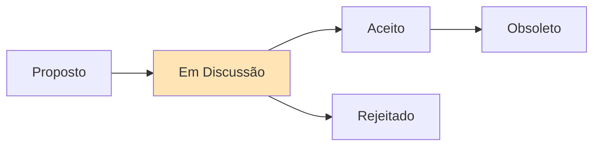

# ADR-003: Estratégia de Suporte Cross-Platform

## Status



**Status Atual:** Em Discussão  
**Data:** 2025-07-23  
**Decisores:** Team Lead, Platform Teams

## Contexto

O projeto atualmente tem:
- **Linux**: 100% de cobertura (Ubuntu, Mint, Pop!_OS)
- **Windows**: 80% de cobertura (Win11 via PowerShell)
- **macOS**: 20% de cobertura (estrutura básica)

Desafios identificados:
- Diferenças significativas entre gerenciadores de pacotes
- Sintaxe de script incompatível (bash vs PowerShell)
- Caminhos e permissões diferentes
- Ferramentas exclusivas de cada plataforma

## Decisão

Adotaremos uma estratégia de **"Core Compartilhado + Adaptadores de Plataforma"**:

### Arquitetura Proposta:
```
core/
├── common/          # Lógica compartilhada
├── interfaces/      # Contratos de plataforma
└── utils/          # Utilidades agnósticas

platforms/
├── linux/          # Implementação Linux
├── windows/        # Implementação Windows  
└── macos/          # Implementação macOS

adapters/
├── package-managers/   # apt, brew, winget
├── shell-compat/      # bash, zsh, pwsh
└── path-handlers/     # Cross-platform paths
```

### Princípios:
1. **Feature Parity > Code Reuse** - Mesma funcionalidade, não mesmo código
2. **Native Feel** - Usar idiomas nativos de cada plataforma
3. **Graceful Degradation** - Funcionar com recursos limitados
4. **Explicit Compatibility** - Documentar diferenças claramente

## Consequências

### Positivas
- ✅ Melhor experiência nativa por plataforma
- ✅ Manutenção mais fácil (separação de concerns)
- ✅ Permite otimizações específicas
- ✅ Testes mais focados por plataforma

### Negativas
- ❌ Alguma duplicação de código
- ❌ Maior complexidade arquitetural
- ❌ Requer expertise em múltiplas plataformas
- ❌ Mais difícil garantir paridade

### Neutras
- 🔄 Necessidade de CI/CD multi-plataforma
- 🔄 Documentação específica por OS

## Alternativas Consideradas

1. **Shell único (Bash everywhere)** - Rejeitada: WSL não é universal
2. **Linguagem compilada (Go/Rust)** - Rejeitada: complexidade desnecessária
3. **Containers only** - Rejeitada: não nativo, overhead

## Implementação

### Fase 1 - Refatoração (Q3 2025)
1. 📋 Extrair lógica comum para core/
2. 📋 Criar interfaces de plataforma
3. 📋 Implementar adaptadores

### Fase 2 - Paridade macOS (Q4 2025)
1. 📋 Mapear ferramentas Linux → macOS
2. 📋 Implementar instaladores Homebrew
3. 📋 Adaptar configurações de shell

### Fase 3 - Otimizações (Q1 2026)
1. 📋 Performance tuning por plataforma
2. 📋 Features exclusivas opcionais
3. 📋 Integração com gerenciadores nativos

## Tabela de Compatibilidade Alvo

| Feature | Linux | Windows | macOS |
|---------|-------|---------|--------|
| Package Installation | ✅ 100% | ✅ 100% | 🎯 100% |
| Shell Config | ✅ 100% | ✅ 90% | 🎯 95% |
| Dev Tools | ✅ 100% | ✅ 85% | 🎯 90% |
| Containers | ✅ 100% | ✅ 80%* | 🎯 95% |
| System Utils | ✅ 100% | ⚠️ 60% | 🎯 80% |

*Via WSL2 ou Docker Desktop

## Referências

- [Cross-Platform Shell Scripting](https://google.github.io/styleguide/shellguide.html)
- [PowerShell Best Practices](https://docs.microsoft.com/powershell/scripting/developer/cmdlet/strongly-encouraged-development-guidelines)
- [Homebrew Documentation](https://docs.brew.sh)

## Notas

Esta decisão está em discussão. Feedback necessário sobre:
1. Viabilidade da arquitetura proposta
2. Priorização macOS vs melhorias Windows
3. Recursos necessários para implementação