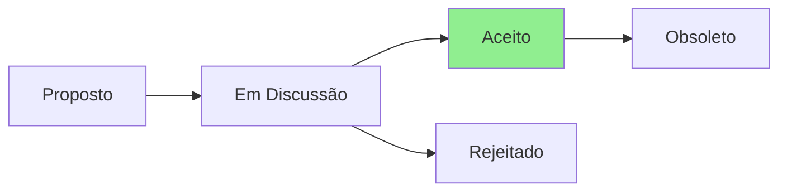

# ADR-008: Adiar Release v3.0.0 para Correções Críticas

## Status



**Status Atual:** Aceito  
**Data:** 2025-07-23  
**Decisores:** Product Owner, Security Team, Team Lead  
**Severidade:** 🚨 CRÍTICA

## Contexto

Durante a implementação do CLAUDE.md v2.3.0 e revisão pelos agentes BMAD, foram descobertas três issues críticas:

1. **Vulnerabilidade de Segurança**: Scripts forçam remoção de locks APT, podendo corromper sistemas
2. **Transparência**: Alegação falsa de 100% cobertura de testes (real: ~5%)
3. **Débito Técnico**: Arquitetura core/adapters prometida não existe

O plano original era lançar v3.0.0 com:
- Integração CLAUDE.md ✅
- Suporte macOS expandido
- Melhorias de performance

## Decisão

**Adiar v3.0.0 até conclusão do Epic 0** com as correções críticas:

### Novo Roadmap:
- **v2.2.1** - Hotfix de segurança se necessário (opcional)
- **v2.3.0** - Epic 0 completo (segurança + testes + arquitetura)
- **v3.0.0** - Features originais + macOS support (após Epic 0)

### Justificativa (PO):
> "This is a 'stop the line' moment where quality and user safety must take precedence over new features."

## Consequências

### Positivas
- ✅ Protege usuários de corrupção de sistema
- ✅ Mantém integridade e confiança do projeto
- ✅ Base sólida para crescimento futuro
- ✅ Transparência com a comunidade
- ✅ Evita riscos legais/éticos

### Negativas
- ❌ Atraso de 2-3 semanas no roadmap
- ❌ Possível frustração de usuários esperando macOS
- ❌ Trabalho adicional não planejado

### Neutras
- 🔄 Oportunidade de melhorar qualidade geral
- 🔄 Chance de envolver comunidade nas correções

## Comunicação

### Anúncio Público:
```markdown
## Importante: Adiamento da v3.0.0

Descobrimos issues críticas que requerem atenção imediata:

1. **Segurança**: Vulnerabilidade que pode afetar integridade do sistema
2. **Qualidade**: Métricas de teste precisam correção
3. **Arquitetura**: Implementação necessária para sustentabilidade

**Nossa decisão:**
- v3.0.0 adiada até resolução completa
- Segurança dos usuários é prioridade #1
- Transparência total sobre o processo

**Timeline:**
- 2-3 semanas para correções
- Updates diários de progresso
- v2.3.0 com todas as correções

Agradecemos a compreensão. Qualidade > Velocidade.
```

### Canais:
- README.md - Badge de status
- GitHub Releases - Anúncio
- Issues - Tracking público
- Discussions - Feedback da comunidade

## Implementação

### Semana 1:
- [ ] ADR-005: Segurança APT (3 dias)
- [ ] ADR-006: Framework de testes (início)
- [ ] Comunicação inicial

### Semana 2:
- [ ] ADR-006: Framework de testes (conclusão)
- [ ] ADR-007: Arquitetura (início)
- [ ] Primeiros testes de segurança

### Semana 3:
- [ ] ADR-007: Arquitetura (conclusão)
- [ ] Validação completa
- [ ] Preparar v2.3.0

## Métricas de Sucesso

- Zero vulnerabilidades de segurança conhecidas
- Cobertura de testes real > 30%
- Arquitetura implementada e documentada
- Feedback positivo da comunidade sobre transparência
- Nenhum sistema corrompido por nossa falha

## Lições Aprendidas

1. **Sempre realizar auditorias de segurança** antes de major releases
2. **Verificar claims de qualidade** com ferramentas automatizadas
3. **Arquitetura primeiro**, features depois
4. **Transparência** constrói confiança a longo prazo

## Referências

- [ADR-005: Security Fix](./ADR-005-security-apt-lock-handling.md)
- [ADR-006: Test Reality](./ADR-006-test-coverage-reality-check.md)
- [ADR-007: Architecture](./ADR-007-implement-core-adapters-architecture.md)
- [Epic 0 Stories](../../STORIES.md#epic-0-critical-security-and-architecture-fixes-urgent)

## Notas

Esta decisão demonstra maturidade do projeto ao priorizar qualidade e segurança sobre prazos. É melhor adiar e entregar com qualidade do que comprometer a confiança dos usuários.